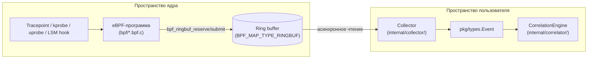

# Глава 2. Ликбез по eBPF (нулевой уровень)

> Уровень: **новичок**. Предполагает, что вы прочитали [главу 1](01-introduction.md).

## Зачем это нужно

В прошлой главе мы сравнили ebpf-guard с охранником, который смотрит за
процессами. Но как охранник умудряется заглядывать *внутрь* ядра Linux, не
устанавливая туда посторонний код и не рискуя обрушить всю систему одной
ошибкой? Ответ — **eBPF**. Без понимания того, как он работает, дальнейшие
главы (про коллекторы, BPF-программы, ring buffer) будут набором магических
слов. Эта глава закрывает пробел «с нуля».

## Что такое eBPF и почему это не модуль ядра

Обычно, чтобы добавить в ядро Linux новую логику (например, «отслеживать
каждый `open()`»), нужно писать **модуль ядра** (`.ko`) — код на C, который
компилируется под конкретную версию ядра, загружается через `insmod` и
выполняется с полными привилегиями ядра. Одна ошибка (null pointer
dereference, бесконечный цикл) — и вы получаете `kernel panic`: сервер
падает целиком.

**eBPF (extended Berkeley Packet Filter)** — это способ выполнить
пользовательский код *внутри* ядра, но:

1. код компилируется в специальный **байткод eBPF**, а не в машинные
   инструкции напрямую;
2. перед загрузкой этот байткод проходит через **verifier** — статический
   анализатор ядра, который отклоняет программу, если она может привести к
   бесконечному циклу, выходу за границы памяти или падению ядра;
3. если verifier одобрил байткод, он либо интерпретируется, либо (что
   обычно) компилируется в нативные машинные инструкции на лету —
   это называется **JIT (just-in-time compilation)** — и работает почти
   с той же скоростью, что и написанный на C код модуля ядра.

То есть eBPF даёт почти всю мощь модуля ядра, но с гарантией безопасности от
verifier и **без перезагрузки/пересборки ядра** для каждого изменения.
Именно поэтому CLAUDE.md описывает ebpf-guard как агент «no kernel module,
no Cilium dependency» — вся логика наблюдения работает через eBPF-программы,
а не через отдельно скомпилированный `.ko`.

### Verifier и JIT в двух словах

- **Verifier** — проверяет граф выполнения программы *до* её запуска:
  ограничивает число инструкций, запрещает недоступные для проверки циклы
  (кроме ограниченных `bpf_loop`), проверяет, что каждый доступ к памяти
  проверен на границы. Если проверка не проходит — ядро просто отказывается
  загружать программу (`bpf(BPF_PROG_LOAD, ...)` вернёт ошибку).
- **JIT** — после успешной верификации байткод eBPF транслируется в
  нативные инструкции целевой архитектуры (x86-64, arm64), поэтому
  накладные расходы на сам eBPF-код минимальны — основная стоимость
  приходится на копирование данных в userspace через ring buffer (см. ниже).

## Где eBPF-программа может «зацепиться» за ядро

eBPF-программа не работает сама по себе — она **прикрепляется** (attach) к
конкретной точке в ядре или пользовательском процессе. ebpf-guard использует
несколько типов точек прикрепления, у каждой — свой файл `bpf/*.bpf.c`:

| Тип точки | Что это | Пример в ebpf-guard |
|---|---|---|
| **Tracepoint** | Стабильная, документированная точка в коде ядра (например, вход/выход из системного вызова). Не меняется между патч-версиями ядра. | `SEC("tracepoint/syscalls/sys_enter_connect")` в `bpf/dns.bpf.c:221` |
| **Kprobe / kretprobe** | Динамическая точка на *любой* функции ядра (вход — kprobe, выход — kretprobe). Менее стабильна между версиями ядра, но гибче tracepoint. | `SEC("kprobe/__x64_sys_bpf")` в `bpf/bpf_monitor.bpf.c:117` |
| **Uprobe / uretprobe** | То же самое, но для функции в **пользовательском** бинарнике или библиотеке (например, `libssl.so`). Позволяет заглянуть в аргументы функции ещё до/после её выполнения. | `SEC("uprobe/cuMemAlloc_v2")` в `bpf/gpu_uprobe.bpf.c:137`; аналогично `SSL_write`/`SSL_read` в `bpf/tls_uprobe.bpf.c` |
| **LSM hook** | Точки Linux Security Module — те же точки, где работают AppArmor/SELinux; ядро вызывает их **до** разрешения действия, поэтому можно не только увидеть, но и **заблокировать** его (вернуть `-EPERM`). Требует ядро 5.7+. | `SEC("lsm/bpf_file_open")`, `SEC("lsm/bpf_socket_connect")`, `SEC("lsm/bpf_task_kill")` в `bpf/lsm.bpf.c:139,193,298` |
| **XDP (eXpress Data Path)** | Прикрепляется к сетевой карте максимально рано, ещё до сетевого стека ядра — самый быстрый способ дропнуть пакет. | `bpf/xdp_block.bpf.c` — блокировка по IP на скорости линии |
| **Socket filter** | Прикрепляется к сокету и видит сырые пакеты на этом сокете. | `bpf/dns.bpf.c` — ранняя фильтрация DNS-пакетов (только UDP dport 53) прямо в BPF, до копирования в userspace |

Разные точки прикрепления дают разный компромисс между стабильностью
API, гибкостью и тем, можно ли **заблокировать** действие синхронно (LSM,
XDP) или можно только **увидеть** его постфактум (tracepoint, kprobe).

## Как данные попадают из ядра в userspace: ring buffer и maps

eBPF-программа выполняется в ядре, а решения принимает Go-код в userspace
(`internal/correlator/`). Значит, нужен канал передачи данных.

- **BPF maps** — это ключ-значение хранилище, доступное и из eBPF-программы,
  и из userspace через syscall `bpf()`. Используются для конфигурации
  (списки отслеживаемых syscall-ов), состояния между вызовами (например,
  «этот PID уже находится в интересующем нас cgroup») и для самого канала
  событий.
- **Ring buffer (`BPF_MAP_TYPE_RINGBUF`)** — специальный вид map: кольцевой
  буфер в разделяемой памяти. eBPF-программа резервирует место
  (`bpf_ringbuf_reserve`), заполняет структуру `struct event` (см.
  `bpf/common.h:73`) и публикует её (`bpf_ringbuf_submit`); Go-код в
  userspace читает буфер асинхронно через `perf`/`epoll`-нотификацию, без
  постоянного опроса (polling). Ring buffer эффективнее старого
  `BPF_MAP_TYPE_PERF_EVENT_ARRAY`, потому что это **один** общий буфер на
  всю систему, а не по одному на CPU — меньше потерь при пиковой нагрузке.
  В CLAUDE.md этот механизм описан как «BPF ring buffer (256KB)» — таков
  типичный размер буфера событий по умолчанию (реальный размер
  настраивается в секции `bpf.map_sizes` файла `config/config.yaml`).



## BTF и CO-RE: почему один и тот же байткод работает на разных ядрах

Структуры данных ядра (например, `struct task_struct`) отличаются по
раскладке полей между версиями и конфигурациями ядра. Раньше eBPF-программы
приходилось перекомпилировать под каждую целевую версию ядра. Два механизма
решают эту проблему:

- **BTF (BPF Type Format)** — метаданные о типах ядра (структуры, поля,
  их смещения), которые ядро может экспортировать через
  `/sys/kernel/btf/vmlinux`. Это «карта», по которой eBPF-программа находит
  поля в структурах ядра во время загрузки, а не жёстко «зашивает» смещения
  на этапе компиляции.
- **CO-RE (Compile Once – Run Everywhere)** — подход, при котором
  eBPF-программа компилируется **один раз**, используя относительные
  обращения к полям (`bpf_core_read()` вместо прямого разыменования), а
  при загрузке на конкретной машине компоновщик (loader) подставляет
  реальные смещения полей для той версии ядра, опираясь на BTF.

Именно поэтому в репозитории лежит `bpf/vmlinux.h` — это сгенерированный
заголовочный файл со всеми типами ядра в формате BTF, вынесенный в
компилируемый код. Если у вас есть работающий BTF (`/sys/kernel/btf/vmlinux`),
`make generate` перегенерирует `bpf/vmlinux.h` под вашу версию ядра; если
BTF недоступен, используется уже закоммиченный файл, а относительные
смещения полей всё равно разрешаются на этапе загрузки программы CO-RE
рантаймом (см. комментарий в `Makefile` над целью `generate`).

## Как это соотносится с ebpf-guard

Собираем всё вместе на примере одного файла — `bpf/common.h`:

```c
/* Event type identifiers - must match pkg/types/event.go */
#define EVENT_TYPE_SYSCALL     1
#define EVENT_TYPE_TCP_CONNECT 2
#define EVENT_TYPE_FILE_ACCESS 3
...
struct event {
    /* ... общая структура события, отправляемая через ring buffer ... */
};
```

Каждая eBPF-программа (`syscall.bpf.c`, `network.bpf.c`, `dns.bpf.c` и т.д.)
прикрепляется к своей точке ядра, заполняет `struct event` данными о
происходящем действии и публикует запись в общий ring buffer. На стороне
Go-кода `bpf2go` (запускается через `make generate`) генерирует типизированные
обёртки (`*_gen.go`) для загрузки этих программ и работы с их maps — так Go
получает типобезопасный доступ к тому, что раньше было C-структурами.
Подробный разбор каждой BPF-программы будет в [главе 5](05-bpf-layer.md).

## Дальше почитать

- [ebpf.io — What is eBPF?](https://ebpf.io/what-is-ebpf/) — официальный обзорный сайт проекта eBPF.
- [Brendan Gregg, "BPF Performance Tools"](https://www.brendangregg.com/bpf-performance-tools-book.html) — классика по трейсингу через eBPF/BCC.
- [Andrii Nakryiko, "BPF CO-RE (Compile Once – Run Everywhere)"](https://nakryiko.com/posts/bpf-portability-and-co-re/) — лучшее объяснение CO-RE от одного из мейнтейнеров libbpf.
- [Kernel documentation: BPF Type Format (BTF)](https://www.kernel.org/doc/html/latest/bpf/btf.html) — официальная документация ядра по BTF.
- [cilium/ebpf: bpf2go documentation](https://pkg.go.dev/github.com/cilium/ebpf/cmd/bpf2go) — генератор Go-биндингов, используемый в `make generate`.
- [Linux kernel docs: tracepoints](https://www.kernel.org/doc/html/latest/trace/tracepoints.html) — формат и стабильность tracepoint-интерфейса.

## Глоссарий

- **Verifier** — статический анализатор ядра, проверяющий безопасность eBPF-байткода перед загрузкой (нет неограниченных циклов, нет выхода за границы памяти).
- **JIT (Just-In-Time compilation)** — компиляция проверенного eBPF-байткода в нативные машинные инструкции непосредственно перед выполнением.
- **Tracepoint** — стабильная, версионно-независимая точка инструментирования в коде ядра.
- **Kprobe/kretprobe** — динамическая точка на входе/выходе произвольной функции ядра.
- **Uprobe/uretprobe** — то же самое, но для функций в пользовательских бинарниках/библиотеках.
- **LSM hook (Linux Security Module)** — точка принятия решения о доступе, вызываемая ядром *до* разрешения действия; позволяет не только наблюдать, но и блокировать.
- **XDP (eXpress Data Path)** — точка прикрепления на максимально раннем этапе обработки сетевого пакета, ещё до стека ядра.
- **BPF map** — структура ключ-значение, общая между eBPF-программой и userspace-кодом.
- **Ring buffer** — кольцевой буфер в разделяемой памяти для эффективной передачи событий из ядра в userspace.
- **BTF (BPF Type Format)** — метаданные о типах структур ядра, используемые для разрешения смещений полей.
- **CO-RE (Compile Once – Run Everywhere)** — техника, позволяющая одному скомпилированному eBPF-байткоду работать на разных версиях ядра благодаря относительным, разрешаемым во время загрузки обращениям к полям.

---

**Назад:** [Глава 1. Введение](01-introduction.md) · **Далее:** [Глава 3. Быстрый старт (Getting Started)](03-getting-started.md)
