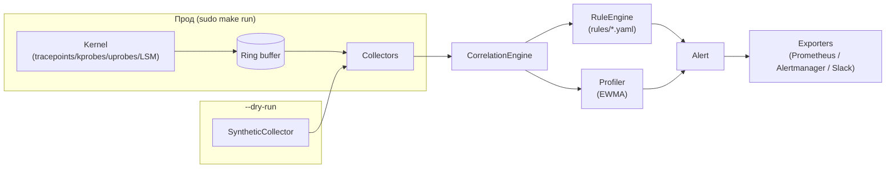

# Глава 3. Быстрый старт (Getting Started)

> Уровень: **новичок**. Предполагает главы [1](01-introduction.md) и [2](02-ebpf-basics.md).

## Зачем это нужно

Теория из первых двух глав объясняет, *что* делает ebpf-guard и *как*
работает eBPF под капотом. Эта глава — про руки: за пять минут вы получите
первый алерт на своей машине, причём **без root и без реального ядра**,
с помощью режима `--dry-run`. Это самый быстрый способ убедиться, что
пайплайн «событие → правило → алерт» действительно работает, прежде чем
разбираться, как всё устроено внутри.

## Prerequisites

Чтобы **собрать** ebpf-guard из исходников, понадобятся:

| Инструмент | Версия | Зачем |
|---|---|---|
| **Go** | 1.23+ | Сборка самого агента |
| **clang / LLVM** | 14+ | Компиляция eBPF C-кода (`bpf/*.bpf.c`) в байткод |
| **linux-headers** | под вашу версию ядра | Заголовочные файлы для сборки eBPF-программ |
| **libbpf-dev** | любая современная | Библиотека загрузки BPF-программ, используемая `bpf2go` |
| **bpf2go** | `go install github.com/cilium/ebpf/cmd/bpf2go@latest` | Генератор типизированных Go-обёрток из `.bpf.c` файлов |

Для **запуска в `--dry-run`** (см. ниже) ничего из этого не требуется — только
собранный бинарник или `go run`.

Полный список условий сборки задокументирован прямо в комментариях над целью
`generate` в `Makefile` (см. `Makefile:29-51`).

## Шаг 1. Собрать бинарник

```bash
git clone https://github.com/zugolO/ebpf-guard.git
cd ebpf-guard

# Сгенерировать Go-биндинги из eBPF C-кода (нужно clang + kernel headers)
make generate

# Собрать бинарник в build/ebpf-guard
make build
```

`make generate` запускает `bpf2go`, который компилирует каждый файл
`bpf/*.bpf.c` в eBPF-байткод и генерирует к нему типизированный Go-код
(`*_gen.go`) с описанием maps и программ. Если в системе доступен
`/sys/kernel/btf/vmlinux`, `Makefile` дополнительно перегенерирует
`bpf/vmlinux.h` под текущее ядро через `bpftool`; если BTF недоступен —
используется уже закоммиченный `bpf/vmlinux.h` (подробнее — в
[главе 2](02-ebpf-basics.md#btf-и-co-re-почему-один-и-тот-же-байткод-работает-на-разных-ядрах)).
Пересобирать биндинги нужно **каждый раз**, когда меняется код в `bpf/*.bpf.c`
или `bpf/common.h`.

Другие полезные цели `Makefile`:

```bash
make test          # тесты с race detector (по умолчанию в CI)
make test-norace    # тесты без race detector (для платформ без поддержки)
make lint           # go vet + golangci-lint
make bench          # бенчмарки (correlation engine, profiler, ...)
make docker         # сборка Docker-образа (multi-stage → distroless)
```

## Шаг 2. Запустить без ядра: `--dry-run`

Настоящий запуск (`sudo make run`) требует root и реального Linux-ядра с
поддержкой eBPF — это нормально для прод-окружения, но неудобно для первого
знакомства. Поэтому в ebpf-guard есть `SyntheticCollector`
(`internal/collector/`) — он генерирует те же самые структуры
`pkg/types.Event`, которые в проде пришли бы из ring buffer, но без
реального ядра и без привилегий:

```bash
./build/ebpf-guard --dry-run --config config/config.yaml
```

Флаг `--dry-run` заменяет коллекторы, читающие ring buffer, на
`SyntheticCollector`: события идут в тот же `CorrelationEngine`, проходят
через тот же `RuleEngine` и тот же `Profiler`, что и в проде — разница
только в источнике событий. Это значит, что всё, что вы увидите в
`--dry-run`, ведёт себя так же, как в реальном развёртывании: те же правила,
та же логика fingerprinting, тот же формат алертов.



## Шаг 3. Первый алерт за 5 минут

При запуске без явно настроенного токена агент **сам генерирует** bearer
token и один раз печатает его в лог (см. `cmd/ebpf-guard/main.go:670`):

```
INFO auth: generated admin token — save this, it will not be shown again ...
```

Сохраните этот токен — он не выводится повторно (он также пишется в файл,
см. `cmd/ebpf-guard/main.go:1902` — `writeTokenFile`). Дальше используем его
для запросов к HTTP API:

```bash
# Health-check — агент жив и слушает
curl http://localhost:19090/health

# Список сработавших алертов через HTTP API
curl -H "Authorization: Bearer $TOKEN" http://localhost:19090/alerts

# То же самое, но через встроенный CLI-клиент
./build/ebpf-guard alerts --output json --follow
```

Минимальный конфиг для этого — уже готовый `config/config.yaml`: он
указывает, откуда грузить правила (`rules.path`, hot-reload через fsnotify),
на каком порту слушать HTTP-сервер (`server.bind_address`) и какие
BPF-map-ы использовать (актуально только для реального запуска, не для
`--dry-run`):

```yaml
server:
  bind_address: ":19090"
  metrics_path: "/metrics"
  health_path: "/health"

rules:
  path: "/opt/ebpf-guard/rules/"   # директория с *.yaml правилами, грузятся все сразу
  hot_reload: true                 # изменили файл правила — перечитается на лету
```

В `SyntheticCollector` изначально «зашиты» события, специально
подобранные так, чтобы совпасть с одним из встроенных правил
(например, `rules/container-escape.yaml`, см. пример в
[главе 1](01-introduction.md#как-это-выглядит-в-конфигурации-и-коде)) —
поэтому уже в первые секунды после старта в `--dry-run` вы увидите первый
алерт в терминале и по `/alerts`.

## Что дальше

Если первый алерт получен — вы прошли путь «событие ядра → правило →
алерт» целиком, пусть и на синтетических данных. Следующий логичный шаг —
разобраться, как эти события формируются на самом деле:
[глава 4. Архитектура и поток событий](04-architecture.md) даёт полную
Mermaid-схему пайплайна и карту всех пакетов `internal/*`.

## Дальше почитать

- [`Makefile`](../../Makefile) в корне репозитория — все доступные цели сборки с комментариями.
- [`config/config.yaml`](../../config/config.yaml) — полностью закомментированный пример конфигурации.
- [README.md — секция "60-Second Quickstart"](../../README.md#60-second-quickstart) — альтернативный быстрый старт через Docker и Helm.
- [docs/operations.md](../operations.md) — эксплуатация в проде (за рамками dry-run).

## Глоссарий

- **`--dry-run`** — режим запуска, в котором реальные eBPF-коллекторы заменяются на `SyntheticCollector`, генерирующий синтетические события без ядра и без root.
- **`SyntheticCollector`** — компонент `internal/collector/`, эмулирующий события `pkg/types.Event` для тестов и демонстраций.
- **Bearer token** — токен авторизации HTTP API; при отсутствии в конфиге генерируется автоматически один раз при старте и печатается в лог.
- **Hot-reload** — автоматическая перезагрузка правил при изменении файлов в `rules.path`, реализована через `fsnotify`.
- **`bpf2go`** — генератор Go-биндингов из `.bpf.c` исходников, запускается через `make generate`.

---

**Назад:** [Глава 2. Ликбез по eBPF](02-ebpf-basics.md) · **Далее:** Глава 4. Архитектура и поток событий *(в работе)*
