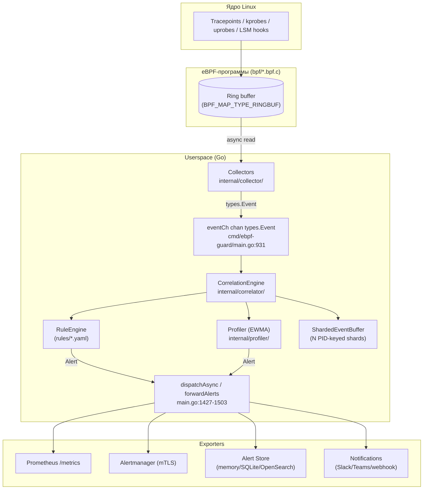

# Глава 4. Архитектура и поток событий

> Уровень: **средний**. Предполагает главы [1](01-introduction.md)–[3](03-getting-started.md).

## Зачем это нужно

В главе 3 вы запустили `--dry-run` и увидели первый алерт, но «чёрный ящик»
между стартом процесса и алертом в терминале пока не раскрыт. Эта глава
открывает этот ящик целиком: как события физически проходят путь от ядра до
Prometheus, и что происходит на каждом шаге запуска агента
(`cmd/ebpf-guard/main.go`). Она — карта для всех последующих глав: главы 5–7
разбирают отдельные звенья этой цепи подробно.

## Полная схема потока событий

Ключевая деталь: коллекторы не вызывают `CorrelationEngine` напрямую — все
они пишут в один общий канал `eventCh` (`cmd/ebpf-guard/main.go:931`), а
основной цикл (`main.go:1547-1612`) читает из этого канала и передаёт
события в движок через `engine.IngestAsync(ctx, event)` (`main.go:1596`).
Такая развязка через канал — то, что позволяет `SyntheticCollector` в
`--dry-run` подменять источник событий, не трогая ни `CorrelationEngine`,
ни `RuleEngine`, ни `Profiler`: с их точки зрения события приходят из того
же самого канала, независимо от того, кто их туда положил.

## Запуск агента по шагам (`cmd/ebpf-guard/main.go`, `runAgent`)

Функция `runAgent` (начинается на `main.go:137`) — это последовательность
шагов, каждый из которых можно проследить по номерам строк:

1. **Логгер и контекст завершения** (`main.go:137-148`) — создаётся
   структурный логгер и `context.Context`, который отменяется по
   `SIGINT`/`SIGTERM`, чтобы остановка агента (`Ctrl+C`, `systemctl stop`)
   была управляемой, а не обрывалась на середине записи алерта.
2. **Загрузка конфигурации и правил** (`main.go:150-201`) — либо
   zero-config режим со встроенными значениями по умолчанию
   (`main.go:155-181`, полезно для «просто запустить и посмотреть»), либо
   полноценная загрузка `config.yaml` и правил из `rules.path` через
   `loadRulesWithTuning` (`main.go:182-200`).
3. **Аппаратный профиль** (`main.go:203-220`) — агент определяет профиль
   (`lite`/`balanced`/`production`) и настраивает `GOMEMLIMIT`/`GOGC` под
   доступную память ноды (`applyRuntimeTuning`, `main.go:220`) — это то,
   что в `docs/performance-tuning.md` называется hardware-profiles.
4. **Детекция ядра и BTF** (`main.go:237-272`) — `internalbpf.DetectFeatures()`
   (`main.go:244`, реализация в `internal/bpf/features.go:29`) проверяет
   поддержку нужных возможностей ядра (BTF, LSM, ring buffer), а
   `internalbpf.ResolveBTF(...)` (`main.go:249`) находит или генерирует
   `vmlinux.h`-совместимые метаданные типов (см. главу 2 про CO-RE). Весь
   этот блок **пропускается**, если передан `--dry-run` (проверка на
   `main.go:241`) — поэтому dry-run не требует ни root, ни реального ядра.
5. **Сборка конфигурации движка корреляции и профайлера**
   (`main.go:343-441`) — здесь читаются секции `profiler.*` из конфига
   (`learning_period`, `anomaly_threshold`, `ewma_weight`, `sequence`,
   `lineage` — подробности в главе 9) и, если профайлер включён, создаётся
   `profiler.NewProfilerWithContext` (`main.go:420`).
6. **Создание `CorrelationEngine`** (`main.go:598`) —
   `correlator.NewCorrelationEngineWithConfig(engineCfg)` — момент, когда
   `RuleEngine`, `ShardedEventBuffer` и связь с профайлером собираются в
   единый объект, который дальше будет получать события из `eventCh`.
7. **Хранилище алертов** (`main.go:617-655`) — `store.NewWithContext`
   поднимает выбранный backend (`memory`/`sqlite`/`opensearch`, глава 14).
8. **HTTP-сервер** (`main.go:706-772`) — `exporter.NewServerWithMultiTenant`
   (`main.go:706`) поднимает bearer-аутентифицированный HTTP API
   (`/alerts`, `/health`, `/metrics`, `/rules`, `/debug/pprof`) и
   запускается через `srv.Start(ctx)` (`main.go:770`) **до** того, как
   пойдут первые события — так `/health` отвечает `200 OK` уже во время
   инициализации коллекторов.
9. **Инициализация коллекторов** (`main.go:958-1065`) — в dry-run режиме
   создаётся один `collector.NewSyntheticCollector` (`main.go:962`); в
   боевом режиме — набор реальных коллекторов: syscall, network,
   fileaccess, dns, tls, http, lsm, kmod (`main.go:966-1064`), каждый из
   которых загружает соответствующую BPF-программу (глава 5) и
   прикрепляет её к точке в ядре.
10. **Запуск коллекторов** (`main.go:1133-1147`) — каждый коллектор
    получает собственную горутину: `c.Start(ctx, eventCh)`. С этого
    момента события начинают поступать в общий канал.
11. **K8s-обогащение** (`main.go:1274-1299`) — если включено, поднимается
    `k8s.NewEnricher` (горутина, `main.go:1291-1295`), который следит за
    подами на ноде и добавляет к событиям метаданные (namespace, labels).
12. **Главный цикл событий** (`main.go:1547-1612`) — `select` с двумя
    ветками: `ctx.Done()` для мягкой остановки (`main.go:1549`) и
    `eventCh` для обработки события (`main.go:1558`): обогащение
    K8s/runtime-контекстом (`1572-1577`), запись метрик (`1589`),
    `engine.IngestAsync(ctx, event)` (`1596`), при необходимости —
    диспетчеризация в drift detection (`1600-1610`).
13. **Мягкая остановка** (`gracefulShutdown`, начинается около
    `main.go:1728`) — упорядоченная остановка: сначала коллекторы
    перестают писать новые события, затем движок дорабатывает буфер,
    затем закрываются HTTP-сервер и хранилище.

## Карта пакетов `internal/*`

На момент этой главы в репозитории 37 пакетов под `internal/`. Таблица из
`CLAUDE.md` покрывает основные из них; фактический список немного шире —
несколько пакетов появились уже после того, как таблица в `CLAUDE.md` в
последний раз обновлялась (поведение агента развивается быстрее
документации, это нормально для активного проекта):

| Пакет | Роль |
|---|---|
| `bpf/` | Загрузчик BPF-программ, детекция возможностей ядра (BTF), размеры maps, per-event sampling |
| `collector/` | Чтение ring buffer для syscall/network/file/DNS/TLS/HTTP/LSM событий; `SyntheticCollector` для `--dry-run` |
| `correlator/` | YAML rule engine, `ShardedEventBuffer`, SHA-256 fingerprinting, rate limiting, DNS entropy, детекция майнинг-пулов |
| `profiler/` | EWMA-профили, `SequenceProfiler`, `LineageTracker` |
| `policy/` | Встроенный Rego/OPA движок, MITRE-обогащение |
| `exporter/` | Prometheus, Alertmanager (mTLS), HTTP API, cardinality guard, нотификации, Falco-совместимый вывод |
| `enforcer/` | Действия реагирования: kill/throttle/nftables/LSM block |
| `migration/` | Импорт правил Falco |
| `k8s/` | Watcher подов, обогащение метаданными |
| `store/` | memory/SQLite/OpenSearch backend для алертов |
| `integrity/` | Стартовый скан целостности (LD_PRELOAD, cron, root shell configs) |
| `watchdog/` | Heartbeat, проверка живости BPF-программ, memory pressure auto-tuning |
| `explainer/` | Объяснение алертов, MITRE-шаблоны |
| `config/` | Viper-загрузчик конфигурации, валидация |
| `autolearn/` | Allowlist-режим автообучения (глава 11) |
| `drift/` | Детекция дрейфа поведения (глава 11) |
| `feedback/` | Обратная связь по алертам (глава 11) |
| `selfprotect/` | Самозащита агента (глава 15) |
| `canary/` | Canary-ловушки (глава 15) |
| `gossip/` | Межнодовая корреляция/кластеризация (глава 15) |
| `ja3/` | JA3/JA4 TLS-фингерпринтинг (глава 17) |
| `osint/` | OSINT-обогащение индикаторов (глава 15) |
| `hidden/` | Детекция скрытых процессов (глава 15) |
| `wasm/` | WASM-плагины (глава 16) |
| `runtime/`, `simple/`, `simulate/`, `ruletest/`, `attacker/`, `audit/`, `apiclient/`, `admission/`, `pgo/`, `integration/`, `tui/`, `util/` | Вспомогательные и продвинутые подсистемы: режим упрощённого запуска, симуляция атак (`attack-sim`), тестирование правил, K8s admission-контроль, PGO-профили сборки, TUI-дашборд и внутренние утилиты |

`pkg/types/` (вне `internal/`) хранит канонические структуры `Event`,
`Alert`, `DNSEvent`, `TLSEvent`, общие для всех пакетов — подробнее в
главе 6.

## Что дальше

Следующие три главы разбирают по отдельности три звена этой цепи:
[глава 5](05-bpf-layer.md) — что происходит в ядре (BPF-программы),
[глава 6](06-collectors.md) — как события попадают в Go-код,
[глава 7](07-correlation-engine.md) — как эти события превращаются в
алерты.

## Дальше почитать

- [`cmd/ebpf-guard/main.go`](../../cmd/ebpf-guard/main.go) — полный код старта агента, лучше всего читать вместе с этой главой.
- [docs/performance-tuning.md](../performance-tuning.md) — hardware-profiles, GOMEMLIMIT/GOGC тюнинг, упомянутые в шаге 3.
- [docs/allowlist-mode.md](../allowlist-mode.md), [docs/drift.md](../drift.md) — подробности про `autolearn`/`drift`, кратко упомянутые в карте пакетов.

## Глоссарий

- **`eventCh`** — единственный Go-канал (`chan types.Event`), через который все коллекторы передают события в основной цикл; точка развязки между источником событий и логикой обработки.
- **`CorrelationEngine`** — центральный объект `internal/correlator/`, объединяющий `RuleEngine`, `Profiler` и `ShardedEventBuffer`.
- **Graceful shutdown** — упорядоченная остановка агента: сначала прекращается приём новых событий, затем дорабатывается буфер, затем закрываются экспортёры.
- **Hardware profile** — предустановленный набор параметров (`lite`/`balanced`/`production`), управляющий использованием памяти и CPU.

---

**Назад:** [Глава 3. Быстрый старт](03-getting-started.md) · **Далее:** [Глава 5. BPF-слой](05-bpf-layer.md)
