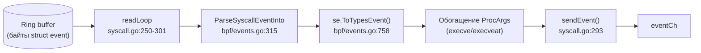

# Глава 6. Коллекторы (`internal/collector/`)

> Уровень: **средний**. Предполагает главы [4](04-architecture.md) и [5](05-bpf-layer.md).

## Зачем это нужно

Глава 5 разобрала BPF-программы — код, который живёт в ядре и публикует
сырые байты в ring buffer. Но `RuleEngine` и `Profiler` (глава 7) работают
не с сырыми байтами, а с типобезопасной Go-структурой `pkg/types.Event`.
Мост между ними — коллекторы: они читают ring buffer, парсят байты
согласно `struct event` из `bpf/common.h` и превращают их в
`types.Event`. Эта глава показывает этот мост на конкретном примере, шаг за
шагом.

## Один коллектор на одну BPF-программу

В `internal/collector/` для большинства программ из главы 5 есть свой
файл-коллектор: `syscall.go`, `network.go` (+ `network_parse.go`),
`fileaccess.go`, `dns.go` (+ `dns_parse.go`), `tls.go`, `lsm.go`,
`http_uprobe.go`, `gpu.go`, `iouring.go`, `bpfmonitor.go`,
`tlsfingerprint.go` (+ `tlsfingerprint_parse.go`), `privesc.go`. Отдельно
стоят `cloudtrail.go`, `gcp_audit.go`, `azure_monitor.go` — они не читают
ring buffer вообще, а получают события из облачных audit-логов (AWS
CloudTrail, GCP Audit Log, Azure Monitor) через их API, но приводят
результат к тому же самому `types.Event`, что позволяет `RuleEngine`
работать с облачными событиями теми же правилами, что и с событиями ядра.

Общая логика (интерфейс `Collector`, вспомогательные функции) вынесена в
`collector.go`; `batch.go` и `pool.go` отвечают за батчинг записи в канал
и переиспользование выделенной памяти (`sync.Pool`) под структуры событий,
чтобы не создавать сборщику мусора лишнюю работу на каждое событие.

## От байт в ring buffer до `types.Event`: пример syscall-коллектора

Рассмотрим полный путь одного syscall-события.

1. **Цикл чтения** — `readLoop` в `internal/collector/syscall.go:250-301`
   читает очередную запись из ring buffer (через биндинг, сгенерированный
   `bpf2go`, глава 5), забирает из пула переиспользуемый указатель
   `*types.Event` (`eventPool.Get()`, строка 267), чтобы не аллоцировать
   новый объект на каждое событие.
2. **Парсинг сырых байт** — `internal/collector/syscall.go:345` вызывает
   `bpf.ParseSyscallEventInto(raw, &se)` (реализация —
   `internal/bpf/events.go:315`), которая читает срез `[]byte` из ring
   buffer в промежуточную Go-структуру `SyscallEvent`, поле за полем, в
   том же порядке и с теми же размерами, что в `struct event` из
   `bpf/common.h` (см. главу 5 про инвариант «layout must match exactly»).
3. **Конвертация в канонический тип** —
   `internal/collector/syscall.go:345` сразу после парсинга вызывает
   `se.ToTypesEvent()` — метод `internal/bpf/events.go:758`, который
   собирает `types.Event{Type: types.EventSyscall, PID: ..., Comm: ...,
   Syscall: &types.SyscallEvent{Nr, Ret, Args}}`. Аналогичные методы
   `ToTypesEvent()` существуют для каждого сырого типа события:
   `NetworkEvent` (`events.go:775`), `FileaccessEvent` (`events.go:799`),
   `PrivescRawEvent` (`events.go:822`), `NetworkCloseRawEvent`
   (`events.go:840`), `KmodRawEvent` (`events.go:862`),
   `CgroupEscapeRawEvent` (`events.go:887`), `IOUringRawEvent`
   (`events.go:904`), `BpfMonitorRawEvent` (`events.go:924`),
   `TlsClientHelloRawEvent` (`events.go:945`) — по одному на каждую строку
   из таблицы в главе 5.
4. **Обогащение (опционально)** — для событий `execve`/`execveat`
   syscall-коллектор дополнительно подтягивает аргументы командной строки
   процесса в поле `ProcArgs` (`syscall.go:276-284`), прежде чем событие
   уйдёт дальше.
5. **Отправка в общий канал** — `sendEvent(...)`
   (`internal/collector/syscall.go:293`) кладёт готовый `*types.Event` в
   `eventCh` (см. главу 4) — с этого момента дальнейшая обработка уже не
   зависит от того, какой конкретно коллектор произвёл событие.



## `pkg/types.Event` — канонический контракт

Структура `types.Event` (`pkg/types/event.go:201`) — общий формат для
**всех** источников событий, включая облачные audit-логи. Основные поля:
`Type`, `Timestamp`, `PID`, `TGID`, `PPID`, `UID`, `Comm [16]byte`,
`ParentComm [16]byte`; далее — набор указателей, из которых для
конкретного события заполнен ровно один: `Syscall`, `Network`, `File`,
`TLS`, `DNS`, `Privesc`, `NetClose`, `Kmod`, `CgroupEsc`, `GPU`,
`CloudAudit`, `IOUring`, `BPFProgram`, `HTTPPlaintext`, `TraceContext`,
`Enrichment`, `ProcArgs`. Именно к полям внутри этих указателей обращаются
условия правил (`field: dport`, `field: qname_entropy` и т.д.) — детали в
главе 7.

## `SyntheticCollector` — источник событий для `--dry-run`

`internal/collector/synthetic.go` реализует тот же интерфейс `Collector`,
что и реальные коллекторы, но вместо чтения ring buffer генерирует заранее
подготовленные `types.Event` на таймере. В `main.go:962` он создаётся так:

```go
collector.NewSyntheticCollector(slog.Default(), 100*time.Millisecond)
```

Это единственный коллектор, который используется, если передан
`--dry-run` (см. шаг 9 в главе 4) — с точки зрения `eventCh` и всего, что
после него, разницы между синтетическим и реальным событием нет.

## Per-event sampling

При высокой нагрузке читать и обрабатывать 100% событий может быть
избыточно — sampling снижает объём данных, сохраняя статистическую
представительность. В ebpf-guard есть два независимых уровня семплирования:

- **BPF-side sampling (1-в-N)** — конфигурируется секцией `sampling` в
  `config.yaml` (`internal/config/config.go:758-768`,
  `SamplingConfig`), применяется через `enableSampling()`
  (`main.go:1675-1714`): каждый коллектор объявляет свою карту допустимых
  типов событий и множителей через `SamplingConfigMap()` (например,
  `internal/collector/syscall.go:328-335`, `network.go:270-276`,
  `fileaccess.go:135-141`), а `internalbpf.SamplingController` записывает
  эти коэффициенты прямо в BPF map `sampling_config` — то есть решение
  «пропустить событие» принимается **внутри ядра**, ещё до попадания в
  ring buffer, экономя копирование данных в userspace.
- **Adaptive sampling** — `AdaptiveSamplingConfig`
  (`internal/config/config.go:884-916`) позволяет агенту динамически
  увеличивать семплирование под давлением CPU: `watchdog.MultiBPFController`
  (`main.go:386`, поле `samplingMux`) получает сигнал от наблюдателя за
  нагрузкой (`main.go:449-461`) и снижает частоту событий на лету, без
  перезапуска агента.

Это отдельный механизм от per-rule семплирования внутри самого
`RuleEngine` (`internal/correlator/rules.go:757-781`, `rule.SampleRate`) —
там семплируется не поток событий, а частота, с которой конкретное правило
имеет право сработать (подробнее — в главе 7).

## Дальше почитать

- [`internal/bpf/events.go`](../../internal/bpf/events.go) — все `ToTypesEvent()`-конвертеры в одном файле.
- [`pkg/types/event.go`](../../pkg/types/event.go) — полное определение `types.Event` и связанных типов (`SyscallEvent`, `DNSEvent`, `TLSEvent`, ...).
- [`internal/collector/synthetic.go`](../../internal/collector/synthetic.go) — реализация `SyntheticCollector`.

## Глоссарий

- **Коллектор** — компонент `internal/collector/`, читающий один ring buffer (или внешний API) и производящий `types.Event`.
- **`sync.Pool`** — механизм переиспользования объектов в Go, используемый коллекторами (`pool.go`), чтобы снизить нагрузку на сборщик мусора при высокой частоте событий.
- **BPF-side sampling** — отбрасывание части событий внутри самой eBPF-программы, до копирования в userspace.
- **Adaptive sampling** — автоматическое увеличение семплирования при росте нагрузки на CPU.

---

**Назад:** [Глава 5. BPF-слой](05-bpf-layer.md) · **Далее:** [Глава 7. Движок корреляции и DSL правил](07-correlation-engine.md)
