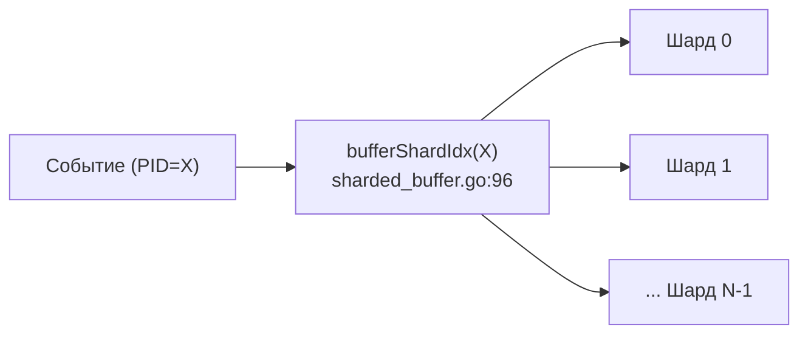

# Глава 7. Движок корреляции и DSL правил (`internal/correlator/`)

> Уровень: **средний**. Предполагает главы [4](04-architecture.md)–[6](06-collectors.md).

## Зачем это нужно

Коллекторы (глава 6) поставляют поток `types.Event` в `eventCh`. Задача
`CorrelationEngine` — превратить этот поток в алерты: сопоставить каждое
событие с YAML-правилами, хранить недавнюю историю событий по процессам
для правил, требующих контекста, и не допустить, чтобы один шумный процесс
завалил систему тысячами одинаковых алертов. Эта глава разбирает
внутренности `internal/correlator/`: буфер событий, fingerprinting,
rate limiting и полный справочник операторов условий, которые вы пишете в
`rules/*.yaml`.

## `ShardedEventBuffer`: история событий по процессам

Некоторым правилам и профайлеру (глава 9) нужен не только текущее событие,
но и недавняя история по конкретному PID (например, «после `execve` из
`/tmp` в течение 5 секунд был открыт сетевой сокет»). Хранить всю историю
в одной структуре под одним мьютексом означало бы, что каждое событие от
любого процесса на ноде конкурирует за одну и ту же блокировку.

`internal/correlator/sharded_buffer.go` решает это шардированием по PID:
буфер разбит на N независимых сегментов (шардов), каждый со своим
мьютексом, а PID детерминированно определяет, в какой шард он попадает
(`bufferShardIdx(pid uint32)`, `sharded_buffer.go:96`, побитовая маска
`mask = numShards - 1`). Число шардов **не зафиксировано жёстко на 16** —
вопреки тому, что можно предположить по названию буфера в общем описании
архитектуры: `computeBufferShards()` (`sharded_buffer.go:32-66`)
вычисляет его как `max(NumCPU, GOMAXPROCS) * 4`, округляет до ближайшей
степени двойки и ограничивает диапазоном `[16, 256]` (`sharded_buffer.go:63-66`).
То есть 16 — это **минимум** (на маленьких машинах вроде `lite`
hardware-profile из главы 4), а на многоядерном сервере шардов будет
больше — это снижает конкуренцию за блокировку пропорционально числу CPU.
Сам буфер создаётся через `NewShardedEventBuffer` (`sharded_buffer.go:102`),
базовые операции — `Add`/`Get`/`GetRecent`/`Remove`
(`sharded_buffer.go:120,163,192,237`).



## Fingerprinting алертов: SHA-256

Чтобы алерт можно было однозначно идентифицировать (для дедупликации,
rate limiting, проверки целостности после доставки в Alertmanager/SIEM),
`internal/correlator/fingerprint.go` строит криптографический отпечаток.
`FingerprintGenerator.Generate(alert)` (`fingerprint.go:42`) сериализует
ключевые поля алерта в JSON и хэширует их через `sha256.Sum256(...)`
(`fingerprint.go:76`); если сериализация невозможна, есть строковый
fallback-путь (`fallbackHash`, `fingerprint.go:81`), тоже основанный на
`sha256.Sum256` (`fingerprint.go:95`). Проверить, что отпечаток
действительно соответствует содержимому алерта, можно через `Verify()`
(`fingerprint.go:100`) — это то, что позволяет доказать постфактум, что
алерт не был подделан или изменён после генерации.

## Rate limiting: защита от шторма алертов

`internal/correlator/ratelimiter.go` реализует `RateLimiter`, работающий
**на уровне правила**, а не глобально: у каждого `RuleID` — свой счётчик
в скользящем окне. Конфигурируется тремя полями движка
(`engine.go:322-323`): `EnableRateLimit`, `RateLimitWindow`,
`MaxAlertsPerWindow`, создаётся в `NewRateLimiterWithContext`
(`engine.go:615`) и проверяется во всех точках, где движок собирается
породить алерт (`engine.go:1377,1472,1505,1594,1659` —
`ce.rateLimiter.Allow(alert.RuleID)`). Практический смысл: если один
процесс генерирует 10 000 однотипных сетевых событий в секунду и все они
совпадают с одним и тем же правилом, наружу уйдёт не 10 000 алертов, а
ограниченное число в пределах окна — без этого Prometheus/Alertmanager
захлебнулись бы дубликатами одной и той же атаки.

## Справочник операторов условий

Каждое условие в YAML-правиле (`field`/`op`/`values`) при загрузке
транслируется в целочисленный `opCode` (маппинг строки `op:` → код
происходит в загрузчике правил, `internal/correlator/rule_loader.go`), а
не сравнивается по строке на каждое событие — это осознанное решение
производительности: `evaluateCondition`
(`internal/correlator/rules.go:899-999`) переключается по `cond.opCode`
через jump-table (~2 нс) вместо строкового `switch` (~10 нс), поскольку
эта функция вызывается на **каждое** событие для **каждого** правила.

| `op:` в YAML | Внутренний код (файл:строка) | Семантика |
|---|---|---|
| `in` | `condOpIn` (`rules.go:924`) | Значение поля входит в список `values` (линейный перебор при ≤8 элементах, иначе — поиск по map) |
| `not_in` | `condOpNotIn` (`rules.go:942`) | Обратное к `in` |
| `eq` | `condOpEquals` (`rules.go:956`) | Точное совпадение строки/числа |
| `neq` | `condOpNotEquals` (`rules.go:958`) | Обратное к `eq` |
| `prefix` | `condOpPrefix` (`rules.go:960`) | Значение начинается с одной из строк в `values` |
| — | `condOpNotPrefix` (`rules.go:962`) | Обратное к `prefix` |
| `suffix` | `condOpSuffix` (`rules.go:964`) | Значение заканчивается на одну из строк в `values` |
| — | `condOpNotSuffix` (`rules.go:971`) | Обратное к `suffix` |
| `regex` | `condOpRegex` (`rules.go:978`) | Совпадение с regex, скомпилированным через RE2 **на этапе загрузки** правила (не на каждое событие) |
| `gt` | `condOpGT` (`rules.go:980`) | Численное «больше» |
| `lt` | `condOpLT` (`rules.go:982`) | Численное «меньше» |
| `gte` | `condOpGTE` (`rules.go:984`) | «Больше или равно» |
| `lte` | `condOpLTE` (`rules.go:986`) | «Меньше или равно» |
| `contains` | `condOpContains` (`rules.go:988`) | Подстрока входит в значение поля |
| `in_cidr` | `condOpInCIDR` (`rules.go:995`) | IP входит в один из CIDR-диапазонов из `values` |
| `not_in_cidr` | `condOpNotInCIDR` (`rules.go:997`) | Обратное к `in_cidr` |

Отдельно, до основного `switch`, обрабатываются `caps_gained`/`caps_dropped`
(`rules.go:903,905`) — они читают поле `Privesc` события напрямую, минуя
универсальный `getFieldValue`, поскольку сравнивают не скалярное значение,
а множество capability-флагов.

Unknown `field`-имена отклоняются на этапе загрузки правила (см.
`CLAUDE.md`), а не во время матчинга событий — ошибка в правиле проявится
сразу при старте/hot-reload, а не тихим отсутствием алертов в проде.

## `condition_group`: вложенная логика AND/OR

Помимо одиночного `condition`, правило может использовать
`condition_group` с произвольной вложенностью через `SubGroups`.
Тип `RuleConditionGroup` определён в `rules.go:197` (поле `SubGroups
[]RuleConditionGroup` — `rules.go:203`). Логика вычисляется рекурсивно в
`evaluateConditionGroup` (`rules.go:856-882`):

```go
switch group.Operator {
case "or":
    // true, как только совпало любое условие ИЛИ любая вложенная подгруппа
case default: // "and" или пусто
    // false, как только НЕ совпало любое условие ИЛИ любая вложенная подгруппа
}
```

То есть `or` — короткое замыкание на первом совпадении, `and`
(поведение по умолчанию, если `operator` не задан) — короткое замыкание
на первом несовпадении, и в обоих случаях рекурсия одинаково спускается
в `SubGroups`, что позволяет строить произвольно глубокие деревья
`(A AND (B OR C)) AND NOT D`.

## DNS entropy и детекция майнинг-пулов

Два примера того, как правило может опираться не на сырое поле события, а
на **вычисленное** значение:

- **DNS entropy** (`internal/correlator/dns_entropy.go`) — Шеннон-энтропия
  доменного имени считается в `CalculateShannonEntropy`
  (`dns_entropy.go:73`, цикл суммирования — строки 84-98); высокая
  энтропия — характерный признак доменов, сгенерированных DGA-алгоритмом
  вредоносного ПО (`IsDGADomain`, `dns_entropy.go:103`). Главная точка
  входа — `AnalyzeDomain(domain)` (`dns_entropy.go:152`), результат
  которой кэшируется один раз на событие (`dnsAnalysis`, `rules.go:816-820`),
  поэтому несколько правил, ссылающихся на разные производные поля одного
  и того же `qname` (`qname_entropy`, `qname_dga_score`,
  `qname_digit_ratio`, `qname_subdomain_count`, `qname_is_dga`), не
  пересчитывают энтропию заново для каждого из них.
- **Mining pool detection** (`internal/correlator/mining_pools.go`) —
  `MiningPoolDetector` загружает список известных IP/доменов майнинг-пулов
  из файла (`NewMiningPoolDetector`, `mining_pools.go:77`), явно исключая
  частные диапазоны RFC 1918 и loopback (`privateRanges`,
  `mining_pools.go:45-63`, чтобы не путать внутренний трафик кластера с
  внешним подключением к пулу). Методы `IsMiningPoolIP`
  (`mining_pools.go:174`), `IsMiningPoolDomain` (`mining_pools.go:195`) и
  комбинированный `IsMiningPool` (`mining_pools.go:215`) используются
  правилами из `rules/cryptominer.yaml`.

## Два реальных правила построчно

**`rules/cryptominer.yaml:13-24`** — простое условие без `condition_group`:

```yaml
- id: cryptominer_pool_ports
  name: "Cryptominer: Connection to known mining pool port"
  description: "Process connected to a port commonly used by cryptocurrency mining pools"
  event_type: network
  condition:
    field: dport
    op: in
    values: [3333, 4444, 14444, 45560, 8080, 9999, 20535, 20536, 45700, 45570]
  severity: critical
  action: alert
  tags: [cryptominer, crypto, mining, network]
  mitre:
    tactic: "Impact"
    technique: "T1496"
```

Читается так: для каждого события `event_type: network` берётся поле
`dport` (порт назначения, заполняется коллектором сети из главы 6) и
проверяется через `condOpIn` (`rules.go:924`) на вхождение в список из
десяти портов, исторически ассоциированных с mining-пулами. Значений
меньше девяти — движок выберет линейный перебор, а не построение map,
экономя аллокацию на каждое сравнение.

**`rules/dns-threats.yaml:8-21`** — условие на вычисленное поле:

```yaml
- id: dns_dga_high_entropy
  name: "DGA Domain Detected (High Entropy)"
  description: "Domain name exhibits high entropy characteristics typical of DGA malware"
  event_type: dns
  condition:
    field: qname_entropy
    op: gt
    values: ["3.5"]
  severity: critical
  action: alert
  tags: [dns, dga, malware]
```

Здесь `field: qname_entropy` не существует в сыром DNS-событии
буквально — это значение, которое `getFieldValue` вычисляет через
`AnalyzeDomain` (описано выше) при первом обращении и берёт из
`dnsAnalysis.Entropy` для всех последующих условий того же события.
`op: gt` со значением `"3.5"` уходит в `condOpGT` (`rules.go:980`) и
`compareNumeric`: типичные читаемые слова имеют энтропию около 3.0–3.5
бит/символ, тогда как случайно сгенерированные DGA-домены обычно
превышают 3.5–4.0 — порог подобран эмпирически.

## Дальше почитать

- [`internal/correlator/rules.go`](../../internal/correlator/rules.go) — полная реализация `RuleEngine`.
- [CLAUDE.md — Detection Rules](../../CLAUDE.md#detection-rules-rulesyaml) — краткий справочник формата правил.
- [docs/coverage-matrix.md](../coverage-matrix.md) — сопоставление правил с техниками MITRE ATT&CK (используется в главе 8).

## Глоссарий

- **Шард (shard)** — независимый сегмент буфера со своим мьютексом; PID детерминированно определяет свой шард через побитовую маску.
- **Fingerprint** — SHA-256 отпечаток содержимого алерта, позволяющий проверить его целостность постфактум.
- **Rate limiting (per-rule)** — ограничение числа алертов в скользящем окне для одного и того же `RuleID`, не глобально.
- **`opCode`** — целочисленный код оператора условия, вычисленный один раз при загрузке правила для быстрого диспетчеризации через `switch`.
- **DGA (Domain Generation Algorithm)** — техника вредоносного ПО, генерирующая псевдослучайные доменные имена для C2-инфраструктуры; распознаётся по высокой энтропии символов.

---

**Назад:** [Глава 6. Коллекторы](06-collectors.md) · **Далее:** Глава 8. Руководство по написанию правил + встроенные наборы *(в работе)*
