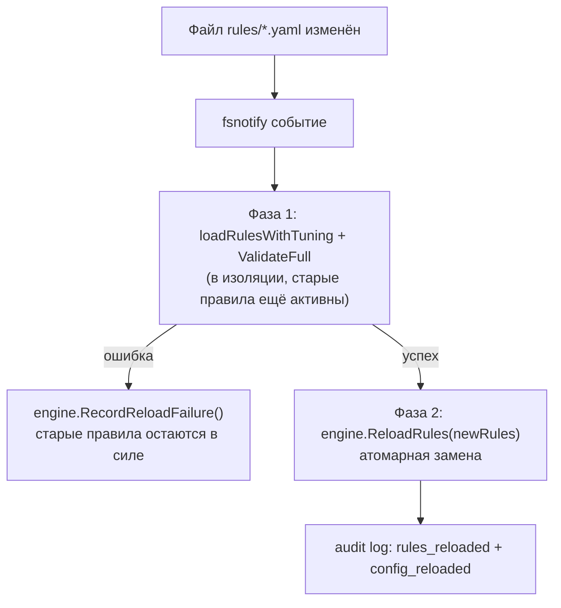

# Глава 8. Руководство по написанию правил + встроенные наборы

> Уровень: **средний**. Предполагает главу [7](07-correlation-engine.md).

## Зачем это нужно

Глава 7 разобрала *движок*, который исполняет правила: как условие
превращается в `opCode`, как работает `condition_group`, как считается
DNS entropy. Эта глава — про другую сторону того же интерфейса: как
человеку писать сами правила в `rules/*.yaml`, что уже поставляется
«из коробки» в 49 файлах, как эти правила проверяются перед тем как
попасть в прод, и как понять, какая доля MITRE ATT&CK уже покрыта.
Аналогия: глава 7 — это «как работает светофор внутри», эта глава —
«как разметить перекрёсток знаками».

## Анатомия правила

Правило — это один YAML-документ внутри списка `rules:` в файле
`rules/*.yaml`. Минимальный набор полей:

```yaml
rules:
  - id: rule_unique_id       # уникальный идентификатор, используется в rate limiting и алертах
    name: "Человеко-читаемое имя"
    description: "Что именно детектирует правило и почему это подозрительно"
    event_type: syscall | network | file | tls | dns
    condition:                # ИЛИ condition_group (глава 7) — не оба сразу
      field: "имя_поля"
      op: in | not_in | eq | neq | prefix | suffix | regex | gt | lt | gte | lte | contains | in_cidr | not_in_cidr
      values: [...]
    severity: info | warning | critical
    action: alert | block | kill | throttle | drop
    tags: [owasp, cve, container-escape, ...]   # опционально, для фильтрации и MITRE-покрытия
    mitre:                    # опционально, для coverage-matrix.md
      tactic: "Impact"
      technique: "T1496"
```

Поле `id` обязано быть уникальным — по нему работает per-rule rate
limiter (глава 7) и фильтрация в CLI (`ebpf-guard rules`). `severity` и
`action` — типизированные значения (`types.AlertSeverity`,
`correlator.RuleAction`, `internal/correlator/rules.go:280-281`);
опечатка в этих полях отклоняется при загрузке, а не тихо превращается
в правило с `severity: ""`.

### `action`: что происходит при совпадении

| `action:` | Эффект |
|---|---|
| `alert` | Только сгенерировать алерт (по умолчанию для большинства встроенных правил) |
| `block` | Алерт + попытка активной блокировки через `internal/enforcer` (глава 12) |
| `kill` | Алерт + завершение процесса |
| `throttle` | Алерт + ограничение процесса (например, приостановка сети) |
| `drop` | Событие отбрасывается без алерта — используется для подавления шума на уровне правила, а не только через `exceptions` |

Реальная блокировка/kill выполняется `internal/enforcer` только если
он сконфигурирован (`block_backend: log/nftables/lsm`, см. главу 12) —
правило лишь **запрашивает** действие, решение о фактическом
исполнении и режим `dry_run` — за enforcer'ом.

### Пример с одиночным условием

`rules/container-escape.yaml:10-19`:

```yaml
- id: container_escape_mount
  name: "Container Escape: Mount syscall from container"
  description: "Container process executed mount syscall (attempting to access host filesystem)"
  event_type: syscall
  condition:
    field: nr
    op: in
    values: ["165"]  # mount syscall
  severity: critical
  action: alert
  tags: [container-escape, privilege-escalation, mount, cis]
```

Читается так: любое `syscall`-событие, где номер системного вызова
(`nr`) равен 165 (`mount(2)` на x86-64), считается подозрительным —
контейнеризированные процессы почти никогда не должны монтировать
файловые системы напрямую.

### Пример с `condition_group` (AND/OR)

`rules/ransomware.yaml:12-25` комбинирует «что произошло» с «кто это
не должен был делать» через `condition_group` (детали механики — в
главе 7, `evaluateConditionGroup`, `rules.go:856-882`):

```yaml
- id: ransomware_mass_rename
  event_type: syscall
  condition_group:
    operator: and
    conditions:
      - field: nr
        op: in
        values: ["82"]   # rename(2) x86-64
      - field: proc.comm
        op: not_in
        values: ["mv", "rsync", "git", "dpkg", "rpm", "apt", "pip", "pip3",
                 "npm", "yarn", "cargo", "go", "vim", "emacs", "nano",
                 "cp", "install", "make", "cmake", "meson", "gradle"]
  severity: critical
  action: alert
  tags: [mitre:T1486, ransomware, impact]
```

Смысл: `rename(2)` сам по себе — совершенно нормальный вызов, шум от
него был бы огромным. Но `rename` **не от одного из легитимных
инструментов** (`proc.comm not_in [...]`) — гораздо более узкий и
информативный сигнал: именно так ransomware переименовывает файлы
после шифрования (`file.txt` → `file.txt.locked`), и обычные утилиты
для сборки/пакетных менеджеров/VCS в этот список не попадают.

### `exceptions`: подавление ложных срабатываний без переписывания условия

Помимо `condition`/`condition_group`, у правила может быть список
`exceptions` (`Rule.Exceptions`, `rules.go:285`) — если событие
попадает под основное условие, но **также** совпадает с одним из
исключений, алерт не генерируется. Это позволяет один раз описать
детектирующее условие и отдельно, локально, подстроить его под
конкретную среду (см. также `local-tuning.yaml.example` — оверлей
исключений поверх встроенных правил без правки самих файлов правил).

## Hot-reload: правила перечитываются без рестарта

`rules.hot_reload: true` (по умолчанию, `internal/config/config.go:1937`)
включает `fsnotify`-наблюдение за файлом конфигурации/правил
(`cfgManager.Watch()`). При изменении файла срабатывает двухфазный
процесс в `cmd/ebpf-guard/main.go:1164-1206`:



Ключевой момент — **валидация до подмены**: если новый файл содержит
синтаксическую ошибку, неизвестный `field` или невалидный regex, старый
набор правил продолжает работать, а в лог уходит `hot-reload aborted:
validation failed` (`main.go:1172-1177`). Живой трафик никогда не
остаётся без правил из-за опечатки в YAML.

## Проверка правил перед продакшеном: `ebpf-guard rules test` и `rules check`

Два независимых инструмента, для разных вопросов:

**`ebpf-guard rules test`** — «сколько алертов сработало бы на реальных
исторических событиях» (`cmd/ebpf-guard/main.go:2365-2432`). Читает
JSONL event log (пишется агентом при `event_log.enabled: true`),
прогоняет его через одно правило и печатает сводку:

```bash
ebpf-guard rules test --rule rules/cryptominer.yaml --replay 24h
ebpf-guard rules test --rule my-rule.yaml --replay 1h --limit 50
```

Полезно перед включением нового правила в проде: если `--replay 7d`
на реальных данных кластера даёт 40 000 совпадений, порог явно надо
затянуть, прежде чем ставить `action: block`.

**`ebpf-guard rules check`** — декларативные unit-тесты для правил на
**синтетических** событиях, без ядра и без реального трафика
(`cmd/ebpf-guard/main.go:2440-2470`). Обнаруживает файлы `*_test.yaml`,
прогоняет каждый через движок и печатает результат в формате TAP v13
(плюс опционально JUnit XML для CI):

```bash
ebpf-guard rules check ./tests/rules/
ebpf-guard rules check ./tests/rules/ --junit results.xml
```

Разница на практике: `rules check` отвечает на вопрос «правило вообще
работает так, как я задумал?» (регрессионный тест, гоняется в CI на
каждый PR), `rules test` — «как это правило поведёт себя на *моих*
реальных данных прямо сейчас?» (разовая проверка перед раскаткой).

## Обзор встроенных наборов правил (`rules/`)

В репозитории 49 YAML-файлов с правилами (не считая
`checksums.sha256`, каталогов `custom/`, `osint/`, `rego/` и
`local-tuning.yaml.example` — оверлея, а не набора правил). Сгруппируем
по смыслу:

| Категория | Файлы | Что покрывают |
|---|---|---|
| Kubernetes / облако | `cis-k8s.yaml`, `k8s-attacks.yaml`, `cloud-threats.yaml`, `cloud-attacks-extended.yaml`, `aks-threats.yaml`, `eks-threats.yaml`, `gke-threats.yaml` | CIS Kubernetes Benchmark, атаки на control plane, специфика конкретных managed-K8s (AKS/EKS/GKE) |
| Побег из контейнера | `container-escape.yaml` | mount/pivot_root, доступ к host-путям, Docker/containerd sockets |
| Веб / приложения | `owasp-web.yaml`, `application-exploits.yaml`, `web-attacks-enhanced.yaml`, `web-attacks-network.yaml`, `webshell-detection.yaml` | OWASP Top 10 паттерны, web shell'ы, эксплуатация приложений |
| Криптомайнинг / C2 | `cryptominer.yaml`, `command-and-control.yaml`, `mining-pools.txt` (список IP/доменов для `MiningPoolDetector`, глава 7) | Известные mining-порты/пулы, C2-паттерны |
| DNS / TLS сеть | `dns-threats.yaml`, `tls-patterns.yaml`, `tls-fingerprints.yaml`, `network-anomaly.yaml`, `network-intrusion.yaml` | DGA-домены (энтропия, глава 7), аномальные TLS/сетевые паттерны |
| Вымогатели / целостность | `ransomware.yaml`, `file-integrity-extended.yaml`, `kernel-integrity.yaml`, `runtime-integrity.yaml`, `rootkit-detection.yaml`, `bpf-rootkit.yaml`, `ebpf-subversion.yaml` | Массовое переименование/шифрование, руткиты, подмена собственного BPF-инструментария |
| MITRE-тактики отдельными файлами | `initial-access.yaml`, `persistence.yaml`, `persistence-extended.yaml`, `privesc.yaml`, `defense-evasion.yaml`, `credential-access.yaml`, `credential-and-defense-gaps.yaml`, `lateral-movement.yaml`, `collection-and-evasion-gaps.yaml`, `data-exfiltration.yaml`, `exfiltration-extended.yaml`, `impact-gaps.yaml`, `reconnaissance.yaml`, `process-injection.yaml`, `living-off-the-land.yaml`, `mitre-additional.yaml` | Закрывают конкретные тактики/техники ATT&CK, которые не укладываются в тематические файлы выше |
| Экзотика / нишевые векторы | `iouring.yaml`, `gpu-threats.yaml`, `supply-chain.yaml`, `sigma-linux.yaml` (импорт Sigma-правил под Linux), `drift-rules.yaml` (см. `internal/drift`, глава 11) | io_uring-based syscall bypass, GPU-майнинг/эксплуатация, supply-chain, дрейф поведения |

`custom/` — место для правил, которые пишет сам оператор кластера и
которые не входят в поставку; `osint/` и `rego/` — не YAML-правила
движка корреляции, а данные OSINT-обогащения и Rego-политики
(разбираются в главе 10).

## MITRE ATT&CK покрытие

[`docs/coverage-matrix.md`](../coverage-matrix.md) — таблица,
сопоставляющая каждую технику MITRE ATT&CK for Linux/Containers/K8s с
тем, каким файлом(-ами) правил она покрыта (✅/⚠️/❌), например:

```
| Exploit Public-Facing Application | T1190 | ✅ | `initial-access.yaml`, `application-exploits.yaml`, `sigma-linux.yaml`, `webshell-detection.yaml` |
```

Матрица честно помечает и непокрытые техники с причиной (например,
`Phishing: Spearphishing Attachment` — ❌, «content-inspection not
feasible in kernel»): ebpf-guard видит syscalls/сеть/файлы, а не
содержимое писем, и не претендует на покрытие того, что физически не
может увидеть с точки наблюдения в ядре.

## Мини-туториал: написать своё правило end-to-end

1. **Сформулировать сигнал.** Пример: «алерт, если внутри контейнера
   кто-то читает `/etc/shadow` не через штатный `passwd`/`sshd`».
2. **Выбрать `event_type` и поле.** Это `file`-событие, поле
   `filename` (см. главу 6 про то, откуда коллектор берёт это поле) и
   `proc.comm` для исключения легитимных процессов.
3. **Написать YAML** (например, в `rules/custom/read-shadow.yaml`):

   ```yaml
   rules:
     - id: custom_shadow_read
       name: "Unusual read of /etc/shadow"
       description: "A process other than passwd/sshd/login read /etc/shadow"
       event_type: file
       condition_group:
         operator: and
         conditions:
           - field: filename
             op: eq
             values: ["/etc/shadow"]
           - field: proc.comm
             op: not_in
             values: ["passwd", "sshd", "login", "su", "sudo", "unix_chkpwd"]
       severity: critical
       action: alert
       tags: [credential-access, custom]
       mitre:
         tactic: "Credential Access"
         technique: "T1003.008"
   ```

4. **Прогнать синтетический тест** — `ebpf-guard rules check` с
   `*_test.yaml`, описывающим синтетическое событие «читает shadow из
   `cat`» (должно сработать) и «читает shadow из `sshd`» (не должно).
5. **Проверить на исторических данных** (если есть event log):
   `ebpf-guard rules test --rule rules/custom/read-shadow.yaml --replay 24h`
   — убедиться, что легитимные процессы в вашем кластере не попадают
   под условие.
6. **Включить hot-reload** — правило подхватится автоматически, без
   рестарта агента, как только файл окажется в `rules.path`.

## Дальше почитать

- [CLAUDE.md — Detection Rules](../../CLAUDE.md#detection-rules-rulesyaml) — краткий справочник формата правил.
- [`internal/correlator/rules.go`](../../internal/correlator/rules.go) — реализация `Rule`/`RuleEngine` (разобрана в главе 7).
- [docs/coverage-matrix.md](../coverage-matrix.md) — полная MITRE ATT&CK матрица покрытия.
- [Sigma project](https://github.com/SigmaHQ/sigma) — формат, из которого импортированы правила `sigma-linux.yaml`.
- [MITRE ATT&CK for Containers](https://attack.mitre.org/matrices/enterprise/containers/) — матрица техник, на которую опирается `tags`/`mitre` в правилах.

## Глоссарий

- **`exceptions`** — список условий-исключений в правиле: совпадение с любым из них подавляет алерт даже при совпадении основного условия.
- **`action: drop`** — событие отбрасывается без генерации алерта; способ подавить шум на уровне самого правила.
- **Hot-reload** — автоматическая перезагрузка правил по `fsnotify` с обязательной полной валидацией нового набора до атомарной замены старого.
- **TAP v13** (Test Anything Protocol) — текстовый формат вывода результатов тестов, который печатает `ebpf-guard rules check`.
- **Coverage matrix** — таблица соответствия «техника MITRE ATT&CK → файл(ы) правил», `docs/coverage-matrix.md`.

---

**Назад:** [Глава 7. Движок корреляции и DSL правил](07-correlation-engine.md) · **Далее:** Глава 9. Профайлер и аномалии *(в работе)*
