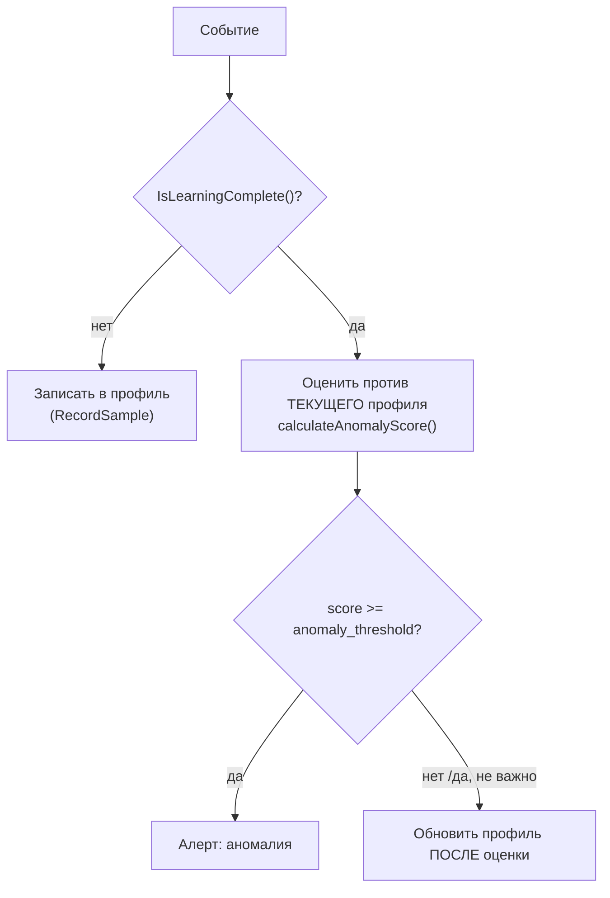
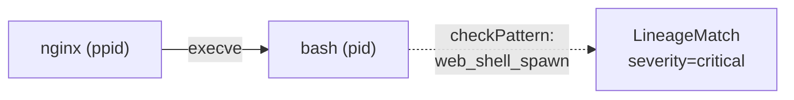
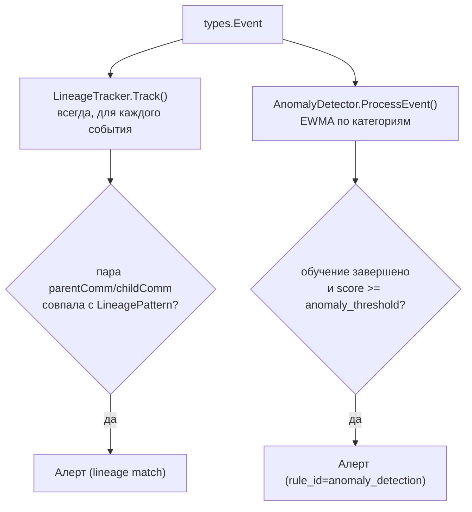

# Глава 9. Профайлер и аномалии (`internal/profiler/`)

> Уровень: **средний**. Предполагает главы [7](07-correlation-engine.md)–[8](08-writing-rules.md).

## Зачем это нужно

YAML-правила из главы 8 умеют детектировать только то, что кто-то
явно описал заранее — «этот syscall», «этот путь», «этот порт».
Но что делать с атакой, которая не нарушает ни одно конкретное
правило, а просто **не похожа** на то, как обычно ведёт себя этот
процесс? Например, `nginx`, который годами открывал только порт 80,
вдруг открывает исходящее соединение на порт 4444. `internal/profiler/`
решает эту задачу иначе, чем `internal/correlator`: вместо
статических условий он **учится** нормальному поведению каждого
рабочего профиля (workload) и поднимает алерт, когда наблюдаемое
событие статистически на него не похоже. Аналогия: правила из главы
8 — это охранник со списком «известных плохих людей», профайлер — это
охранник, который просто запомнил лица сотрудников и замечает
незнакомца.

## EWMA: экспоненциально взвешенное скользящее среднее

В основе — предельно простой, но эффективный статистический
инструмент. `EWMA` (`internal/profiler/baseline.go:11-16`) хранит одно
плавающее число — «насколько типично» некоторое значение (например,
«как часто процесс `X` открывает порт `Y`»), и после каждого нового
наблюдения обновляет его по формуле:

```go
// internal/profiler/baseline.go:34-46
func (e *EWMA) Update(observation float64) {
	if e.count == 0 {
		e.value = observation
	} else {
		// new_value = weight * observation + (1 - weight) * old_value
		e.value = e.weight*observation + (1-e.weight)*e.value
	}
	e.count++
}
```

Интуиция: `weight` (вес свежего наблюдения) близкий к 1 делает среднее
почти мгновенно реагирующим на изменения (мало «памяти» о прошлом);
вес, близкий к 0, делает его очень инерционным. `NewEWMA` (`baseline.go:21-30`)
принудительно отбрасывает `weight <= 0` или `weight > 1` в пользу
значения по умолчанию `0.3` — ровно то же число, что стоит по
умолчанию в конфиге (см. ниже), так что даже без явной настройки
поведение предсказуемо.

Профайлер держит **отдельный `EWMA`-счётчик на каждое наблюдаемое
значение** — не «средняя частота syscalls вообще», а, например, «как
часто конкретно этот процесс делает `connect()` на порт 22» — так
аномалия ловится на уровне конкретного поведенческого признака, а не
общей активности процесса.

## `BaselineLearner`: сначала учимся, потом судим

Прежде чем профайлер начнёт генерировать алерты, ему нужно накопить
достаточно данных о нормальном поведении — иначе первые же события
после запуска агента будут ошибочно помечены как аномалии просто
потому, что EWMA ещё пуст. `BaselineLearner` (`baseline.go:71-186`)
отслеживает этот период обучения: `IsLearningComplete()`
(`baseline.go:104-113`) возвращает `true`, только когда **одновременно**
прошло не меньше `learning_period` секунд **и** накоплено не меньше
`min_learning_samples` образцов — оба условия защищают от двух разных
проблем: слишком короткого по времени, но «богатого событиями» окна
(мало реального разнообразия поведения) и достаточно долгого, но
почти бессобытийного (мало сэмплов).

Ключевой нюанс порядка операций в `AnomalyDetector.ProcessEvent`
(`anomaly.go:160-207`): **пока идёт обучение**, событие только
записывается в профиль, алерт не генерируется. **После** завершения
обучения каждое новое событие сначала **оценивается** относительно
уже накопленного профиля, и только *затем* профиль обновляется этим
событием. Порядок важен: если бы профиль обновлялся раньше оценки,
атака сама «нормализовала» бы себя — после первого же вредоносного
соединения EWMA сдвинулся бы в его сторону, и повторные попытки той
же атаки перестали бы казаться аномальными.



## Категории поведения и итоговый скор

`anomaly.go` считает score отдельно по нескольким категориям —
`analyzeNetworkBehavior` (`anomaly.go:294`), `analyzeFileBehavior`
(`anomaly.go:358`), `analyzeGPUBehavior` (`anomaly.go:447`),
`analyzeSyscallBehavior` (`anomaly.go:524`). Логика одна и та же для
всех: для наблюдаемого значения (порт, адрес, директория, расширение
файла, GPU-операция, номер syscall) находится соответствующий `EWMA`;
если значение уже встречалось — `score = 1.0 - freq` (чем чаще
встречалось, тем ниже «странность»); если значение видится впервые —
фиксированный штраф в диапазоне 0.4–1.0 в зависимости от категории.
Итоговый score обрезается в `[0, 1]` и сравнивается с порогом
`anomaly_threshold` (`anomaly.go:286-287`).

## Конфигурация: `learning_period`, `anomaly_threshold`, `ewma_weight`

`internal/config/config.go`, `ProfilerConfig` (строки 949-988):

```go
type ProfilerConfig struct {
	Enabled            bool
	LearningPeriod     int                    `mapstructure:"learning_period"`
	MinLearningSamples uint64                 `mapstructure:"min_learning_samples"`
	AnomalyThreshold   float64                `mapstructure:"anomaly_threshold"`
	EWMAWeight         float64                `mapstructure:"ewma_weight"` // deprecated
	EWMA               EWMASettings           `mapstructure:"ewma"`
	ProfileTTL         int
	MaxTrackedPIDs     int
	Sequence           SequenceProfilerConfig `mapstructure:"sequence"`
	Lineage            LineageTrackerConfig   `mapstructure:"lineage"`
	// ...
}
```

Значения по умолчанию (`config.go:1954-1981`):

```yaml
profiler:
  learning_period: 3600     # секунд — час без алертов, только обучение
  anomaly_threshold: 0.8    # score >= 0.8 -> алерт
  ewma_weight: 0.3          # то же значение, что дефолт NewEWMA
```

- **`learning_period`** — сколько секунд `BaselineLearner` копит
  данные, прежде чем `AnomalyDetector` начнёт судить, а не только
  записывать.
- **`anomaly_threshold`** — порог итогового score (0.0–1.0), выше
  которого событие считается аномалией. Чем ниже порог, тем
  чувствительнее детектор и тем больше ложных срабатываний.
- **`ewma_weight`** — вес свежего наблюдения для *каждого* внутреннего
  `EWMA`-счётчика профиля. Поле помечено как deprecated в пользу
  вложенного `profiler.ewma.weight` (схема v0.2.0) — при заданном
  вложенном значении оно побеждает флоское (`config.go:1862`,
  `cfg.Profiler.EWMAWeight = cfg.Profiler.EWMA.Weight`).

## `SequenceProfiler`: анализ *порядка* системных вызовов

EWMA-профиль выше анализирует значения по отдельности («какой порт»,
«какое расширение файла»), но не порядок событий. `SequenceProfiler`
(`sequence.go`) заходит с другой стороны: он строит вектор частот
системных вызовов за скользящее окно (`FrequencyVector`, 512 слотов)
и сравнивает его с базовым вектором через **косинусное расстояние**:

```go
// internal/profiler/sequence.go:421-450 (упрощено)
func cosineDistance(a, b FrequencyVector) float64 {
	var dotProduct, normA, normB float64
	for i := range a {
		dotProduct += a[i] * b[i]
		normA += a[i] * a[i]
		normB += b[i] * b[i]
	}
	if normA == 0 || normB == 0 {
		return 1.0
	}
	cosineSim := dotProduct / (math.Sqrt(normA) * math.Sqrt(normB))
	return 1.0 - cosineSim // 0 = идентичны, 1 = ортогональны
}
```

Идея косинусного расстояния: два вектора считаются похожими, если
похоже **направление** их частот (какая доля вызовов приходится на
какой syscall), а не абсолютное число вызовов — процесс, который
делает вдвое больше того же самого, но в тех же пропорциях, не
считается аномальным. Порог по умолчанию — `0.3`
(`DefaultSequenceConfig`, `sequence.go:47-53`). Дополнительно
`SequenceProfiler` умеет учитывать Марковскую модель переходов между
вызовами (`markov.go`) и берёт итоговое расстояние как максимум из
косинусного и марковского скора (`sequence.go:326-329`) — так ловится
не только «набор вызовов изменился», но и «порядок вызовов стал
нетипичным» при том же наборе.

> **Важная оговорка про то, где это реально включено в конвейер.**
> `SequenceProfiler.Update` вызывается из фасада `Profiler.Ingest`
> (`profiler.go:183`), но в `cmd/ebpf-guard/main.go` (строки 420-432)
> `profiler.Profiler` создаётся только для того, чтобы забрать из него
> `LineageTracker` (передаётся в движок корреляции) и
> `SequenceProfiler` (регистрируется у watchdog'а как
> `ControllableProfiler` для сжатия окна под memory pressure, глава
> 15) — сам `Profiler.Ingest()`, а значит и путь с косинусным
> расстоянием, из живого потока событий **не вызывается**;
> `CorrelationEngine` держит собственный `AnomalyDetector` (EWMA) и
> `LineageTracker` напрямую, без прохода через `Profiler`-фасад.
> Другими словами: EWMA-детектор аномалий (выше) работает на реальном
> трафике, а `SequenceProfiler`/косинусное расстояние на момент
> написания этой главы задействованы в коде и покрыты тестами, но не
> подключены к живому event loop — стоит свериться с
> `internal/correlator/engine.go` перед тем, как полагаться на этот
> механизм в проде.

## `LineageTracker`: цепочки атак через родословную процессов

Многие атаки — это не одно подозрительное событие, а характерная
**последовательность порождения процессов**: веб-сервер неожиданно
порождает шелл, шелл порождает сетевой инструмент. `LineageTracker`
(`lineage.go:131-138`) хранит родословную процессов в 16 шардах (по
PID, тот же приём, что и `ShardedEventBuffer` из главы 7) и на каждое
событие:

1. Определяет `(ppid, parentComm)` — предпочтительно из поля события,
   заполненного BPF-коллектором напрямую (`e.ParentComm`), либо, если
   его нет, читает `/proc/<ppid>/status` (`readProcStatus`,
   `lineage.go:430`).
2. Обновляет цепочку предков процесса, поднимаясь вверх по шардам, не
   удерживая два шардовых мьютекса одновременно (`buildAncestry`,
   `lineage.go:326`), при необходимости достраивая её через `/proc`
   (`buildChainFromProc`, `lineage.go:384`).
3. Сравнивает пару `(parentComm, childComm)` с настроенными
   `LineagePattern` (`checkPattern`, `lineage.go:503`).

Пример встроенного паттерна (`DefaultLineageConfig`,
`lineage.go:57-87`):

```go
{
    Name:        "web_shell_spawn",
    ParentComms: []string{"nginx", "apache2", "node", "python", "python3"},
    ChildComms:  []string{"sh", "bash", "dash"},
    Severity:    "critical",
}
```

Смысл: `nginx`, порождающий `bash`, — не то, что делает нормальный
веб-сервер; это классический признак web shell. Другие встроенные
паттерны: `shell_network_tool` (шелл → `curl`/`wget`/`nc`, critical)
и `shell_recon_tool` (шелл → `nmap`/`dig`, warning). Паттерн может
дополнительно проверять произвольное поле события через
`LineageCondition` (`evaluateLineageCondition`, `lineage.go:519`) —
например, ограничить срабатывание конкретным UID.

`GetProcessTree(pid)` (`lineage.go:308`) возвращает полную цепочку
предков (`types.ProcessTree`) — этим пользуется движок корреляции,
чтобы приложить дерево процессов к каждому алерту как контекст для
расследования, даже если сам алерт сработал не по lineage-паттерну.



## Как это укладывается в общий конвейер



`AnomalyDetector` и `LineageTracker`, вызываемые напрямую из
`CorrelationEngine.ingestWithAD`, работают **параллельно** YAML-правилам
из главы 8 — оба пути могут сгенерировать алерт по одному и тому же
событию независимо друг от друга.

## Дальше почитать

- [`internal/profiler/baseline.go`](../../internal/profiler/baseline.go), [`anomaly.go`](../../internal/profiler/anomaly.go), [`sequence.go`](../../internal/profiler/sequence.go), [`lineage.go`](../../internal/profiler/lineage.go) — полная реализация.
- [Exponential smoothing (Wikipedia)](https://en.wikipedia.org/wiki/Exponential_smoothing) — математика EWMA.
- [Cosine similarity (Wikipedia)](https://en.wikipedia.org/wiki/Cosine_similarity) — база для `cosineDistance`.
- Глава 15 — про watchdog и `ControllableProfiler` (сжатие профилей под memory pressure).

## Глоссарий

- **EWMA (Exponentially Weighted Moving Average)** — экспоненциально взвешенное скользящее среднее; даёт больший вес недавним наблюдениям.
- **Baseline (базовый профиль)** — накопленное за период обучения представление «нормального» поведения конкретного workload'а.
- **Anomaly score** — число `[0, 1]`, отражающее, насколько событие статистически не похоже на базовый профиль; сравнивается с `anomaly_threshold`.
- **Cosine distance (косинусное расстояние)** — мера непохожести направления двух векторов частот; `0` — идентичны, `1` — ортогональны.
- **Lineage (родословная процесса)** — цепочка предков процесса (`parentComm` → `comm` → ...), используемая для детекции характерных цепочек атак.

---

**Назад:** [Глава 8. Руководство по написанию правил](08-writing-rules.md) · **Далее:** [Глава 10. Policy engine (Rego/OPA)](10-policy-engine.md)
