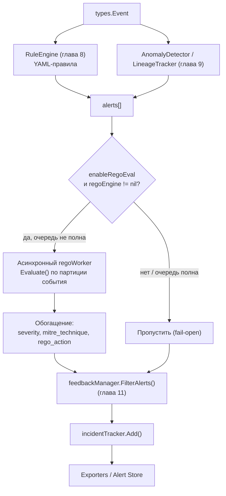

# Глава 10. Policy engine (`internal/policy/`, Rego/OPA)

> Уровень: **средний**. Предполагает главы [7](07-correlation-engine.md)–[9](09-profiler-anomalies.md).

## Зачем это нужно

YAML-правила (глава 8) хорошо выражают вопросы вида «это конкретное
поле события совпало с этим конкретным значением». Но иногда решение
зависит от **комбинации фактов из разных источников** — «это шелл,
и он порождён процессом, который является веб-сервером, и это не
файловая операция» — то есть от небольшой логической программы, а не
от одного условия. Для этого в ebpf-guard встроен опциональный слой
policy engine на [Open Policy Agent (OPA)](https://www.openpolicyagent.org/)
и его языке Rego: `internal/policy/` с политиками в `rules/rego/`.
Важно сразу понимать его место в конвейере: это **пост-фильтр**,
который работает **после** того, как YAML-движок уже сгенерировал
алерты (не до), и может их обогатить или переписать — а не альтернативный
способ породить событие с нуля.

## Rego — опциональная зависимость через build tag

`internal/policy/` состоит из двух файлов с одинаковым публичным API,
но взаимоисключающими build tag'ами:

- `rego_enabled.go` (`//go:build rego`) — настоящая реализация на
  `github.com/open-policy-agent/opa/rego`.
- `rego_disabled.go` (`//go:build !rego`) — no-op заглушка с тем же
  интерфейсом.

Это значит, что зависимость от OPA (заметно увеличивающая размер
бинарника) по умолчанию **не собирается** в `ebpf-guard`; чтобы
включить Rego-политики, нужно собрать с тегом:

```bash
go build -tags rego -o build/ebpf-guard ./cmd/ebpf-guard
```

Без тега `policy.rego.enabled: true` в конфиге просто ни на что не
влияет — заглушка молча ничего не оценивает.

## `RegoEngine`: партиционированная компиляция политик

```go
// internal/policy/rego_enabled.go:68-83 (сокращено)
type RegoEngine struct {
	prepared    *rego.PreparedEvalQuery            // полный запрос по всем модулям
	partitioned map[string]*rego.PreparedEvalQuery // запрос под конкретный тип события
	policies    map[string]string                  // имя файла -> содержимое
	rulesDir    string
	enabled     atomic.Bool
	// счётчики: evalDuration, evalTotal, evalErrors, reloadCounter
}
```

`loadPolicies()` читает все `*.rego` из `rulesDir` (кроме
`*_test.rego`), а `compile()` не просто готовит один общий запрос к
`data.ebpf_guard.decisions` — он **дополнительно** строит отдельные
подготовленные запросы на каждый тип события (`syscall`, `network`,
`file`, `dns`, ...), каждый из которых загружает только релевантные
`.rego`-модули (например, партиция `syscall` включает
`base.rego + process_injection.rego + lineage.rego`, а не весь
`rules/rego/`). Смысл — производительность: `Evaluate()` выбирает
партицию, соответствующую типу события алерта, вместо того чтобы
каждый раз прогонять OPA-запрос по всем политикам сразу — по
комментарию в коде это ускоряет оценку в 2–4 раза.

## Структура политики: `base.rego` + модули по типам событий

`rules/rego/` — восемь файлов политик (`admission.rego`, `base.rego`,
`dns.rego`, `file.rego`, `k8s.rego`, `lineage.rego`, `network.rego`,
`process_injection.rego`) плюс `test/` с юнит-тестами на самих Rego
(`lineage_test.rego`, `network_test.rego`). `base.rego` — пакет
`ebpf_guard`, который объединяет наборы `rules[...]` из всех
под-пакетов в общий `decisions[...]`:

```rego
# rules/rego/base.rego
package ebpf_guard

decisions[{"rule_id": rule_id, "severity": severity, "message": msg,
           "action": action, "mitre_technique": mitre, "matched": true}] {
	some rule
	data.ebpf_guard.rules[rule]
	rule.matched
	rule_id := rule.rule_id
	severity := rule.severity
	msg := rule.message
	action := rule.action
	mitre := rule.mitre_technique
}

rules[rule] { some r; data.ebpf_guard.lineage.rules[r]; rule := r }
rules[rule] { some r; data.ebpf_guard.network.rules[r]; rule := r }
rules[rule] { some r; data.ebpf_guard.file.rules[r]; rule := r }
# ... и так же для dns, process_injection, k8s
```

Пример конкретного правила — `rules/rego/lineage.rego`:

```rego
package ebpf_guard.lineage

# MITRE ATT&CK: T1059 - Command and Scripting Interpreter
rules[{"rule_id": "reverse_shell_webserver", "severity": "critical",
       "message": msg, "action": "alert",
       "mitre_technique": "T1059", "matched": true}] {
	input.event.parent_comm
	is_webserver(input.event.parent_comm)
	is_shell(input.comm)
	not input.event.file  # не файловая операция
	msg := sprintf("Potential reverse shell: %s spawned from %s (pid=%d)",
	               [input.comm, input.event.parent_comm, input.pid])
}
```

Это ровно тот же класс сигнала, что lineage-паттерны профайлера из
главы 9 (`web_shell_spawn`), но выраженный декларативно на Rego, с
дополнительным условием `not input.event.file` и явным
`mitre_technique` прямо в теле правила — в этом разница подходов:
`LineageTracker` — быстрый встроенный механизм с фиксированным набором
Go-структур, Rego — расширяемый DSL общего назначения для операторов,
которые хотят писать собственную логику без пересборки бинарника (в
пределах уже собранного с `-tags rego`).

Также в `lineage.rego` есть правило `container_escape_proc`, которое
использует хелпер `is_container_escape_path(path)` — проверяет пути
вида `/proc/1/root`, `/proc/self/root`, `/proc/self/cwd/../` —
характерные обходы через `/proc` для выхода из контейнера (тот же
класс атак, что `rules/container-escape.yaml` из главы 8, но
проверенный отдельным движком).

## Место в конвейере: пост-фильтр после YAML-правил

Rego **не** заменяет `RuleEngine` и не видит сырые события первым —
он получает на вход уже сгенерированные алерты. В
`internal/correlator/engine.go`, `ingestWithAD`, к моменту вызова
Rego уже отработали YAML-правила, IOC-матчер (gossip) и EWMA-детектор
аномалий:

```go
// internal/correlator/engine.go — после YAML/IOC/EWMA, до diff feedback/store
if ce.enableRegoEval && ce.regoEngine != nil && len(alerts) > 0 {
	regoCtx, regoCancel := context.WithTimeout(context.WithoutCancel(ctx), 5*time.Second)
	task := regoTask{ctx: regoCtx, cancel: regoCancel, alerts: alerts}
	ce.regoWg.Add(1)
	select {
	case ce.regoQueue <- task:
		return alerts, true // обрабатывается асинхронно воркер-пулом
	default:
		// очередь переполнена: пропустить Rego, отдать алерты как есть
	}
}
```

Важные детали:

- **Асинхронность.** Оценка Rego отправляется в очередь
  `regoQueue` и обрабатывается пулом воркеров (`regoWorker`, размер —
  `max(2, NumCPU/2)`), а не выполняется синхронно внутри `Ingest`.
  Так медленный OPA-запрос не добавляет задержку на горячем пути
  обработки события.
- **Fail-open при переполнении.** Если очередь полна
  (`select ... default`), Rego-обогащение для этой партии алертов
  просто пропускается — алерты уходят дальше **без** MITRE-обогащения,
  но не теряются.
- **Таймаут 5 секунд** на контекст оценки — зависший или медленный
  Rego-запрос не может заблокировать обработку бесконечно.

Внутри `Evaluate(ctx, alert)` (`rego_enabled.go`) движок выбирает
наименьшую подходящую партицию по типу события алерта, конвертирует
алерт в Rego `input` (`alertToInput`/`eventToInput`), выполняет
`prepared.Eval(ctx, rego.EvalInput(input))` и парсит каждое
возвращённое решение (`parseDecision`) — вытаскивая `matched`,
`rule_id`, `severity`, `message`, `action`, `mitre_technique`.

## MITRE-обогащение

Обогащение полностью **декларативно** и живёт в самих `.rego`-файлах:
каждое правило `rules[...]` включает литерал `mitre_technique`
(например, `"T1059"` в примере выше). Обвязка в
`evaluateRegoPolicies()`/`selectMostSevereDecision()` просто выбирает
самое серьёзное совпавшее решение и переписывает у исходного алерта
поля `RuleID`, `Severity`, `Message`, а также кладёт
`Details["mitre_technique"]` и `Details["rego_action"]`. То есть Rego
может не только пометить алерт техникой ATT&CK, но и **повысить**
его severity или изменить рекомендованное действие (`rego_action`) —
финальное решение по-прежнему принимает `internal/enforcer` (глава 12).

## Полный конвейер обработки события (обновлённая картина)

Главы 8 и 9 показали два независимых источника алертов (YAML-правила
и EWMA/lineage-профайлер). Rego встраивается в конвейер уже после
обоих:



## Конфигурация

`internal/config/config.go`:

```yaml
policy:
  rego:
    enabled: false          # policy.rego.enabled — требует сборки с -tags rego
    rules_dir: rules/rego   # policy.rego.rules_dir, дефолт
```

Без флага сборки `-tags rego` поле `enabled: true` не даёт эффекта —
скомпилирован no-op движок. Каталог `rules_dir` перечитывается при
изменении файлов так же, как обычные YAML-правила (fsnotify,
`reloadCounter` в `RegoEngine` инкрементируется на каждой
перекомпиляции).

## Дальше почитать

- [`internal/policy/rego_enabled.go`](../../internal/policy/rego_enabled.go) — полная реализация `RegoEngine`.
- [`rules/rego/`](../../rules/rego/) — все Rego-политики и их тесты.
- [Rego Policy Language](https://www.openpolicyagent.org/docs/latest/policy-language/) — официальная документация языка.
- [Open Policy Agent — Go integration (`rego` package)](https://www.openpolicyagent.org/docs/latest/integration/#integrating-with-the-go-api) — API, который использует `internal/policy`.

## Глоссарий

- **Rego** — декларативный язык политик Open Policy Agent, на котором написаны `rules/rego/*.rego`.
- **Партиция (partition)** — подмножество Rego-модулей, скомпилированное в отдельный `PreparedEvalQuery` под конкретный тип события — оптимизация скорости оценки.
- **Пост-фильтр** — стадия, которая обрабатывает уже сгенерированные алерты, а не сырые события; Rego в ebpf-guard именно такая стадия.
- **Fail-open** — поведение «при ошибке/перегрузке пропустить обогащение, но не потерять сам алерт»; применяется при переполнении `regoQueue`.
- **`mitre_technique`** — поле алерта, указывающее конкретную технику MITRE ATT&CK; для Rego-правил задаётся прямо в теле правила.

---

**Назад:** [Глава 9. Профайлер и аномалии](09-profiler-anomalies.md) · **Далее:** [Глава 11. Автообучение и дрейф](11-autolearn-drift.md)
