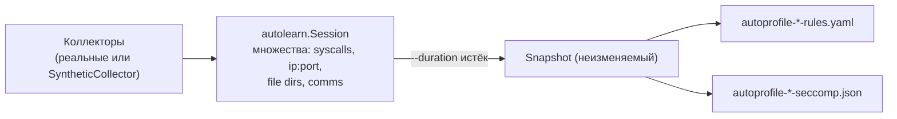
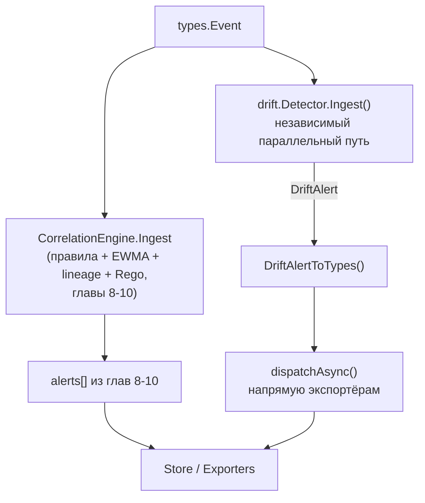

# Глава 11. Автообучение и дрейф (`internal/autolearn/`, `internal/drift/`, `internal/feedback/`)

> Уровень: **средний**. Предполагает главы [8](08-writing-rules.md)–[10](10-policy-engine.md).

## Зачем это нужно

Главы 8–10 разобрали три способа получить алерт: статические
YAML-правила, статистический EWMA/lineage-профайлер и Rego-политики.
Эта глава — про три вспомогательных механизма, которые не детектируют
атаки напрямую, а **облегчают жизнь оператору**: автоматически
сгенерировать первый набор правил вместо ручного написания «с нуля»
(автообучение), поймать поведение контейнера, которое отличается от
его собственного недавнего прошлого, а не от общих правил (дрейф), и
дать аналитику способ сказать «это ложное срабатывание» так, чтобы
агент это запомнил (feedback). Все три механизма разные по
архитектуре — важно не путать их между собой.

## `internal/profiler`: syscall allowlist (deny-unknown режим)

Прежде чем перейти к `internal/autolearn`, стоит отдельно упомянуть
`SyscallAllowlistProfiler` (`internal/profiler/allowlist.go`) —
именно он стоит за `docs/allowlist-mode.md` и конфигом
`profiler.syscall_allowlist`. Это **не** то же самое, что
`internal/autolearn` (см. ниже), хотя оба слова — «обучение». Разница
в модели угроз:

- Обычный EWMA-детектор (глава 9) считает *непрерывный* score
  «насколько странно» и требует превышения порога.
  `SyscallAllowlistProfiler` — **бинарная** deny-unknown модель: за
  период `learning_period` (по умолчанию 3600 с, тот же смысл, что и
  в главе 9) для каждого workload'а строится множество *когда-либо
  замеченных* номеров syscalls, а после окончания обучения **любой**
  незамеченный syscall — нарушение, независимо от того, насколько он
  «похож» на обычные.

```yaml
profiler:
  syscall_allowlist:
    enabled: true
    mode: learning            # "learning" -> автоматически "enforcing" после окна
    enforcing_action: alert   # alert | block | kill
    per_workload: true        # свой allowlist на каждый (comm, namespace, app_label)
    learning_period: 3600
    min_samples: 100
    sparse_threshold: 10      # workload с малым числом уникальных syscalls -> warning "sparse_profile"
    global_allow: [0, 1, 3, 9, 11, 21, 231]  # read/write/close/mmap/munmap/access/exit_group
```

`sparse_threshold` защищает от ложного чувства безопасности: если за
время обучения workload успел сделать только 5 разных syscalls (мало
трафика, короткое окно), allowlist на нём ненадёжен — профиль
помечается `sparse_profile`, а не молча включается в enforcing-режим,
как будто он полноценный. `global_allow` — список syscalls, которые
разрешены всегда, даже если ни разу не встретились за время обучения
(типичные «фоновые» вызовы, которые могут просто не успеть
проявиться в коротком окне).

Эта модель — «сильная» защита для стабильных, предсказуемых нагрузок
(веб-сервер, база данных, sidecar), где набор используемых syscalls
объективно узкий и мало меняется от деплоя к деплою; для
разнообразных или часто обновляемых приложений deny-unknown будет
давать много шума, там уместнее непрерывный EWMA-скоринг из главы 9.

## `internal/autolearn`: разовая генерация набора правил

`internal/autolearn/` — это не часть постоянно работающего конвейера
корреляции, а **отдельный CLI-инструмент**: `ebpf-guard learn`.

```bash
ebpf-guard learn --duration 5m
ebpf-guard learn --duration 10m --namespace production --output rules/generated/
ebpf-guard learn --duration 5m --comm nginx --dry-run   # без ядра, синтетические события
```

`Session` (`learner.go`) в течение заданного `--duration` копит
**множества** (не счётчики, в отличие от EWMA) наблюдаемых значений:
syscalls, адреса и порты назначения, пути и директории файлов,
имена команд, пути исполняемых файлов — опционально фильтруя по
namespace/container/comm (флаги `--namespace`, `--container`,
`--comm`). По завершении окна `Session.Run` возвращает неизменяемый
`Snapshot`, который `export.go` превращает в:

- `autoprofile-<label>-rules.yaml` — YAML-правила в формате главы 8
  (allowlist наблюдённых значений, конвертированный в набор `not_in`
  условий);
- `autoprofile-<label>-seccomp.json` — OCI seccomp-профиль
  (`SCMP_ACT_ERRNO` по умолчанию для всего, что не входит в
  наблюдённое множество) — то есть тот же самый профиль поведения
  можно применить сразу на двух уровнях: детекция на уровне
  ebpf-guard **и** блокировка на уровне ядра через стандартный
  Kubernetes seccomp.



Практический смысл: вместо того чтобы вручную писать правило вроде
«из главы 8» для незнакомого workload'а, оператор запускает `ebpf-guard
learn --duration 10m` в staging-окружении, где приложение выполняет
типичный набор операций, получает сгенерированный YAML/seccomp,
просматривает его и, если всё выглядит разумно, кладёт в `rules/`.
Это разовая офлайн-операция, а не постоянно работающий детектор — в
этом ключевое отличие от `internal/profiler` (глава 9), который учится
и оценивает непрерывно в фоне живого агента.

## `internal/drift`: поведенческий дрейф контейнера

`internal/drift.Detector` — третий, отдельный механизм. В отличие от
`autolearn` (офлайн, по требованию) и `SyscallAllowlistProfiler`
(только syscalls, ключ — per-workload), `Detector` работает постоянно,
в живом event loop, ключуется по **`ContainerID`** (из K8s-обогащения,
глава 15/20) и следит сразу за пятью категориями поведения:

| `DriftType` | Что триггерит | Severity по умолчанию |
|---|---|---|
| `new_syscall` | Номер syscall, не встречавшийся в окне обучения | `warning` |
| `new_exec` | Бинарник в системном exec-пути, которого не было в baseline | `critical` |
| `new_library` | Загружена ранее не наблюдавшаяся `.so`-библиотека | `warning` |
| `new_network` | Исходящая пара IP:порт, которой не было в baseline | `warning` |
| `new_file_dir` | Обращение к директории вне baseline | `warning` |

`new_exec` намеренно `critical`: неожиданно загруженный бинарник — это
сильный индикатор побега из контейнера, supply-chain компрометации
или living-off-the-land атаки (тот же класс угроз, что
`container-escape.yaml` из главы 8, но пойманный не по конкретному
пути, а по факту «этого бинарника раньше не было»).

Каждый контейнер получает собственный `ContainerBaseline`, который в
течение `baseline_window` (по умолчанию 5 минут) только записывает
пять множеств выше без генерации алертов; после того как окно
закрывается, baseline «замораживается», и любое новое значение в
любой из пяти категорий превращается в `DriftAlert`.

### Дрейф — это **не** `class: drift` в правилах главы 8

Важно не путать два механизма, которые оба называются «drift»:

1. **`internal/drift.Detector`** (эта глава) — самостоятельный,
   параллельный конвейер поведенческого дрейфа контейнера. В
   `cmd/ebpf-guard/main.go` он вызывается **отдельно** от движка
   корреляции, прямо в главном цикле:

   ```go
   // рядом с engine.IngestAsync(ctx, event)
   if driftDetector != nil {
       driftAlerts := driftDetector.Ingest(event)
       for _, da := range driftAlerts {
           alerts = append(alerts, drift.DriftAlertToTypes(da, seq, cfg.Drift.EnforceMode))
       }
       dispatchAsync(alerts)
   }
   ```

   Алерты дрейфа отправляются экспортёрам напрямую, **минуя**
   `RuleEngine`, EWMA-детектор и Rego — то есть это третий,
   независимый источник алертов в дополнение к двум из глав 8–9.

2. **`profiler.DriftBaselineProfiler`** (`internal/profiler/driftbaseline.go`,
   конфиг `profiler.drift_baseline`) — совершенно другой механизм:
   он **подавляет** срабатывания YAML-правил, помеченных
   `class: drift` (поле `Class` в `Rule`, глава 8), во время
   собственного окна обучения. Он вызывается **внутри**
   `CorrelationEngine.ingestWithAD`, прямо на пути обработки
   YAML-правил:

   ```go
   // internal/correlator/engine.go
   if alert.Class == string(ClassDrift) && ce.driftBaselineProfiler != nil {
       if !ce.driftBaselineProfiler.Observe(alert.RuleID, e) {
           return // подавлено — ещё период обучения для этого правила/процесса
       }
   }
   ```

Итого: если правило в `rules/*.yaml` помечено `class: drift`, за его
подавление в период обучения отвечает `profiler.DriftBaselineProfiler`
(встроен в основной путь `RuleEngine`), а полностью независимая
пятикатегорийная детекция «контейнер ведёт себя не так, как раньше»
— это `internal/drift.Detector`, работающий параллельно.



## `internal/feedback`: аналитик закрывает петлю обратной связи

Ни один из механизмов выше не идеален — рано или поздно правило,
профайлер или дрейф-детектор дадут ложное срабатывание на конкретном
процессе в конкретной среде. `internal/feedback.Manager` даёт способ
это исправить точечно, не редактируя правило (и не отключая его для
всех остальных процессов):

```go
// internal/feedback/manager.go (сокращено)
type Manager struct {
	records             []Record
	suppressions        map[suppressKey]struct{} // (ruleID, comm) -> подавлять
	anomalySuppressions map[string]struct{}      // comm -> подавлять аномалии
	exportPath          string
}
```

Цикл:

1. Аналитик вызывает `POST /api/v1/alerts/{id}/feedback` с
   `verdict: "false_positive"` (или `"true_positive"`) и текстовой
   `reason`.
2. `Manager.Submit()` записывает `Record` и, для `false_positive`,
   добавляет пару `(ruleID, comm)` в `suppressions`. Для алертов
   общего `anomaly_detection` rule ID (EWMA из главы 9) подавление
   делается **только по `comm`** — одно решение аналитика заглушает
   все будущие аномалии от процессов с этим именем, а не только
   конкретное правило.
3. Все записи персистятся в YAML-файл (`export_path`) — подавления
   переживают рестарт агента.
4. `Manager.FilterAlerts(alerts)` вызывается движком корреляции перед
   тем, как алерты уходят в incident tracker/store — как в
   асинхронном Rego-пути (после MITRE-обогащения из главы 10), так и
   в синхронном fallback-пути, если Rego отключён или очередь
   переполнена.

```
POST /api/v1/alerts/{id}/feedback
Authorization: Bearer <token>
Content-Type: application/json

{
  "verdict": "false_positive",
  "reason": "nginx health-check pattern, not an attack"
}
```

Ключевое свойство модели: подавление **специфично для процесса**
(`comm`), а не глобальное — если `nginx` регулярно триггерит
конкретное правило на легитимном health-check паттерне, аналитик
может заглушить именно эту пару `(rule_id, "nginx")`, при этом то же
самое правило продолжит нормально работать для любого другого
процесса.

## Как эти три механизма соотносятся друг с другом

| Механизм | Когда работает | Что делает | Часть постоянного конвейера? |
|---|---|---|---|
| `SyscallAllowlistProfiler` (`internal/profiler`) | Постоянно, per-workload | Deny-unknown по множеству syscalls | Да |
| `internal/autolearn` (`ebpf-guard learn`) | По требованию, разово, офлайн | Генерирует YAML-правила + seccomp из наблюдений | Нет — отдельная CLI-команда |
| `internal/drift.Detector` | Постоянно, per-container | 5 категорий поведенческого дрейфа, алерты напрямую | Да, но параллельно `CorrelationEngine` |
| `profiler.DriftBaselineProfiler` | Постоянно, per-rule (`class: drift`) | Подавляет YAML-правила в период обучения | Да, встроен в `RuleEngine`-путь |
| `internal/feedback.Manager` | По запросу аналитика через API | Подавляет будущие алерты по `(rule, comm)` | Да, финальный фильтр перед store/export |

## Дальше почитать

- [docs/allowlist-mode.md](../allowlist-mode.md) — полное руководство по syscall allowlist.
- [docs/drift.md](../drift.md) — полное руководство по `internal/drift`.
- [docs/feedback.md](../feedback.md) — полное руководство по API обратной связи.
- [`internal/autolearn/learner.go`](../../internal/autolearn/learner.go), [`internal/drift/detector.go`](../../internal/drift/detector.go), [`internal/feedback/manager.go`](../../internal/feedback/manager.go) — реализации.
- [OCI seccomp profile format](https://github.com/opencontainers/runtime-spec/blob/main/config-linux.md#seccomp) — формат, в который экспортирует `autolearn`.

## Глоссарий

- **Deny-unknown (allowlist mode)** — модель детекции, где разрешено только явно замеченное во время обучения, а не «то, что не похоже на норму».
- **Baseline (в контексте дрейфа)** — зафиксированные после `baseline_window` пять множеств поведения контейнера (syscalls/exec/libs/network/dirs).
- **Snapshot** — неизменяемый результат сессии `autolearn`, экспортируемый в YAML-правила и seccomp-профиль.
- **Suppression (подавление)** — запись `(ruleID, comm)` или `comm`, добавленная через feedback API, из-за которой будущие совпадающие алерты отбрасываются до попадания в store/экспортёры.
- **`class: drift`** — метка YAML-правила (глава 8), означающая, что оно проходит через `profiler.DriftBaselineProfiler` и подавляется в период обучения — не путать с `internal/drift.Detector`.

---

**Назад:** [Глава 10. Policy engine](10-policy-engine.md) · **Далее:** Глава 12. Enforcer — активная реакция *(в работе)*
