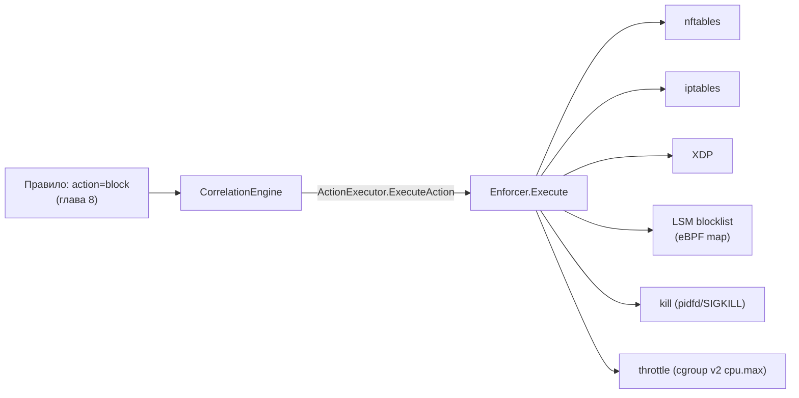

# Глава 12. Enforcer — активная реакция (`internal/enforcer/`)

> Уровень: **средний**. Предполагает главу [8](08-writing-rules.md) (поле `action` в правилах).

## Зачем это нужно

Главы 7–11 разобрали, как ebpf-guard **обнаруживает** подозрительное
поведение — правилами, EWMA-профилем, Rego-политиками. Но обнаружение
и реакция — это два разных вопроса. Правило с `action: block` (глава
8) лишь **запрашивает** блокировку; кто её реально выполняет —
`internal/enforcer`. Аналогия: правила — это охранник, который заметил
нарушителя и нажал тревожную кнопку; enforcer — это шлагбаум,
физически перекрывающий проезд. Кнопку можно нажать и без шлагбаума
(`action: alert` без enforcer'а) — тогда сработает только сигнализация,
без физической блокировки.

## Диспетчер действий: `ActionType` и `Execute`

Пять типов действий (`internal/enforcer/enforcer.go:61-80`):

```go
ActionBlock         ActionType = "block"
ActionKill          ActionType = "kill"
ActionThrottle      ActionType = "throttle"
ActionLog           ActionType = "log"
ActionLSMBlock      ActionType = "lsm_block"       // с fallback на nftables
ActionNetworkPolicy ActionType = "networkpolicy"   // генерация/применение K8s NetworkPolicy
```

`Enforcer.Execute` (`enforcer.go:311-330`) — центральная точка
диспетчеризации:

```go
func (e *Enforcer) Execute(ctx context.Context, action ActionType, alert types.Alert) error {
	if !e.enabled[action] && action != ActionLSMBlock { /* ... */ }
	switch action {
	case ActionBlock:
		return e.executeBlock(ctx, alert)
	case ActionLSMBlock:
		return e.executeLSMBlock(ctx, alert)
	case ActionKill:
		return e.executeKill(ctx, alert)
	case ActionThrottle:
		return e.executeThrottle(ctx, alert)
	case ActionNetworkPolicy:
		return e.executeNetworkPolicy(ctx, alert)
	}
}
```

`ExecuteAction(ctx, action string, alert)` (`enforcer.go:339-341`) —
тонкий адаптер, реализующий интерфейс `correlator.ActionExecutor`:
именно им пользуется движок корреляции, чтобы вызвать enforcer, не
зная о его внутреннем устройстве. Это тот же приём разделения
интерфейса и реализации, что и `LSMBlocklistManager` ниже.



## Backend'ы блокировки: `log` / `nftables` / `iptables` / `xdp`

`BlockBackend` (`enforcer.go:97-109`) выбирает, **чем** физически
блокировать трафик; конструируется в `NewEnforcer` (`enforcer.go:249-274`):

| `block_backend:` | Что происходит |
|---|---|
| `log` | Ничего не блокируется — только запись в аудит-лог (по умолчанию, безопасно для первого включения) |
| `nftables` | `NewNFTablesManager` (`nftables.go:56-92`), netlink через `google/nftables` |
| `iptables` | `NewIPTablesManager` (`iptables.go`) |
| `xdp` | `NewXDPManager` (`xdp.go`), блокировка на уровне драйвера сетевой карты |

### nftables: как устроена блокировка

`NFTablesManager` (`nftables.go:20-44`) держит `*nftables.Conn` и три
in-memory множества уже заблокированных сущностей: `blockedUIDs`,
`blockedIPs`, `blockedCgroups`. При инициализации (`initialize()`,
95-146) создаётся (или переиспользуется) таблица `ebpf-guard`
(`nftables.Table{Family: TableFamilyINet}`, 125-128) и один chain
`output` типа `filter`, hook `output`, приоритет `filter` (131-137) —
то есть правила цепляются на исходящий трафик хоста.

Три способа блокировки, каждый — отдельное netlink-правило:

- **`BlockUID`** (151-201) — правило матчит `expr.Meta{Key:
  MetaKeySKUID}` (UID сокета) и роняет пакет (`expr.VerdictDrop`,
  167-187). Блокировка не по IP, а «этому UID больше не давать
  выходить в сеть» — удобно, когда сам процесс скомпрометирован,
  независимо от того, куда он пытается достучаться.
- **`BlockIP`** (407-477) — правило читает адрес назначения из
  `expr.Payload{Base: PayloadBaseNetworkHeader, Offset: 16}` (IPv4)
  или `24` (IPv6) и сравнивает с целевым адресом (441-463).
- **`BlockCgroup`** (257-304) — двухуровневая блокировка: (1) сначала
  **замораживает** все процессы в cgroup, записывая `cgroup.freeze=1`
  (`writeCgroupControl`, 280-287) — это гарантированно останавливает
  процесс независимо от поддержки NFT_META_CGROUP ядром; (2) затем
  best-effort правило nftables по `expr.Meta{Key: MetaKeyCGROUP}`
  (требует ядро 4.18+, `addCgroupDropRule`, 348-377) для будущих
  процессов той же cgroup.

### `dry_run`: посмотреть, что было бы заблокировано, ничего не блокируя

Поле `Config.DryRun` (`enforcer.go:149`, из `cfg.DryRun`, 220)
пробрасывается в каждый backend-менеджер отдельным `DryRun`-флагом
(`NFTablesConfig.DryRun`, `IPTablesConfig.DryRun`, `XDPConfig.DryRun`
— 253, 259, 266-268). Каждый мутирующий метод nftables-менеджера
(`BlockUID`, `BlockCgroup`, `BlockIP`, `Cleanup`, ...) первым делом
проверяет `if m.dryRun` и вместо netlink-вызова просто пишет в лог
`"[DRY-RUN] Would block ..."`, обновляя только in-memory
множество отслеживаемых блокировок (например, `nftables.go:160-164`,
`213-217`, `422-426`). Практический смысл: включить `dry_run: true`
на новом кластере на неделю, посмотреть в логах/алертах, что *было бы*
заблокировано, и только затем выключить dry-run — без риска уронить
легитимный трафик из-за неточного правила. `IsDryRun()`
(`enforcer.go:795-797`) — публичный аксессор для CLI/статуса.

## LSM-блокировка: `ActionLSMBlock`

Отдельный путь — блокировка через eBPF LSM hooks (`bpf/lsm.bpf.c`,
глава 5) вместо netfilter. `Enforcer.executeLSMBlock`
(`enforcer.go:454-543`):

- Для событий `types.EventFileAccess` — блокировка **по пути**:
  `extractFilePath` (`lsm.go:13-23`) достаёт путь из
  `alert.Event.File.Filename`, `executeLSMBlockFile` (`lsm.go:41-61`)
  вызывает `lsmManager.AddPathToBlocklist(path)` (484-494).
- Для остальных событий — блокировка **по PID**: если не dry-run,
  `lsmManager.AddToBlocklist(alert.Event.PID)` (499-506); при неудаче
  — `goto nftablesFallback` (501-503) на `BlockUID` через
  nftables/iptables (511-535).

`LSMBlocklistManager` (интерфейс, `enforcer.go:113-126`) отделяет
enforcer от конкретной реализации; её даёт `collector.LSMCollector`.
Реализация (`internal/collector/lsm.go:262-367`) пишет напрямую в
eBPF-мапы `LsmBlocklist` (по PID) и `LsmPathBlocklist` (по пути) через
`ebpf.Map.Update` — то есть решение «пускать/не пускать» принимается
**в ядре**, без похода в userspace на каждый `open()`/`connect()`.
Путь хешируется FNV-1a 32-бит (`fnv32a`, `lsm.go:35-39`) — тем же
алгоритмом, что и BPF-хелпер в `bpf/lsm.bpf.c`, чтобы ядро могло
сравнивать хеш пути из `bpf_d_path()` с мапой без копирования строк в
BPF-программе.

> **Текущее ограничение.** `LSMCollector.Load()`
> (`internal/collector/lsm.go:226-243`) на момент написания этой главы
> безусловно помечает себя недоступным: «lsm_bpf_gen.go does not exist
> yet ... LSM enforcement inactive». Это значит, что
> `lsmManager.IsAvailable()` сейчас всегда `false`, и `ActionLSMBlock`
> **всегда** уходит в fallback на nftables/iptables — свериться с
> `internal/collector/lsm.go` перед тем, как рассчитывать на реальную
> LSM-блокировку в проде.

## Kill: как завершить процесс без гонки за PID

Наивный `kill(pid, SIGKILL)` небезопасен: между моментом обнаружения
события и вызовом `kill` PID мог быть переиспользован ядром для
совершенно другого, легитимного процесса. `internal/enforcer/kill.go`
решает это двумя путями в зависимости от возможностей ядра:

- **`pidfd`** (Linux 5.1+, `killViaPidfd`, 34-48) — открывает файловый
  дескриптор, привязанный именно к этому процессу
  (`unix.PidfdOpen(pid, 0)`), и посылает сигнал через
  `unix.PidfdSendSignal(fd, SIGKILL, nil, 0)`. Поскольку `pidfd`
  ссылается на конкретный процесс, а не на переиспользуемое число,
  переиспользование PID между `PidfdOpen` и `PidfdSendSignal`
  физически невозможно.
- **Fallback через `/proc`** (`killViaProc`, 50-59) — на старых ядрах
  перед `syscall.Kill(pid, SIGKILL)` заново читает
  `/proc/<pid>/comm` (`verifyPIDComm`, `enforcer.go:878-889`) и
  сверяет с именем процесса, зафиксированным BPF-коллектором в момент
  события; если имена не совпадают — PID уже переиспользован, kill не
  выполняется.

Поддержка pidfd определяется один раз при старте пакета
(`init()`, `kill.go:19-32`, пробный `unix.PidfdOpen(1,0)`);
`executeKill` (61-135) выбирает путь автоматически и инкрементирует
Prometheus-счётчик `enforcer_kill_pidfd_used_total` при использовании
pidfd-пути.

## Throttle: ограничение через cgroup v2, а не через сеть

`throttle` — не сетевая блокировка, а **ограничение CPU** через
cgroups v2 (`enforcer.go:561-635`). Путь cgroup процесса находится
через `/proc/<pid>/cgroup` (`findCgroupPath`, 638-662, под
`/sys/fs/cgroup`), после чего `applyCgroupThrottle` (620-635)
записывает в `<cgroup>/cpu.max` строку `"<quota_us> <period_us>"` —
период фиксирован в 100 мс, квота вычисляется как
`100000 * throttleCPUPercent / 100`. Например, при
`ThrottleCPUPercent = 10` (значение по умолчанию) процесс получает
10 мс CPU-времени на каждые 100 мс — не остановлен полностью, но
существенно замедлен (полезно для процесса, который явно ведёт себя
подозрительно, но убивать его сразу рискованно — например, если это
единственная реплика с состоянием).

Состояние по каждому PID (`ThrottleState{PID, LastThrottle, Count,
Active}`, 162-168) хранится в `e.throttles map[uint32]*ThrottleState`;
фоновая горутина (276-292) периодически чистит устаревшие записи через
`CleanupThrottles(maxAge)` (737-751).

## Конфигурация

`enforcer.Config` (`enforcer.go:170-197`, программный конструктор) и
его зеркало в файле конфигурации — `internal/config.EnforcementConfig`
(`internal/config/config.go:1232` и далее):

```yaml
enforcement:
  enabled: false             # без этого enforcer не создаётся вовсе
  block_backend: log         # log | nftables | iptables | xdp
  dry_run: false
  enable_block: false
  enable_kill: false
  enable_throttle: false
  throttle_cpu_percent: 10   # clamp 1-99
  throttle_max_age_minutes: 30
  throttle_cleanup_interval_minutes: 5
  audit_log: /var/log/ebpf-guard/enforcement.jsonl   # ротация при 100MB
  lsm_path_blocklist: []
```

Значения по умолчанию (`config.go:2086-2092`) сознательно
консервативны: `enabled: false`, `block_backend: log` — ничего не
блокируется, пока оператор явно не включит enforcement.

## Wiring в startup sequence

В `cmd/ebpf-guard/main.go` (539-598) enforcer создаётся **только**
если `cfg.Enforcement.Enabled` или включён упрощённый режим
`--simple`/`cfg.SimpleMode.Enabled` (`forceEnforce`, 572-574 — этот же
флаг форсирует `enable_kill`). После открытия канала аудит-лога
(539-565) собирается `enforcer.Config` из `cfg.Enforcement.*`
(575-585), вызывается `enforcer.NewEnforcer` (586), и при успехе
`engineCfg.ActionExecutor = enf` (591) — то есть enforcer
инициализируется и подключается к движку корреляции **до**
`correlator.NewCorrelationEngineWithConfig(engineCfg)` (598), в самом
начале startup-последовательности, сразу после настройки коллекторов и
OSINT.

## Дальше почитать

- [`internal/enforcer/enforcer.go`](../../internal/enforcer/enforcer.go), [`nftables.go`](../../internal/enforcer/nftables.go), [`kill.go`](../../internal/enforcer/kill.go), [`lsm.go`](../../internal/enforcer/lsm.go) — полная реализация.
- [google/nftables](https://github.com/google/nftables) — Go-библиотека для netlink-взаимодействия с nftables, используемая напрямую (не через `nft`-бинарник).
- [pidfd_send_signal(2)](https://man7.org/linux/man-pages/man2/pidfd_send_signal.2.html) — man-страница, объясняющая, почему `pidfd` устраняет гонку за PID.
- [cgroup v2: CPU controller](https://docs.kernel.org/admin-guide/cgroup-v2.html#cpu-interface-files) — семантика `cpu.max`, на которой построен throttle.
- Глава 5 — про `bpf/lsm.bpf.c` и то, какие хуки реально навешаны в ядре.

## Глоссарий

- **Enforcer** — компонент, физически выполняющий действия (`block`/`kill`/`throttle`), запрошенные правилами через `action`; правило только просит, enforcer решает и делает.
- **`dry_run`** — режим, в котором enforcer логирует, что сделал бы, но не выполняет реального netlink/cgroup-вызова.
- **pidfd** — файловый дескриптор, ссылающийся на конкретный процесс (а не на переиспользуемый PID-номер); устраняет гонку между обнаружением и завершением процесса.
- **LSM blocklist** — eBPF-мапа (`LsmBlocklist`/`LsmPathBlocklist`), проверяемая прямо в ядре на LSM-хуках, без похода в userspace на каждое событие.
- **`cpu.max`** — файл управления cgroup v2, задающий квоту и период CPU-времени; основа механизма `throttle`.

---

**Назад:** [Глава 11. Автообучение и дрейф](11-autolearn-drift.md) · **Далее:** [Глава 13. Экспортёры и интеграции](13-exporters.md)
