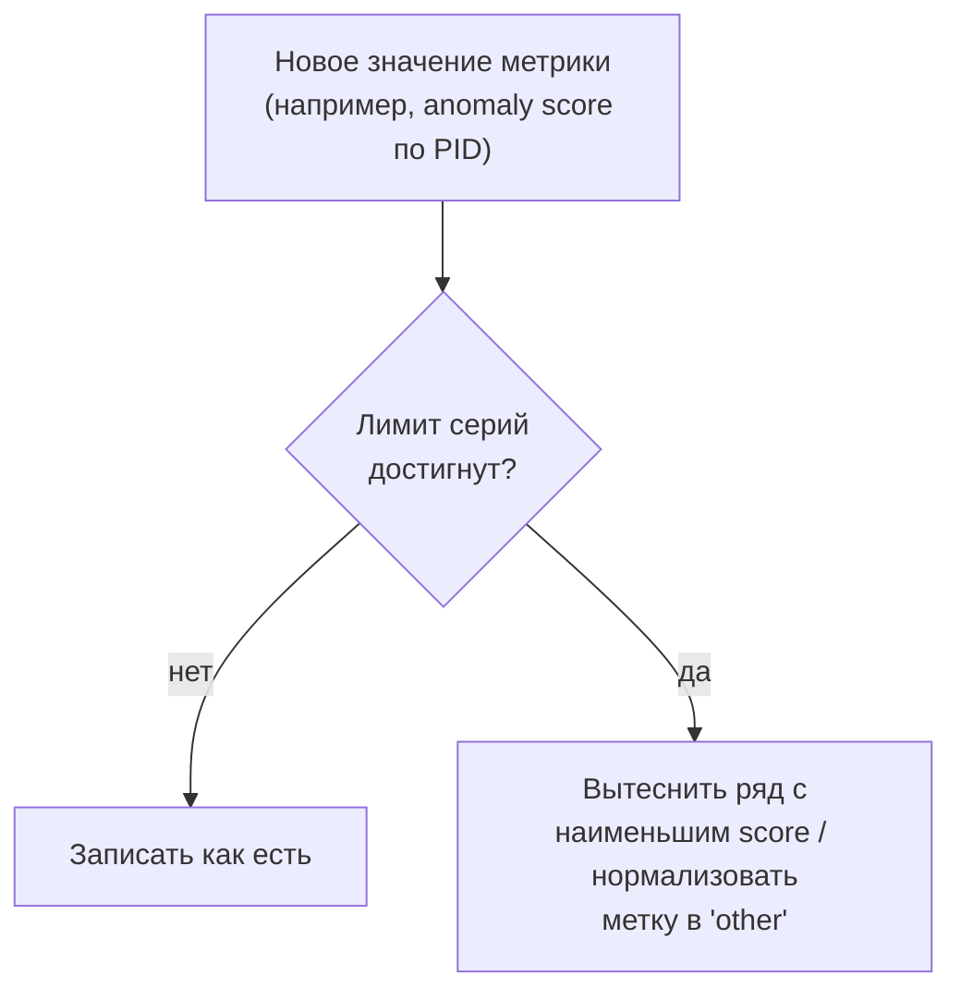
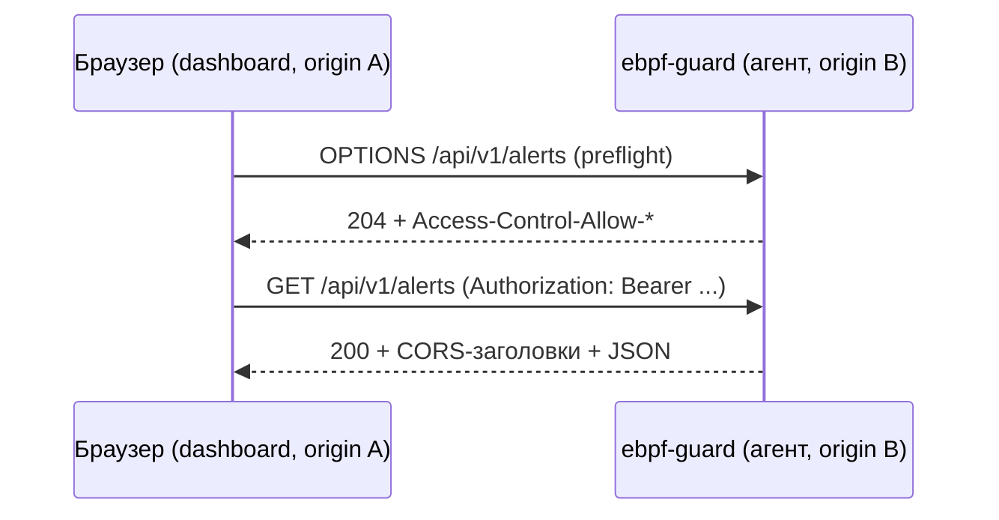

# Глава 13. Экспортёры и интеграции (`internal/exporter/`)

> Уровень: **средний**. Предполагает главу [12](12-enforcer.md).

## Зачем это нужно

К этой точке событие уже прошло весь путь обнаружения и, возможно,
реакции (главы 6–12) и превратилось в `types.Alert`. Дальше встаёт
вопрос: как это увидеть человеку или другой системе? `internal/exporter/`
— это «выходной интерфейс» ebpf-guard: HTTP API для собственного
дашборда и CLI, `/metrics` для Prometheus, вебхук для Alertmanager,
уведомления в Slack/Teams/Discord/Telegram, и вывод в формате Falco —
для тех, кто уже построил тулинг вокруг него. Аналогия: если
correlator и profiler — это «мозг», который решает, что подозрительно,
то exporter — это все способы, которыми этот мозг может
«заговорить» с внешним миром.

## Prometheus `/metrics` и проблема кардинальности

`/metrics` обслуживается стандартным `promhttp.Handler()`
(`internal/exporter/server.go:139` и `:223`). Проблема, которую решает
остальной код пакета — **кардинальность**: если завести отдельную
метрику на каждый PID или на каждый уникальный anomaly score, число
временных рядов Prometheus растёт неограниченно и убивает
производительность как агента, так и самого Prometheus.

`internal/exporter/cardinality.go` решает это двумя независимыми
механизмами:

- **`AnomalyScoreGuard`** (60-167) — держит **не больше**
  `MaxAnomalyScoreSeries = 10000` (15) временных рядов
  `profiler_anomaly_score`. `SetAnomalyScore` (82-112), достигнув
  лимита, вызывает `evictLowest` (116-125) — вытесняет ряд с
  наименьшим score через min-heap (`AnomalyScoreHeap`, 32-57) и удаляет
  соответствующую серию через
  `ProfilerAnomalyScore.DeleteLabelValues`. Дополнительно фоновая
  `Cleanup(maxAge)` (129-160, запускается `StartAnomalyScoreCleanup`,
  250-267) вытесняет ряды, которые давно не обновлялись — не только
  по количеству, но и по возрасту.
- **`CardinalityLimiter`** (169-239) — более общий механизм для любых
  меток: `Normalize(labels, labelKeys...)` (196-232) схлопывает
  значения высококардинальных меток (например, `namespace`/`pod`/`node`)
  в `"other"`, как только число уникальных комбинаций превышает
  `maxSeries` (по умолчанию 1000, 179-182). Используется двойная
  проверка блокировки (double-checked locking): сначала быстрый путь
  с `RLock` (201-206), и только если лимит похоже достигнут — полная
  `Lock` с повторной проверкой (208-215), чтобы не сериализовать
  каждый вызов на запись метрики через один мьютекс.

### Metric aliases: совместимость с чужими дашбордами

`internal/exporter/compat_metrics.go` решает другую задачу: у
организации уже может быть Grafana-дашборд, построенный под метрики
Falco или Tetragon. Вместо переписывания дашборда,
`compat.metric_aliases` (`internal/config/config.go:1424-1428`,
пустой список по умолчанию) заставляет ebpf-guard **дополнительно**
публиковать свои метрики под чужими именами.
`RegisterCompatMetrics(cfg, sourceGatherer, targetRegisterer)`
(45-83) строит карту алиасов (`buildAliasMap`, 86-105) из
предопределённых таблиц `falcoAliasMap`/`tetragonAliasMap`/
`kubeArmorAliasMap` (17-30, например
`ebpf_guard_events_total` → `falco_events_total`) и регистрирует
`forwardingAlias`-коллектор (107-176) на каждый алиас: при каждом
скрейпе он заново собирает исходную метрику и переиздаёт её под новым
именем (поддерживаются только Counter/Gauge/Untyped — гистограммы и
summary не переносятся, 156-169).

## Alertmanager: вебхук по mTLS

`internal/exporter/alertmanager.go` — клиент, который шлёт алерты в
Prometheus Alertmanager по его webhook-протоколу.
`NewAlertmanagerClientWithMTLS(...)` (74-76) — конструктор с
поддержкой взаимного TLS (mTLS): если `mtls.Enabled` (133-142),
`createMTLSConfig` (159-181) загружает пару сертификат/ключ клиента
(`tls.LoadX509KeyPair(mtls.CertFile, mtls.KeyFile)`, 160), читает CA
для проверки серверного сертификата, и собирает
`&tls.Config{Certificates, RootCAs, MinVersion: tls.VersionTLS12}`
(175-178) — вебхук отклонит и клиента без валидного сертификата, и
самого Alertmanager с сертификатом не от доверенного CA, что важно,
если канал идёт через недоверенную сеть между агентом и
Alertmanager'ом.

## Уведомления: fanout на несколько каналов сразу

`internal/exporter/notifier.go` определяет единый интерфейс
`Notifier` (15) с одним методом `Send(ctx, alert) error`.
`FanoutNotifier` (28) держит список всех сконфигурированных
нотификаторов и рассылает алерт **всем** сразу (`Send`/`SendAlert`,
147/183) — Slack и Teams не исключают друг друга, оба получат один и
тот же алерт независимо.

Каждый канал — отдельный файл с собственной реализацией `Send`:

| Канал | Файл | `Send` |
|---|---|---|
| Slack | `slack.go` | `slack.go:74` |
| Microsoft Teams | `teams.go` | `teams.go:73` |
| Discord | `discord.go` | `discord.go:90` |
| Telegram | `telegram.go` | `telegram.go:76` |
| Generic webhook | `webhook.go` | `webhook.go:182` |

Есть и другие каналы (`syslog_cef.go`, `otlp.go`, `kafka_enabled.go`/
`kafka_disabled.go` — сборка с/без Kafka через build tag,
`alert_socket.go` — Unix-сокет для локальных консьюмеров) — общая
идея та же: реализовать `Notifier` и зарегистрироваться в
`FanoutNotifier`.

### Falco-совместимый вывод

Отдельный флаг `FalcoOutput bool` (`notifier.go:45`) переключает
**сам формат** сообщения, которое уходит в generic webhook:
`NewGenericWebhookNotifierWithCompat(cfg.Webhook, logger,
cfg.FalcoOutput, cfg.StrictSSRF)` (79) заставляет вебхук-нотификатор
использовать `ToFalcoAlert`/`MarshalFalcoAlert`
(`falco_output.go:26,56`) вместо нативной схемы `types.Alert`.
`ToFalcoAlert` (26-53) конвертирует алерт в
`FalcoAlert{Time, Rule, Priority, Output, OutputFields,
Source: "ebpf-guard", Tags}`; `toFalcoPriority` (61-68) — упрощённое
отображение severity (только `SeverityCritical` → `"Critical"`, всё
остальное → `"Warning"` — Falco различает больше градаций, ebpf-guard
сознательно не пытается их угадать); `eventTypeName` (85-100)
маппит `types.EventType` в Falco-строки `evt.type`
(`syscall`/`connect`/`open`/`tls`/`dns`/`unknown`). Практический смысл:
существующий пайплайн, который парсит JSON-вывод Falco (например,
Falcosidekick), можно направить на ebpf-guard, включив
`compat.falco_output: true`, без переписывания парсера.

## HTTP API: bearer-аутентификация и эндпоинты

Сервер собран из `internal/exporter/server.go` (маршрутизация,
`/metrics`, `/health*`, `/debug/pprof`) и `api.go`
(`/api/v1/*`-эндпоинты).

### Аутентификация

Два уровня, оба проверяют заголовок `Authorization: Bearer <token>`
через `extractBearerToken` (`server_auth.go:272-282`):

- **`BearerTokenMiddleware(token)`** (`server_auth.go:124`) — простой
  вариант с одним статическим токеном (авто-генерируется 32-байтным
  случайным значением, если не задан в конфиге — см. `CLAUDE.md`,
  раздел `auth`).
- **RBAC-вариант** — `RBACMiddleware(viewerToken, adminToken)`
  (`server_auth.go:344`) и мультитенантный
  `MultiTenantRBACMiddleware(tokens []NamespacedToken)`
  (`server_auth.go:290`) для развёртываний, где нужно разделить
  «может только читать алерты» и «может менять конфигурацию/убивать
  процессы».

### Эндпоинты

`RegisterAPIRoutes` (`api.go:23-57`):

| Путь | Назначение |
|---|---|
| `GET /api/v1/alerts`, `/api/v1/alerts/{id}` | Список и получение алертов, `feedback` |
| `GET /api/v1/alerts/export/cef` | Экспорт в формате CEF (ArcSight и подобные SIEM) |
| `POST /api/v1/feedback` | Отметить алерт как false positive (глава 11) |
| `GET /api/v1/status`, `/api/v1/summary` | Статус агента, агрегированная сводка (глава 14) |
| `GET /api/v1/rules`, `POST /api/v1/rules/reload` | Список правил, ручной hot-reload |
| `GET /api/v1/incidents`, `/api/v1/incidents/{id}` | Агрегированные инциденты (глава 14) |
| `POST /api/v1/bpf/reload` | Перезагрузка BPF-программ без рестарта процесса |
| `/api/v1/tuning/exceptions` | Управление `exceptions` (глава 8) через API |
| `/swaggerui/`, `/api/docs`, `/api/openapi.yaml` | Интерактивная документация API |

Плюс в `server.go`: `/metrics`, `/health`, `/health/ready`,
`/health/live` (139-142/223-226), `/debug/pprof/*` (145-156/228-241,
только если pprof явно включён — небезопасно светить наружу в
проде), `/debug/state` (162/249).

Серверные фильтры и пагинация запросов к алертам разбираются
`parseQueryFilters` (`api.go:632`) — заполняет `filters.Comm` (657) и
`filters.Limit`/`filters.Offset` (667, 672) прямо из query-параметров;
подробнее о том, куда эти фильтры уходят дальше — в главе 14.

## CORS для read-only `/api/v1/*`: зачем понадобился

До недавнего изменения (коммит `bd9660a`, «exporter: allow CORS on
read-only /api/v1/* endpoints») браузер не мог напрямую опросить
`/api/v1/*` одного агента со страницы, открытой с origin другого —
типичная ситуация в fleet-режиме (несколько агентов, один общий
дашборд, глава 15). `corsMiddleware`
(`server_auth.go:225-236`) добавляет CORS-заголовки **только** для
эндпоинтов из списка read-only (`isViewerAllowed(GET, path)`,
204-216 — status/summary/alerts/incidents/rules/feedback) и сам
отвечает на preflight `OPTIONS` запросом `204 No Content` (229-232)
**до** RBAC-мидлвари — браузерный preflight не несёт заголовка
`Authorization`, и если бы CORS шёл после RBAC, preflight упирался бы
в 401 раньше, чем успевал вернуть CORS-заголовки.

`applyCORSHeaders` (`server_auth.go:242-268`) отражает `Origin`
запроса, если он есть в разрешённом списке
(`SetCORSAllowedOrigins`), выставляя `Vary: Origin` для конкретных
origin'ов (259-260) или `Access-Control-Allow-Origin: *` для
wildcard-режима (252-254). Важное ограничение по дизайну:
**write-эндпоинты** (`/rules/reload`, `/bpf/reload`, `/feedback` POST
и т.д.) в `viewerPrefixes` не входят и CORS для них не открывается —
кросс-origin можно только читать чужие данные, не менять их.

## Дальше почитать

- [`internal/exporter/server.go`](../../internal/exporter/server.go), [`api.go`](../../internal/exporter/api.go), [`cardinality.go`](../../internal/exporter/cardinality.go), [`alertmanager.go`](../../internal/exporter/alertmanager.go), [`notifier.go`](../../internal/exporter/notifier.go), [`falco_output.go`](../../internal/exporter/falco_output.go) — полная реализация.
- [Prometheus: cardinality](https://prometheus.io/docs/practices/instrumentation/#do-not-overuse-labels) — почему кардинальность меток нужно ограничивать.
- [Alertmanager webhook receiver](https://prometheus.io/docs/alerting/latest/configuration/#webhook_config) — протокол, которому следует `alertmanager.go`.
- [Falco output fields](https://falco.org/docs/reference/rules/output/) — формат, с которым совместим `falco_output.go`.
- [MDN: CORS](https://developer.mozilla.org/en-US/docs/Web/HTTP/CORS) — механика preflight-запросов, на которой построен `corsMiddleware`.

## Глоссарий

- **Кардинальность метрики** — число уникальных комбинаций значений меток одной метрики; чрезмерная кардинальность перегружает Prometheus.
- **mTLS (mutual TLS)** — режим TLS, при котором сертификат предъявляют обе стороны — и клиент, и сервер, а не только сервер.
- **Fanout** — рассылка одного события сразу нескольким получателям (здесь: нотификаторам) независимо друг от друга.
- **CORS preflight** — предварительный `OPTIONS`-запрос, который браузер шлёт перед «небезопасным» кросс-origin запросом, чтобы узнать, разрешён ли он сервером.
- **RBAC (Role-Based Access Control)** — разграничение прав по ролям; здесь — как минимум «viewer» (только чтение) и «admin».

---

**Назад:** [Глава 12. Enforcer](12-enforcer.md) · **Далее:** [Глава 14. Хранилище алертов](14-alert-store.md)
