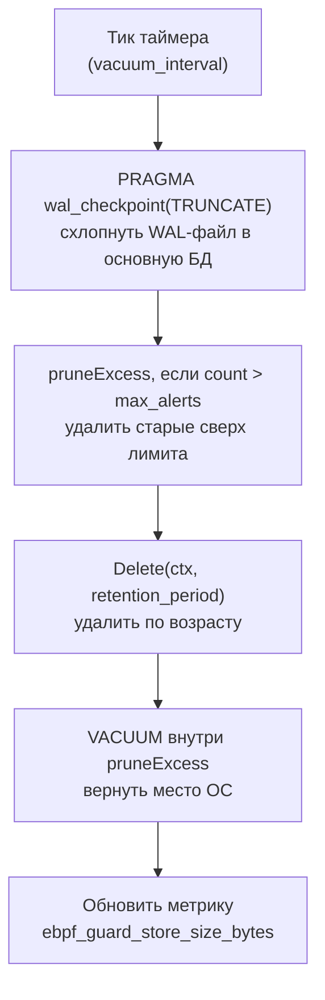

# Глава 14. Хранилище алертов (`internal/store/`)

> Уровень: **средний**. Предполагает главу [13](13-exporters.md).

## Зачем это нужно

`/api/v1/alerts` из главы 13 должен что-то возвращать даже после
рестарта агента, а дашборду нужна сводка «сколько critical за
последний час» без перебора тысяч строк на каждый рендер. За это
отвечает `internal/store` — persistence-слой между движком
корреляции и HTTP API. Ключевая идея пакета: **один и тот же
интерфейс, три взаимозаменяемых реализации**, разной степени
«тяжести» — от простого среза в памяти до полноценного поискового
индекса. Аналогия: это как выбор между блокнотом на столе (быстро,
но пропадает при пожаре), картотекой в сейфе (переживёт рестарт,
но ограничена по объёму) и полноценным архивом с каталогом (не
ограничен объёмом, но требует отдельного сервиса).

## Интерфейс `AlertStore`: контракт для всех трёх backend'ов

`internal/store/store.go:14-46`:

```go
type AlertStore interface {
	Store(ctx context.Context, alert types.Alert) error
	StoreBatch(ctx context.Context, alerts []types.Alert) error
	Query(ctx context.Context, filters QueryFilters) ([]types.Alert, error)
	QueryByID(ctx context.Context, id string) (types.Alert, error)
	Count(ctx context.Context, filters QueryFilters) (int64, error)
	Delete(ctx context.Context, olderThan time.Time) (int64, error)
	Flush(ctx context.Context) error // no-op для memory/OpenSearch, WAL checkpoint для SQLite
	Close() error
	Healthy(ctx context.Context) error
}
```

`QueryFilters` (48-74) — единый набор фильтров для всех backend'ов,
включая `Comm string` (60-62, серверная подстрочная фильтрация по
имени процесса, регистронезависимо) и `Limit`/`Offset` (70-73) для
пагинации — именно эти поля заполняет `parseQueryFilters` из главы 13.
Опциональный интерфейс `Summarizer` (`summary.go:47-51`,
`Summarize(ctx, filters) (AlertSummary, error)`) реализуют не все
backend'ы — там, где его нет, сводка считается наивно, перебором
результатов `Query`.

Выбор конкретной реализации — в `New`/`NewWithContext`
(`store.go:172-209`), по полю `Backend`:

```go
switch cfg.Backend {
case "sqlite":     s, err = NewSQLiteStore(ctx, cfg.SQLite)
case "opensearch": s, err = NewOpenSearchStore(ctx, cfg.OpenSearch)
case "memory":     s, err = NewMemoryStoreWithContext(ctx, cfg.Memory)
}
if cfg.Batching.BatchSize > 0 {
	s = NewBatchingStore(s, cfg.Batching) // группирует записи перед Store()
}
```

## Memory: самый быстрый, живёт до рестарта

`internal/store/memory.go`. `MemoryStore` (39-59) хранит алерты в
`map[string]types.Alert` плюс компактный индекс `byTime
[]byTimeEntry`, отсортированный по убыванию времени, и
`bySev map[Severity][]byTimeEntry` для быстрой выборки по severity без
полного скана. Ограничения задаёт `MemoryStoreOptions{MaxAlerts,
RetentionPeriod}` (28-36):

- **По количеству** — `evictOldestLocked()` (107-129) после каждой
  вставки (`Store`, 149-155) отрезает хвост `byTime` (самые старые
  записи, раз индекс отсортирован по убыванию), если размер превысил
  `MaxAlerts`.
- **По возрасту** — фоновый `retentionLoop`, запускается только если
  `RetentionPeriod > 0`, периодически удаляет записи старше этого
  порога.

Значения по умолчанию (`config.go:2041-2042`): `max_alerts: 10000`,
`retention_period: 6h`. Это backend по умолчанию (`store.backend:
memory`) — разумный выбор для разработки, `--dry-run` и небольших
инсталляций, где потеря алертов при рестарте некритична.

## SQLite: персистентность на одной ноде

`internal/store/sqlite.go` (собирается с тегом `cgo`; для сборок без
cgo есть `sqlite_nocgo.go`-заглушка).

### Схема и индексы

`initSchema` (258-293) создаёт таблицу `alerts` с колонками `id,
timestamp, rule_id, severity, pid, comm, message, details, trace_id,
pod_name, namespace, container_id, labels, count, first_seen,
last_seen, created_at` и семью индексами, включая составные
`idx_alerts_timestamp_rule` и `idx_alerts_severity_ts` (280-286) — они
покрывают самые частые запросы дашборда: «последние N алертов»,
«последние N алертов данной severity». `migrateAggregationColumns`
(299-334) добавляет `count`/`first_seen`/`last_seen` через `ALTER
TABLE` для баз, созданных до появления агрегации, проверяя их наличие
через `PRAGMA table_info` — то есть обновление агента на новую версию
не требует ручной миграции существующего `events.db`.

### WAL-режим

Write-Ahead Logging включается дважды, независимо: через параметры
DSN подключения — `?_journal_mode=WAL&_synchronous=NORMAL&_busy_timeout=5000`
(строка 69) — и повторно через `applySQLitePragmas` (235-254) на
каждом новом соединении (`PRAGMA journal_mode=WAL`,
`synchronous=NORMAL`, `cache_size=-32000`). WAL важен здесь потому,
что запись алертов (движок корреляции) и чтение через HTTP API
(глава 13) идут параллельно из разных горутин — в режиме WAL читатели
не блокируют писателя и наоборот, в отличие от classic
rollback-journal режима SQLite.

### Обслуживание: vacuum, чекпоинты, ротация

Фоновая горутина `runMaintenance` (129-146, запускается в
`NewSQLiteStore`) срабатывает каждые `VacuumInterval` (по умолчанию
`1h`, `config.go:2045`) и последовательно выполняет
`performMaintenance` (148-161):



`pruneExcess` (219-233) — удаляет самые старые строки (`ORDER BY
timestamp ASC`) сверх `max_alerts` (по умолчанию `100000`,
`config.go:2044`), затем выполняет `VACUUM`, чтобы реально освободить
место на диске, а не просто пометить страницы свободными внутри файла
БД. Отдельная горутина `runBackup` (175-192) периодически делает
`VACUUM INTO ?` (`performBackup`, 197-216) — атомарный снепшот базы в
`BackupPath`, если `BackupEnabled` включён; успех/длительность
отслеживаются метриками `ebpf_guard_store_backup_last_success_timestamp`
/ `..._duration_seconds`. `Flush(ctx)` вызывает тот же `PRAGMA
wal_checkpoint(TRUNCATE)` — используется, например, перед graceful
shutdown, чтобы не потерять данные, ещё сидящие в WAL-файле.

### Upsert вместо ошибки UNIQUE

`alertUpsertSQL` (342-352) — `INSERT ... ON CONFLICT(id) DO UPDATE SET
timestamp=excluded.*, count=excluded.count, first_seen=excluded.first_seen,
last_seen=excluded.last_seen`. Это существует ради агрегации алертов
(глава про exporter/`aggregator.go`, повторяющиеся одинаковые алерты
схлопываются в один с счётчиком `count`): без `ON CONFLICT` повторная
запись того же `id` с обновлённым `count` упала бы с ошибкой
нарушения `UNIQUE(id)`.

### Комм-фильтр и сводка на стороне SQLite

`Query` (508-510) реализует серверную фильтрацию по имени процесса
через `LOWER(comm) LIKE ?` с параметром `"%"+strings.ToLower(filters.Comm)+"%"`
— без этого дашборду пришлось бы тащить все строки клиенту и
фильтровать в браузере. `Summarize` (557-620+) считает агрегаты **в
самой SQLite**, а не в Go после выгрузки строк: отдельные запросы
`GROUP BY severity` (567), `GROUP BY rule_id ORDER BY c DESC LIMIT 10`
(589, лимит топ-правил задан в `summary.go:12`), и разбивка по часам
через `strftime('%Y-%m-%dT%H:00:00Z', timestamp, 'utc') GROUP BY h`
(612). Это прямое следствие проблемы производительности, которую
решал коммит #303 (см. ниже) — до него сводка для дашборда считалась
по последним 500 строкам в Go, что не масштабировалось и давало
неточную картину при большем объёме алертов.

### Шифрование колонок (отдельная возможность)

Поля `EncryptionEnabled`/`EncryptionKeyEnv`/`EncryptionKeyFile`
(102-116, реализация в `sqlite_encryption.go`) включают AES-256-GCM
шифрование содержимого `message`/`details`/`labels` — не связано с
vacuum/ротацией напрямую, но живёт в том же файле конфигурации
backend'а; уместно упомянуть, если БД лежит на диске, который
потенциально может утечь (например, снятый с ноды снапшот).

## OpenSearch: масштабируемый поисковый backend

`internal/store/opensearch.go`. Для развёртываний, где алертов
слишком много для одной SQLite-базы на одной ноде, или нужен полный
текстовый поиск/визуализация через OpenSearch Dashboards.

- `StoreBatch` (154) шлёт `POST <address>/_bulk?refresh=wait_for` —
  использует Bulk API вместо N отдельных запросов на вставку.
- `Query` (188) собирает query DSL через `buildQuery(filters)` (231)
  и шлёт `POST <address>/<indexName>/_search`.
- `indexName()` (527-528) возвращает
  `"<indexPrefix>-alerts-<YYYY.MM.DD>"` — **один индекс на день**,
  стандартный паттерн для time-series данных в Elasticsearch/OpenSearch:
  позволяет удалять старые данные целыми индексами (дёшево), а не
  построчным `DELETE` (дорого), и держать более свежие индексы
  «горячими» для быстрого поиска.
- `QueryByID` (343), `Count` (387), `Delete` (432, через delete-by-query),
  `Healthy` (494) — реализуют тот же контракт `AlertStore`, что и
  два других backend'а, так что переключение `store.backend` не
  требует изменений ни в движке корреляции, ни в HTTP API.

## Как выбрать backend

| Backend | Переживает рестарт | Лимит объёма | Когда использовать |
|---|---|---|---|
| `memory` | Нет | Ограничен ОЗУ / `max_alerts` | Разработка, `--dry-run`, короткоживущие поды |
| `sqlite` | Да, локально | Файл на диске, `max_alerts` + vacuum | Одна нода/DaemonSet без общего хранилища, разумный объём алертов |
| `opensearch` | Да, отдельный кластер | Практически не ограничен | Fleet из многих агентов, нужен полнотекстовый поиск, долгое хранение |

## Конфигурация

`StoreConfig` (`internal/config/config.go:366-378`):

```go
type StoreConfig struct {
	Backend    string                `mapstructure:"backend"` // memory | sqlite | opensearch
	Memory     MemoryStoreConfig     `mapstructure:"memory"`
	SQLite     SQLiteStoreConfig     `mapstructure:"sqlite"`
	OpenSearch OpenSearchStoreConfig `mapstructure:"opensearch"`
	Batching   StoreBatchingConfig   `mapstructure:"batching"`
}
```

Значения по умолчанию (`config.go:2040-2053`):

```yaml
store:
  backend: memory
  memory:
    max_alerts: 10000
    retention_period: 6h
  sqlite:
    path: /var/lib/ebpf-guard/events.db
    max_alerts: 100000
    vacuum_interval: 1h
  opensearch:
    url: ""
    index: ebpf-guard-events
    insecure_skip_verify: false
  batching:
    batch_size: 0        # 0 = батчинг выключен, каждый Store() уходит немедленно
    flush_interval: 500ms
```

`Batching` — необязательная обёртка (`NewBatchingStore`,
`store.go:205-207`) поверх любого из трёх backend'ов: если
`batch_size > 0`, отдельные вызовы `Store()` копятся и улетают одним
`StoreBatch()` либо по достижении размера батча, либо по
`flush_interval` — снижает нагрузку на SQLite/OpenSearch при высокой
частоте алертов ценой небольшой задержки видимости самых свежих
записей в API.

## Дальше почитать

- [`internal/store/store.go`](../../internal/store/store.go), [`memory.go`](../../internal/store/memory.go), [`sqlite.go`](../../internal/store/sqlite.go), [`opensearch.go`](../../internal/store/opensearch.go), [`summary.go`](../../internal/store/summary.go) — полная реализация.
- [SQLite WAL mode](https://www.sqlite.org/wal.html) — официальная документация по режиму Write-Ahead Logging.
- [OpenSearch Bulk API](https://opensearch.org/docs/latest/api-reference/document-apis/bulk/) — протокол, которым пользуется `StoreBatch`.
- [Index-per-time-period pattern](https://opensearch.org/docs/latest/im-plugin/index-rollups/index/) — почему time-series индексы часто бьют по дням/месяцам.

## Глоссарий

- **WAL (Write-Ahead Logging)** — режим SQLite, в котором изменения сначала пишутся в отдельный журнал, а не в основной файл БД, что позволяет читателям и писателю работать параллельно.
- **Checkpoint** — операция переноса накопленных изменений из WAL-файла обратно в основной файл базы данных.
- **Upsert** — вставка, которая при конфликте по уникальному ключу превращается в обновление существующей строки (`ON CONFLICT ... DO UPDATE`).
- **Bulk API** — пакетный протокол Elasticsearch/OpenSearch для вставки множества документов одним HTTP-запросом вместо одного запроса на документ.
- **Index-per-day** — паттерн хранения time-series данных, при котором каждый день (или другой период) данных лежит в отдельном индексе — удобно удалять старые данные целиком.

---

**Назад:** [Глава 13. Экспортёры и интеграции](13-exporters.md) · **Далее:** Глава 15. Продвинутая защита и наблюдение (готовится)
