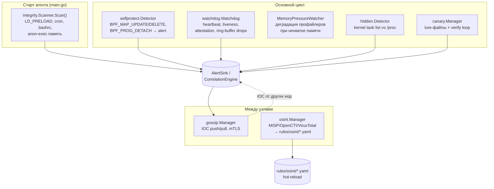
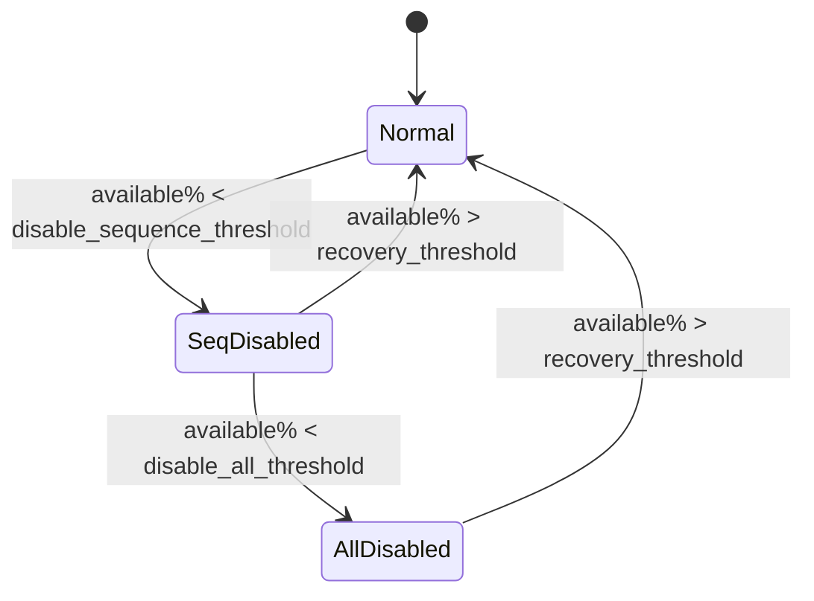

# Глава 15. Продвинутая защита и наблюдение

> Уровень: **продвинутый**. Предполагает главы [4](04-architecture.md), [9](09-profiler-anomalies.md) и [12](12-enforcer.md).

## Зачем это нужно

Всё, что рассмотрено в предыдущих главах, отвечает на вопрос «как
ebpf-guard обнаруживает атаку на *другие* процессы». Но у самого
агента есть привилегированный доступ к ядру (BPF-программы, LSM-хуки),
а значит он сам — привлекательная цель: если атакующий, уже получивший
root, отцепит BPF-программу или подменит map, детектор ослепнет молча,
без единого алерта. Эта глава — про механизмы, которые:

1. защищают сам агент от вмешательства (`internal/selfprotect`);
2. проверяют целостность системы при старте, до того как eBPF успеет
   что-то увидеть (`internal/integrity`);
3. следят, что агент и его BPF-программы вообще живы, и деградируют
   контролируемо при нехватке памяти (`internal/watchdog`);
4. расставляют ловушки и делятся индикаторами компрометации между
   узлами кластера (canary, gossip);
5. обогащают алерты внешней Threat Intelligence (`internal/osint`) и
   ловят руткиты, скрывающие процессы (`internal/hidden`).

Аналогия: если основная часть ebpf-guard — это охранник с камерами,
то эта глава — про сигнализацию на самих камерах (не перерезали ли
провод), автономный генератор на случай отключения света и обмен
ориентировками с охраной соседних зданий.



## Self-protection: детектор вмешательства в собственный BPF

`internal/selfprotect/detector.go:1-9` объясняет модель угрозы прямо в
комментарии пакета: внешний процесс может вызвать `bpf()` с командами
`BPF_MAP_UPDATE_ELEM`, `BPF_MAP_DELETE_ELEM` или `BPF_PROG_DETACH`
против объектов агента. Детектор не мешает нормальной работе — он
следит за событиями `bpf()`, которые сама eBPF LSM-программа уже и
так собирает (см. главу 5).

Ключевая структура — `OwnedObjects` (`detector.go:44-49`): реестр
`programIDs`/`mapIDs`/`pinPaths`, которые принадлежат агенту. Рядом —
`AgentAllowlist` (`detector.go:136-139`), предзаполненный собственным
PID (`os.Getpid()`) при создании (`detector.go:142-148`) — так вызовы
самого агента (перезагрузка BPF-программы после детача, апгрейд) не
считаются атакой.

`ProcessEvent` (`detector.go:252-299`) — основная точка входа,
вызывается для каждого события типа `EventBPFProgram`:

```go
func (d *Detector) ProcessEvent(e types.Event) *types.Alert {
    if !d.cfg.Enabled { return nil }
    if e.Type != types.EventBPFProgram || e.BPFProgram == nil { return nil }

    cmdName := TamperingCmdName(e.BPFProgram.Cmd)
    if cmdName == "" { return nil }               // не опасная команда

    if d.allowlist.IsPIDAllowed(e.PID) { return nil } // это мы сами

    alert := &types.Alert{
        RuleID:   "self_protection_001",
        Severity: d.cfg.AlertSeverity,             // по умолчанию critical
        Details: map[string]interface{}{
            "enforce_mode": d.cfg.EnforceMode,
        },
    }
    ...
}
```

`EnforceMode` (`config.go:1210-1214`, `internal.selfprotect.enforce_mode`)
— это флаг «alert-only vs block». Сам Go-код детектора никогда не
блокирует вызов напрямую — он размечает алерт полем `enforce_mode`,
которое читает eBPF LSM-хук (глава 5) и на его основании решает,
вернуть ли вызывающему `-EPERM`. Это тот же паттерн alert-first, что
и `enforcer.dry_run` из главы 12: сначала наблюдай, потом блокируй.
Требование для реального блокирования — ядро 5.7+ с `CONFIG_BPF_LSM=y`
(без него доступен только детект).

## Integrity: стартовый скан, который не зависит от eBPF

`internal/integrity/scanner.go` решает проблему курицы и яйца: что
если руткит закрепился в системе *до* старта ebpf-guard и eBPF-хуки
никогда не увидят создание вредоносного файла? `Scanner.Scan()`
(`scanner.go:93-126`) запускает четыре проверки на файловой системе
напрямую, без единого eBPF-события:

| Проверка | Метод | Что ищет |
|---|---|---|
| `ld_preload` | `checkLDPreload` (128-162) | Непустой `/etc/ld.so.preload` — классический способ подменить libc-функции во всех процессах |
| `cron` | `checkCronDirs` (164-200) | Файлы в `/etc/cron.*`, `/var/spool/cron*`, изменённые за последние `check_window` (по умолчанию 24 ч) |
| `bashrc` | `checkRootShellConfigs` (202-258) | Недавно изменённые shell-конфиги root'а; дополнительно ищет паттерны `curl|sh`, `wget|sh`, `netcat` прямо в содержимом файла (241-249) |
| `anon_exec` | `checkAnonymousExecRegions` (260-286) → `checkPIDAnonymousRegions` (292-340) | Строки в `/proc/<pid>/maps` с правом `x` и `inode == 0` — типичный признак shellcode/packer, исполняющего код не из файла на диске |

Находки экспортируются как `ebpf_guard_integrity_findings_total{check=...}`
(`exportMetrics`, 343-355) и, если задан `AlertFunc`, группируются по
типу проверки в один алерт `SeverityWarning` на тип (`sendAlerts`,
374-407) — а не по одному алерту на файл, чтобы стартовый скан на
зашумлённой машине не завалил pipeline сотней алертов разом.

Важная деталь для тестируемости: все пути (`ldPreloadPath`, `cronDirs`,
`rootHomeDir`, `procRootDir`, `scanner.go:32-45`) — пакетные
переменные, а не константы, поэтому тесты подменяют их на фикстуры
без мокания файловой системы.

## Watchdog: агент следит сам за собой

`internal/watchdog/watchdog.go` решает другую проблему: eBPF-программа
может быть детачнута легитимно (например, OOM killer прибил процесс,
державший файловый дескриптор pin'а) или нелегитимно — снаружи
разницы не видно без постоянной проверки.

### Liveness + автоматический reattach

`runLivenessChecks` (279-296) каждые `check_interval` (по умолчанию
30s, `watchdog.go:122-129`) обходит зарегистрированные
`BPFProgramChecker` (интерфейс `IsAttached()`/`Reload()`,
`watchdog.go:65-73`). Если программа отвалилась,
`checkProgram` (311-383):

1. выставляет `ebpf_guard_bpf_programs_loaded{program=...} = 0`;
2. шлёт `critical`-алерт `watchdog_bpf_detached`;
3. пытается `checker.Reload()`;
4. при успехе — второй алерт не шлётся, метрика возвращается в `1`,
   растёт счётчик `ebpf_guard_bpf_program_reattach_total`;
5. при неудаче — второй `critical`-алерт `watchdog_bpf_reload_failed`.

### Attestation: проверка BPF-тега, а не просто «прикреплена ли программа»

`IsAttached() == true` не гарантирует, что это *та самая* программа —
теоретически атакующий с root мог отцепить оригинал и подвесить свою
с тем же именем карты. `runAttestation` (385-435) для чекеров,
реализующих `BPFProgramProvider` (интерфейс с `GetPrograms() map[string]*ebpf.Program`,
75-83), сверяет kernel-тег каждой загруженной программы через
`bpf.Attestor.VerifyAll` — при расхождении шлётся `critical`-алерт
`watchdog_bpf_tampering` с `expected_tag`/`actual_tag` в деталях, и
растёт `ebpf_guard_bpf_attestation_violations_total`.

### Ring buffer drops и переполнение карт

Два дополнительных фоновых цикла с интервалом 10s:

- `runDropTracking` (437-465) опрашивает `DropTracker.LostEvents()`
  (монотонный счётчик потерь ring buffer, интерфейс 45-54) и публикует
  **дельту**, а не абсолютное значение, через `exporter.AddBPFLost` —
  так метрика остаётся корректным counter'ом даже если наблюдение
  началось не с нуля.
- `runMapFullTracking` (483-541) читает PERCPU_ARRAY `map_full_counters`
  (заполняется BPF-стороной через `__sync_fetch_and_add`, см. главу 5)
  для трёх карт — `syscall_args`, `conn_start_map`, `conn_meta_map`
  (`mapFullIndexNames`, 477-481) — суммирует значения по всем CPU и
  публикует дельту как `ebpf_guard_bpf_map_full_total{map_name=...}`.
  Рост этой метрики означает, что userspace не успевает вычитывать
  карту быстрее, чем kernel её заполняет — сигнал к увеличению размера
  карты в конфиге `bpf.map_sizes` (глава 19).

### Memory pressure auto-tuning: деградация вместо OOM

`internal/watchdog/memory.go` — отдельный компонент,
`MemoryPressureWatcher`, который каждые 5s (`checkIntervalOrDefault`,
199-203) читает `MemAvailable`/`MemTotal` из `/proc/meminfo`
(`readMemInfo`, 283-318) и управляет тремя уровнями деградации
(`pressureLevel*`, 39-43):



- **Level 1 (`SeqDisabled`)** — `enterSequenceDisabledMode` (320-330)
  выключает только `SequenceProfiler` (глава 9, самый
  memory-intensive компонент — хранит вектора syscall-последовательностей
  по PID) и вызывает `debug.FreeOSMemory()`, чтобы освобождённая куча
  реально вернулась ОС, а не осела в Go runtime.
- **Level 2 (`AllDisabled`)** — `enterAllDisabledMode` (332-356)
  дополнительно выключает EWMA-профилировщик и снижает BPF-сэмплинг
  до 10% через `BPFSamplingController.SetSamplingRate` для
  `syscall`/`network`/`file` — то есть под сильным давлением памяти
  агент жертвует полнотой наблюдения, но продолжает работать вместо
  падения по OOM.
- **Recovery** — `recoverNormalMode` (358-382) восстанавливает
  сохранённые до деградации ставки сэмплирования из `normalRates`.

Пороги по умолчанию (`DefaultMemoryConfig`, `memory.go:81-90`):
`disable_sequence_threshold: 10%`, `disable_all_threshold: 5%`,
`recovery_threshold: 20%` доступной памяти. Разрыв между порогом
отключения (10%/5%) и порогом восстановления (20%) — это гистерезис,
предотвращающий «дребезг» (postoянные переключения туда-обратно при
колебаниях доступной памяти около одного порога).

## Canary: ловушки для атакующего

`docs/canary.md` и раздел `canary:` в конфиге (`config.go:1533`,
`CanaryConfig`) описывают простую, но эффективную технику: разложить
файлы-приманки (`/etc/shadow.canary`, `/root/.ssh/id_rsa.canary` и
т.п. — полный список по умолчанию см. `docs/canary.md:30-40`) по
путям, которые легитимные процессы никогда не трогают, а
пост-эксплуатационные скрипты (linPEAS, LaZagne, mimikatz-порты) —
трогают почти всегда.

Два независимых механизма детекта:

1. **Через eBPF** — `Manager.Rules()` генерирует правила во время
   выполнения (без статического YAML-файла) и подмешивает их в
   correlation engine: любое файловое событие на путь-приманку —
   немедленный `critical`-алерт `canary_NNN`.
2. **Через периодическую проверку** — фоновый цикл каждые
   `verify_interval` (по умолчанию 60s) пересчитывает SHA-256 каждого
   файла-приманки и сравнивает с базовой линией, снятой при
   `Manager.Setup()`. Срабатывает даже если ядро не поддерживает eBPF
   (например, агент запущен с `--dry-run`) — тогда единственный способ
   заметить, что файл удалён или изменён, это как раз опрос по
   расписанию, а не событие.

Метрика `ebpf_guard_canary_files_intact{path}` падает до `0` при
обнаружении подмены/удаления — удобно для алертинг-правила в
Prometheus, независимого от пайплайна ebpf-guard.

## Gossip: обмен индикаторами компрометации между узлами

Одна нода видит только своё дерево процессов. Если контейнер на
Node A обращается к `attacker.example.com`, узлы B–Z ничего об этом
не знают, пока то же самое не произойдёт у них — а к тому моменту
атака может уже распространиться. `docs/gossip.md` описывает решение:
каждый `gossip.Manager` держит in-memory `IOCStore` (LRU,
`max_iocs` записей) трёх типов — `ip`, `dns`, `fingerprint` — и раз в
`push_interval` (по умолчанию 30s) рассылает **дельту** новых IOC всем
`peers` через `POST /gossip/iocs` (mTLS обязателен в проде,
`tls_enabled: true`).

```
Node A                        Node B
┌─────────────────────┐       ┌─────────────────────┐
│  CorrelationEngine  │       │  CorrelationEngine  │
│   ├── IOCMatcher ◄──┼───────┼── Manager.MergeFromPeer │
│   └── ExtractFromAlert──────┼──► Manager.PushIOCs  │
└─────────────────────┘  mTLS └─────────────────────┘
```

Важные детали:

- Расшариваются только **публичные** (не RFC1918) IP — приватные
  адреса кластера никогда не улетают наружу как IOC.
- **Alert amplification** — при `severity: critical`-алерте с
  Kubernetes-namespace нода рассылает `AmplificationSignal`; принявшие
  его пиры временно снижают `anomaly_threshold` профайлера (глава 9)
  для этого namespace — коллективная бдительность кластера растёт во
  время активной атаки, а не только на той ноде, где её впервые
  заметили. Сигналы дедуплицируются по fingerprint, так что кластер из
  100 узлов не даёт 100 одинаковых алертов на одно событие.
- **Секрет + ротация.** `secret`/`secret_previous`/`secret_rotation_ttl`
  позволяют менять общий токен аутентификации между пирами без
  одновременного рестарта всего кластера — старый секрет ещё
  принимается `secret_rotation_ttl` после старта с новым.
- **Отказоустойчивость.** Недоступный пир не блокирует push — дельта
  для него просто отбрасывается (не ретраится), чтобы не копить
  неограниченную память; локальный IOC store продолжает работать по
  уже полученным данным до истечения `ioc_ttl`.

## OSINT: обогащение внешней Threat Intelligence

`internal/osint/manager.go` — ещё один источник правил, не связанный
с ручным написанием YAML (глава 8): `Manager` подключает клиентов к
MISP, OpenCTI и VirusTotal (`NewManager`, `manager.go:32-100` — каждый
клиент требует свой `url`/`api_key`, иначе конструктор возвращает
ошибку конфигурации ещё до старта) и раз в `refresh_interval` (по
умолчанию 3ч, `manager.go:120-127`) вызывает `sync`:

```go
func (m *Manager) sync(ctx context.Context) {
    for _, client := range m.clients {
        result, _ := client.Fetch(state.LastSync[client.Source()]) // инкрементально, since last sync
        fileMap, _ := m.generator.GenerateRules(result)            // → rules/osint/*.yaml
        state.LastSync[client.Source()] = result.FetchedAt
    }
    if m.kernelSyncer != nil {
        m.kernelSyncer.SyncToKernel(successfulResults)             // IP/CIDR → BPF LPM trie
    }
    m.saveState(state)                                              // .osint_state.json
}
```

Два важных архитектурных решения:

1. **Правила пишутся на диск, а не инжектятся в память напрямую.**
   `GenerateRules` кладёт YAML в `OutputDir` (по умолчанию
   `rules/osint/`) — тот же механизм hot-reload (fsnotify, глава 8),
   который подхватывает ручные правки правил, подхватывает и
   OSINT-сгенерированные файлы. Это значит, что OSINT-фиды не требуют
   отдельного пути кода в correlation engine.
   
2. **IP/CIDR-индикаторы дополнительно грузятся прямо в kernel-карты**
   через `WithKernelSyncer` — чтобы блокировать/матчить трафик до
   попадания в userspace, а не только через YAML-правило,
   обрабатываемое после ring buffer (см. также LPM trie в
   `NetworkBlocklist` из главы 12).

Состояние синхронизации (`state.LastSync` по каждому источнику)
персистится в `<output_dir>/.osint_state.json`, поэтому рестарт
агента не приводит к повторной полной выгрузке фида — следующий
`Fetch` запрашивает только то, что появилось `since` последнего
успешного sync.

## Hidden process detection: ловля процессов, скрытых от `/proc`

Классическая техника руткита (LKM-based или LD_PRELOAD-based) —
подделать `/proc`, чтобы скрыть процесс от `ps`/`top`, при этом
процесс продолжает существовать в списке задач ядра.
`internal/hidden/detector.go:1-7` объясняет подход: BPF task iterator
(`bpf iter/task`, ядро 5.8+) читает список задач напрямую из
структур ядра, минуя `/proc`, и `Detector` сравнивает два списка —
PID, присутствующий в kernel-списке, но отсутствующий в `/proc`, это
и есть скрытый процесс (`ebpf_guard_hidden_processes_total`). Если
итератор недоступен (старое ядро или ошибка загрузки BPF), детектор
логирует предупреждение и остаётся в режиме standby без алертов —
он никогда не заменяет собой `/proc`-based enumeration, а лишь
кросс-проверяет её.

## Как всё это включить

Все компоненты этой главы **выключены по умолчанию** — они добавляют
накладные расходы (лишние сисколы на стат/хэш, сетевой трафик между
нодами, периодические сканы `/proc`) и требуют осознанного выбора:

```yaml
self_protection:
  enabled: true
  enforce_mode: false       # сначала alert-only, включайте enforce осознанно
  alert_severity: critical

canary:
  enabled: true
  auto_create: true
  verify_interval: 60s

gossip:
  enabled: true
  secret: "${GOSSIP_SECRET}"
  peers: ["https://10.0.0.2:9090"]
  tls_enabled: true

osint:
  enabled: true
  refresh_interval: 3h
  misp:
    enabled: true
    url: "https://misp.internal"
    api_key: "${MISP_API_KEY}"

watchdog:
  heartbeat_interval: 15s
  check_interval: 30s
```

## Дальше почитать

- [`internal/selfprotect/detector.go`](../../internal/selfprotect/detector.go), [`internal/integrity/scanner.go`](../../internal/integrity/scanner.go), [`internal/watchdog/`](../../internal/watchdog/), [`internal/hidden/detector.go`](../../internal/hidden/detector.go), [`internal/osint/manager.go`](../../internal/osint/manager.go) — полная реализация.
- [`docs/canary.md`](../canary.md), [`docs/gossip.md`](../gossip.md) — операционные руководства с примерами Kubernetes-топологий.
- [Linux LD_PRELOAD hijacking techniques](https://man7.org/linux/man-pages/man8/ld.so.8.html) — man-страница `ld.so`, раздел про `LD_PRELOAD`.
- [BPF CO-RE и BPF iterators](https://docs.kernel.org/bpf/bpf_iterators.html) — официальная документация ядра по `bpf iter`, на которой строится hidden-process detection.
- [MITRE ATT&CK: Rootkit (T1014)](https://attack.mitre.org/techniques/T1014/) — техника, которую покрывает связка hidden-process + integrity scan.

## Глоссарий

- **Attestation (аттестация BPF-программы)** — проверка, что загруженная в ядро программа имеет тот же криптографический тег (`bpf_prog_info.tag`), что и ожидаемая, то есть не была подменена.
- **LD_PRELOAD hijack** — техника подмены функций динамически линкуемых библиотек во всех процессах системы через переменную окружения или `/etc/ld.so.preload`.
- **Canary file (файл-приманка)** — файл, специально размещённый там, где его никогда не открывают легитимные процессы, но часто открывают инструменты пост-эксплуатации.
- **IOC (Indicator of Compromise)** — индикатор компрометации: IP, домен или fingerprint, ранее замеченный в связи с атакой.
- **Гистерезис (в контексте memory pressure)** — разрыв между порогом срабатывания и порогом восстановления, предотвращающий частое переключение состояний при значениях около одной границы.
- **BPF task iterator** — механизм ядра (`bpf iter/task`), позволяющий BPF-программе перечислить все задачи (`task_struct`) напрямую, без похода через `/proc`.

---

**Назад:** [Глава 14. Хранилище алертов](14-alert-store.md) · **Далее:** [Глава 16. WASM-плагины](16-wasm-plugins.md)
