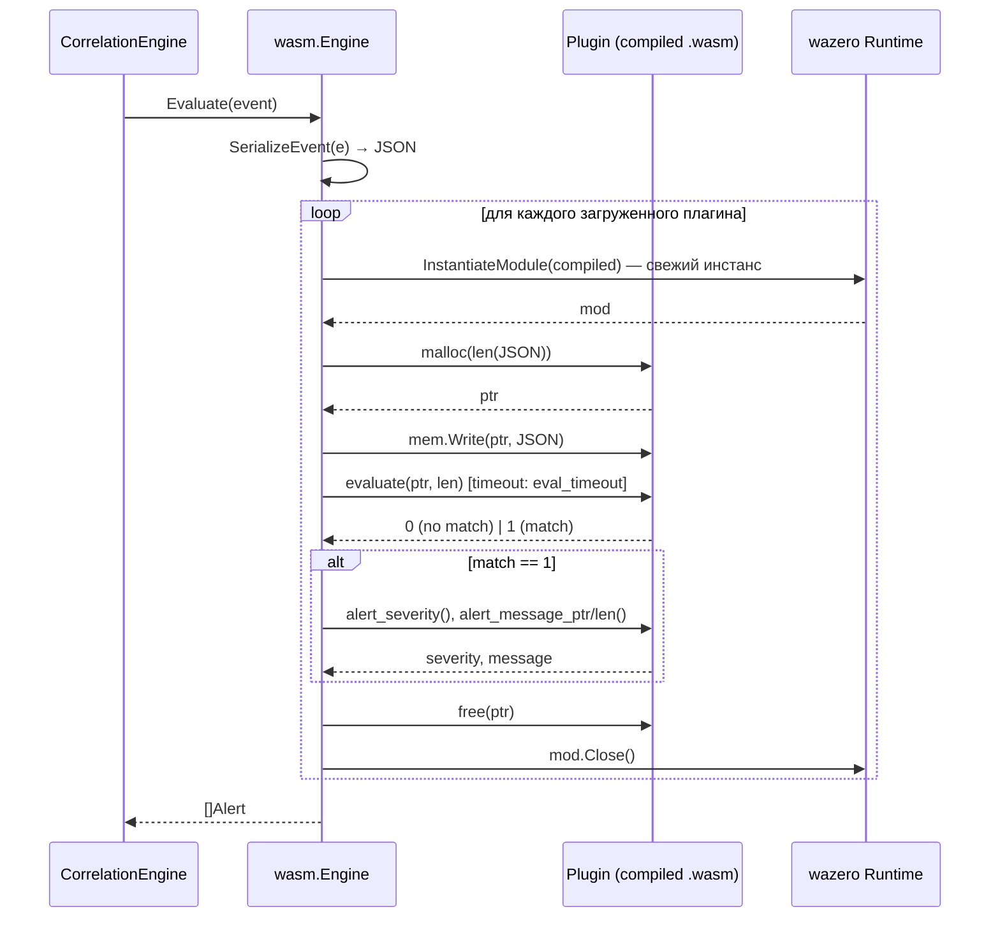

# Глава 16. WASM-плагины (`internal/wasm/`)

> Уровень: **продвинутый**. Предполагает главы [7](07-correlation-engine.md) и [8](08-writing-rules.md).

## Зачем это нужно

DSL правил из главы 8 покрывает подавляющее большинство детектов —
но не всё. Представьте задачу: «обнаружить DGA-домен по энтропии
имени с учётом частотного анализа биграмм» или «сматчить
последовательность из трёх конкретных сисколов с проверкой их
аргументов через кастомную бизнес-логику». Такое либо не выразить
условием `op: regex`, либо выражение получится нечитаемым. Раньше
единственный выход — форкнуть ebpf-guard и написать Go-код внутри
`internal/correlator`. WASM-плагины решают это иначе: детект пишется
на **любом языке, компилируемом в WebAssembly** (Go/TinyGo, Rust,
C/Zig — что угодно с WASI-таргетом), кладётся в `rules/custom/*.wasm`
и подхватывается при старте — без форка, без пересборки самого
агента.

Ключевое инженерное решение — полная песочница. Плагин не может
прочитать файл, открыть сокет или обрушить агент: WASM-рантайм
([wazero](https://wazero.io/), чистый Go, без cgo) исполняет байткод
в изолированной линейной памяти, а каждый вызов `evaluate()` получает
**свежий инстанс модуля** — состояние никогда не утекает ни между
событиями, ни между горутинами.



## ABI v1: контракт между хостом и плагином

Плагин — обычный `.wasm`-модуль, который обязан экспортировать две
функции (`internal/wasm/plugin.go:9-19`, `docs/wasm-plugins.md:54-59`):

| Экспорт | Сигнатура | Обязателен |
|---|---|---|
| `malloc` | `(size i32) → i32` | да |
| `evaluate` | `(ptr i32, len i32) → i32` | да, `1`=матч, `0`=нет |
| `free` | `(ptr i32)` | нет — если отсутствует, хост не освобождает |
| `alert_severity` | `() → i32` | нет — `0`=warning, `1`=critical, иначе берётся из манифеста |
| `alert_message_ptr`/`alert_message_len` | `() → i32` | нет — иначе используется `description` из манифеста |

Хост сериализует событие в JSON (`SerializeEvent`, `plugin.go:283-371`)
и кладёт его в линейную память плагина — важная деталь: сериализуется
**только активный под-объект** события (например, для сетевого
события — только ключ `"network"`, без `"file"`/`"dns"`), чтобы не
раздувать payload и не тратить время плагина на парсинг ненужных
полей. Тип события в JSON — числовой (`"type": 2` = `network`), с
полным списком в комментарии `plugin.go:24-26` и в `docs/wasm-plugins.md:82-105`.

## Жизненный цикл: почему «новый инстанс на каждый вызов» не так дорого, как кажется

`Plugin.Evaluate` (`plugin.go:106-162`) — это и есть шаг «per-call
instantiation» из диаграммы выше:

```go
func (p *Plugin) Evaluate(ctx context.Context, eventJSON []byte) (EvalResult, error) {
    mod, _ := p.rt.InstantiateModule(ctx, p.compiled, ...) // свежий инстанс
    defer mod.Close(ctx)

    ptr, _ := mallocFn.Call(ctx, uint64(len(eventJSON)))
    mem.Write(uint32(ptr[0]), eventJSON)

    evalResults, _ := evaluateFn.Call(ctx, ptr[0], uint64(len(eventJSON)))
    freeFn.Call(ctx, ptr[0])

    if evalResults[0] == 0 {
        return EvalResult{Matched: false}, nil
    }
    return p.readAlert(ctx, mod), nil // читает alert_severity/message только при матче
}
```

`wazero.CompiledModule` (компиляция байткода в машинный код) переиспользуется
между вызовами — она происходит один раз при загрузке
(`loadPlugin`, `plugin.go:223-246`), а не на каждое событие.
Пересоздаётся только **инстанс** — набор линейной памяти и таблиц для
конкретного вызова. Именно поэтому измеренный оверхед приемлем для
рантайма без cgo: **~53 µs/op, 111 KiB/op** на вызов
(`docs/wasm-plugins.md:253-258`), где основная доля аллокаций — это
одна страница линейной памяти 64 KiB, которую wazero выделяет заново
для каждого инстанса — плата за полную изоляцию между событиями.

Практический вывод для тюнинга (`docs/wasm-plugins.md:263-269`): с 10
загруженными плагинами и 50k событий/сек суммарные затраты на
evaluation — порядка 26 CPU-ядер в базовом сценарии. Логику детекта
стоит держать `O(1)` относительно размера входа и профилировать перед
включением большого числа плагинов в high-throughput окружениях.

## Изоляция отказов: плагин не может уронить агент

`docs/wasm-plugins.md:273-283` формулирует три инварианта, которые
проверены на уровне рантайма, а не «соглашением»:

1. **Паника/trap** (деление на ноль, выход за границы памяти внутри
   WASM) — перехватывается, логируется как ошибка, событие идёт дальше
   по пайплайну без этого плагина.
2. **Таймаут** — `wazero.NewRuntimeConfig().WithCloseOnContextDone(true)`
   (`engine.go:59-61`) означает, что истечение `ctx` (заданного
   `eval_timeout`, по умолчанию 100ms) обрывает вызов; плагин остаётся
   загруженным для следующих событий.
3. **Запись за пределы линейной памяти** — физически невозможна:
   WASM-песочница enforce'ит границы памяти на уровне исполнения
   байткода, соседние структуры хост-процесса плагину не видны.

Отдельно стоит забота о ложных срабатываниях: плагин, матчащий каждое
событие, может завалить хранилище алертов — для этого те же
`rules.rate_limit_alerts`, что и для обычных YAML-правил (глава 8),
работают и для алертов из WASM.

## `isNilMemory`: тонкость реализации на Go-интерфейсах

Стоит отметить один нюанс из `plugin.go:164-176`, показывающий, что
интеграция с wazero не тривиальна на уровне Go-типов: модуль без
секции памяти возвращает из `mod.Memory()` типизированный nil-указатель
(`*wasm.MemoryInstance`), упакованный в интерфейс `api.Memory`. Прямое
сравнение `mem == nil` в этом случае **не сработает** — интерфейс с
конкретным (пусть и нулевым) типом внутри не равен голому `nil`. Код
явно обходит это через `reflect.ValueOf(mem).IsNil()`. Это тот случай
типичной Go-ловушки «typed nil in interface», который стоит держать в
голове при работе с любым плагинным API, построенным поверх интерфейсов.

## Пишем плагин: минимальный пример на Go (TinyGo)

SDK в `pkg/plugin-sdk/` прячет всю ABI-обвязку (`malloc`/`free`/`evaluate`)
за одной функцией-обработчиком:

```go
package main

import sdk "github.com/zugolO/ebpf-guard/pkg/plugin-sdk"

func main() {}

func init() {
    sdk.Register(sdk.HandlerFunc(detect))
}

func detect(e *sdk.Event) *sdk.Alert {
    if e.Type == sdk.EventTCPConnect && e.Network != nil && e.Network.Dport == 4444 {
        return sdk.Alertf(sdk.SeverityCritical,
            "outbound connection to port 4444 from %s (pid %d)", e.Comm, e.PID)
    }
    return nil
}
```

Сборка требует именно **TinyGo**, не стандартный `go build`: обычная
сборка тащит рантайм Go и пакет `fmt`, давая бинарник > 3 МиБ; TinyGo
с `-opt=z` укладывается в < 100 КиБ (`docs/wasm-plugins.md:142-146`):

```bash
tinygo build -o my-plugin.wasm -target wasi ./my-plugin/
```

Компаньон-манифест `<plugin_name>.meta.yaml` (`loadMeta`, `plugin.go:248-281`)
задаёт `id`/`name`/`severity`/`action`/`tags`, используемые как
значения по умолчанию, если сам плагин не экспортирует
`alert_severity`/`alert_message_*`. При отсутствии манифеста ID и имя
плагина берутся из имени файла (`base := strings.TrimSuffix(...)`, 251).

## Валидация перед деплоем

```bash
# ABI-проверка + dry-run на синтетических событиях
ebpf-guard plugins validate rules/custom/my-plugin.wasm

# Валидация всей директории
ebpf-guard plugins validate rules/custom/
```

Это не косметика: `plugins validate` ловит частые ошибки ещё до
рантайма — отсутствующий `malloc`/`evaluate` (плагин не собран под
WASI-ABI), невалидный WASM-байткод, отсутствующий
`ebpf_guard_abi_version` (не блокирует загрузку, но логируется
предупреждением). Рекомендуемая практика — добавить этот шаг в CI
(`docs/wasm-plugins.md:314-324`), чтобы сломанный плагин не попал в
`rules/custom/` вместе с остальным конфигом.

## Конфигурация и важное ограничение: без hot-reload

```yaml
wasm:
  enabled: true
  plugin_dir: rules/custom       # директория, сканируемая на *.wasm при старте
  eval_timeout: 100ms            # дедлайн на один вызов; увеличьте для тяжёлой логики
  memory_limit_pages: 256        # 256 страниц = 16 МиБ линейной памяти на инстанс
```

В отличие от YAML-правил (глава 8), которые подхватываются на лету
через fsnotify, **WASM-плагины грузятся один раз при старте**
(`NewEngine` → `loadDir`, `engine.go:54-76`, `docs/wasm-plugins.md:213-214`):
изменение или добавление `.wasm`-файла требует рестарта агента. Это
осознанный компромисс — компиляция WASM-байткода в машинный код
(`rt.CompileModule`) не мгновенна и не рассчитана на то, чтобы
происходить на каждое изменение файла в проде.

## Метрики

| Метрика | Тип | Назначение |
|---|---|---|
| `ebpf_guard_wasm_plugins_loaded` | Gauge | Сколько плагинов успешно загружено |
| `ebpf_guard_wasm_plugin_evaluations_total{plugin_id,result}` | Counter | Число вызовов `evaluate`, с разбивкой по результату (match/no_match/error/timeout) |
| `ebpf_guard_wasm_plugin_latency_seconds{plugin_id}` | Histogram | Задержка одного вызова — основа для тюнинга `eval_timeout` |

## Дальше почитать

- [`docs/wasm-plugins.md`](../wasm-plugins.md) — полное руководство: ABI, примеры на Go/Rust, troubleshooting.
- [`internal/wasm/engine.go`](../../internal/wasm/engine.go), [`plugin.go`](../../internal/wasm/plugin.go), [`validate.go`](../../internal/wasm/validate.go) — реализация движка.
- [`pkg/plugin-sdk/`](../../pkg/plugin-sdk/) — Go/TinyGo SDK и рабочие примеры плагинов.
- [wazero](https://wazero.io/) — WebAssembly-рантайм на чистом Go (без cgo), используемый как хост.
- [WASI (WebAssembly System Interface)](https://wasi.dev/) — таргет компиляции для плагинов; объясняет модель линейной памяти и системных вызовов WASM.
- [TinyGo](https://tinygo.org/) — компилятор Go в WASM/WASI с компактным рантаймом.

## Глоссарий

- **WASM (WebAssembly)** — компактный бинарный байткод-формат, исполняемый в песочнице; изначально для браузеров, здесь используется как безопасный формат для сторонней детект-логики.
- **WASI** — стандартный системный интерфейс для WASM вне браузера (файлы, сеть, время); плагины ebpf-guard компилируются под `wasi`, но фактически используют только линейную память, без реального доступа к ОС.
- **Линейная память (linear memory)** — единый непрерывный, ограниченный по размеру блок памяти WASM-модуля; вся коммуникация хост↔плагин идёт через запись/чтение по смещениям в этом блоке.
- **Trap** — управляемая аварийная остановка исполнения WASM-модуля (например, деление на ноль или выход за границы памяти), которую хост перехватывает без краха всего процесса.
- **ABI (Application Binary Interface)** — здесь: контракт из конкретного набора экспортируемых функций (`malloc`/`evaluate`/…) с фиксированными сигнатурами, которому обязан следовать любой `.wasm`-плагин.
- **CompiledModule vs Instance** — в wazero компиляция байткода в машинный код (дорогая, один раз) и создание изолированного инстанса с собственной памятью (дешевле, на каждый вызов) — разделённые операции.

---

**Назад:** [Глава 15. Продвинутая защита и наблюдение](15-advanced-protection.md) · **Далее:** [Глава 17. TLS/HTTP inspection и DNS-мониторинг](17-tls-dns-monitoring.md)
