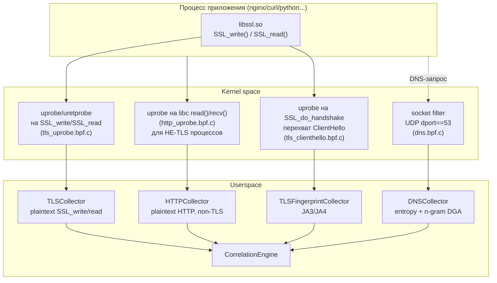
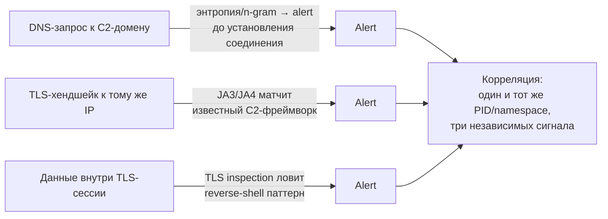

# Глава 17. TLS/HTTP inspection и DNS-мониторинг

> Уровень: **продвинутый**. Предполагает главы [5](05-bpf-layer.md), [6](06-collectors.md) и [7](07-correlation-engine.md).

## Зачем это нужно

Большая часть современного вредоносного трафика идёт по HTTPS — а
значит, правило вида `condition: {field: "network.dport", op: eq,
values: [443]}` из главы 7 видит только «кто-то подключился на 443
порт», но не видит *что* было в запросе: украденные учётные данные,
паттерн reverse-shell в теле ответа, DGA-домен, к которому шёл резолв
перед этим подключением. Эта глава — про три механизма, которые
закрывают этот слепой участок **без установки MITM-прокси и без
перевыпуска сертификатов**:

1. **TLS inspection** — перехват plaintext *до* шифрования и *после*
   расшифровки внутри самого процесса через uprobe на OpenSSL.
2. **JA3/JA4 fingerprinting** — идентификация TLS-клиента по форме
   ClientHello, работает даже когда содержимое недоступно (например,
   для не-OpenSSL стека).
3. **DNS-мониторинг** — энтропийный и n-gram анализ доменных имён для
   поимки DGA-малвари и DNS-туннелирования ещё на этапе резолва, до
   самого подключения.

Аналогия: TLS inspection — это подслушивающее устройство, вживлённое
не в телефонную линию (которая зашифрована), а в саму трубку — вы
слышите разговор до того, как он превращается в шифрованный сигнал.
JA3 — это узнавание человека по манере говорить, даже если слов не
разобрать. DNS-мониторинг — это прослушка не самого разговора, а
телефонной книги: кому вообще звонили.



## TLS inspection: подглядываем до шифрования

`docs/tls-inspection.md` описывает подход: uprobe цепляется не на
сетевой сокол, а прямо на функции `SSL_write`/`SSL_read` в
`libssl.so`. Это принципиально: перехват происходит **внутри
процесса**, до того как OpenSSL зашифрует буфер (`SSL_write`) или
сразу после расшифровки (`SSL_read`) — то есть агент видит именно тот
plaintext, который видело бы приложение, минуя необходимость
расшифровывать TLS-сессию (не нужен приватный ключ сервера, не нужен
MITM с подменой сертификата).

```
Application → SSL_write → [UPROBE: захват plaintext] → Encryption → Network
Network → Decryption → [UPROBE: захват plaintext] → SSL_read → Application
```

### Что можно поймать

`docs/tls-inspection.md:23-42` перечисляет категории, покрытые
`rules/tls-patterns.yaml`: HTTP Basic Auth заголовки, паттерны
эксфильтрации (`/etc/passwd`, SSH-ключи в теле ответа),
reverse-shell индикаторы, SQL-ошибки в ответах, подозрительные
User-Agent (`curl`/`wget` от процесса, который в норме их не
использует). Все правила — обычный YAML DSL из главы 8, применяемый
к `event_type: tls` — никакой отдельной инфраструктуры для этого не
нужно.

### Ограничения — и почему они принципиальны

| Библиотека | Поддержка |
|---|---|
| OpenSSL / `libssl.so` | ✅ полная |
| BoringSSL | ⚠️ частично, зависит от совместимости ABI |
| Go `crypto/tls` | ❌ не поддерживается — своя, не-libssl реализация |
| Java JSSE, Node.js встроенный TLS, Rustls | ❌ не поддерживаются |

Это не недоработка, а прямое следствие механизма перехвата: uprobe
цепляется на **конкретный символ конкретной библиотеки**. Если
процесс не линкует `libssl.so` (а использует, например, собственную
реализацию TLS на чистом Go), символа `SSL_write` в его адресном
пространстве просто нет, и uprobe не на что вешать. Захват также
ограничен по объёму: первые `max_data_size` байт (по умолчанию 256,
максимум 4096) каждого вызова `SSL_write`/`SSL_read` — данные,
разбитые приложением на несколько вызовов, будут захвачены
фрагментами.

### Конфигурация и требования по capabilities

```yaml
collectors:
  tls:
    enabled: true              # по умолчанию false
    scan_interval: 30s         # как часто искать новые процессы с libssl
    max_data_size: 256         # байт на TLS-запись (максимум 4096)
```

Требуются `CAP_SYS_PTRACE` (присоединение uprobe), `CAP_BPF`,
`CAP_PERFMON` (`docs/tls-inspection.md:60-68`) — то есть в Kubernetes
это отдельная строка в `securityContext.capabilities.add`, а не
дефолтный набор привилегий DaemonSet'а.

### Приватность — это не второстепенный вопрос

`docs/tls-inspection.md:110-124` формулирует прямо: захваченный
plaintext может содержать пароли, токены сессий, PII, финансовые
данные. Рекомендации: включать выборочно, только там, где это
оправдано моделью угроз; настраивать короткий retention именно для
TLS-событий в хранилище (глава 14); ограничивать доступ к TLS-алертам
отдельно от остальных. Это тот случай, когда фича, технически
корректно решающая задачу обнаружения, создаёт собственный периметр
комплаенса — включать `collectors.tls.enabled: true` в проде стоит
после ревью с security/compliance-командой, а не по умолчанию (он и
выключен по умолчанию неспроста).

## Plaintext HTTP: то же самое, но без TLS вообще

TLS inspection ловит зашифрованный трафик через libssl. Но что если
приложение вообще не использует TLS — внутренний сервис за
service mesh mTLS-терминацией, легаси-бэкенд на голом HTTP? Для этого
`internal/collector/http_uprobe.go:45-61` реализует `HTTPCollector` —
uprobe на `read()`/`recv()` из libc, но **не на всех процессах**:
цепляние к каждому вызову `read()` в системе (который вызывает
практически любой процесс) было бы неприемлемо дорого и шумно, так
что коллектор ограничен allowlist'ом известных веб-серверных бинарей
(`defaultHTTPServerComms`, `http_uprobe.go:39-43`): `nginx`,
`apache2`, `node`, `python3`, `php-fpm`, `java`, `gunicorn` и т.д.
Дополнительный фильтр — уже в самой BPF-программе
(`bpf/http_uprobe.bpf.c`): в ring buffer попадают только байты,
похожие на строку HTTP-запроса/статуса, остальной трафик того же
процесса (например, чтение файла тем же nginx) никогда не сериализуется.

Ограничения те же по духу, что у TLS-коллектора: первые 256 байт на
вызов, не видит `readv`/`recvmsg`/`io_uring`-путь чтения данных.

## JA3/JA4: узнаём клиента, даже не видя содержимого

Для трафика, где plaintext недоступен (не-OpenSSL стек, TLS
inspection выключен из соображений приватности), остаётся другой
источник сигнала — **форма** самого TLS-хендшейка. `internal/ja3/ja3.go:1-16`
объясняет идею: JA3 (Salesforce, 2017) хэширует конкатенацию версии
TLS, списка cipher suites, extensions, elliptic curves и point
formats из `ClientHello` в MD5; JA4 (FoxIO, 2023) — более
структурированный преемник вида
`Protocol_TLSVersion_SNI_CiphersNumber_CiphersHash_ExtensionsHash`.
Смысл: у разных TLS-библиотек и версий (curl, конкретная версия
Python `requests`, конкретный C2-фреймворк вроде Cobalt Strike или
Sliver) — устойчиво разная форма ClientHello, что позволяет
детектировать инструмент атакующего по одному пакету, ещё до того,
как соединение вообще установлено.

Путь данных: `bpf/tls_clienthello.bpf.c` (uprobe на
`SSL_do_handshake`, перехватывающий сырой ClientHello до того, как
он уйдёт в сеть) → `TLSFingerprintCollector`
(`internal/collector/tlsfingerprint.go:19-25`) → `decodeTLSClientHello`
(`tlsfingerprint_parse.go:16-27`), который парсит сырые байты через
`ja3.ParseClientHello` (`ja3.go:40-68`, обрабатывает TLS 1.0–1.3) и
вычисляет `ja3.ComputeJA3`/`ComputeJA4`, кладя оба хэша в
`event.TLS.JA3`/`.JA4`. Важное свойство: неразбираемый (повреждённый
или укороченный) handshake **не роняет** обработку события — он даёт
валидный `types.Event` с пустыми полями JA3/JA4, а не ошибку,
обрывающую пайплайн (`tlsfingerprint_parse.go:12-13`).

Практическое применение — правило `op: in` по полю `tls.ja3` со
списком известных JA3-хэшей C2-фреймворков (обновляемых, например,
через OSINT-фиды из главы 15), либо `op: eq` на конкретный хэш при
расследовании инцидента, когда JA3 подозрительного клиента уже
известен.

## DNS-мониторинг: детект до подключения

`docs/dns-monitoring.md` описывает путь данных для DNS отдельно от
общего сетевого коллектора: eBPF tracepoint на `sendmsg`/`sendto` с
ранней фильтрацией **в самом BPF** — обрабатываются только пакеты с
UDP dport 53, всё остальное отбрасывается ещё в ядре, не доходя до
ring buffer (`docs/dns-monitoring.md:9`, «Zero overhead for non-DNS
traffic»). Работает с любым DNS-резолвером (`systemd-resolved`,
`dnsmasq`) без его модификации, поскольку смотрит на сам исходящий
UDP-пакет, а не встраивается в конкретный резолвер.

### Shannon-энтропия: первый уровень фильтра

`internal/correlator/dns_entropy.go:70-99`, `CalculateShannonEntropy`
считает классическую формулу `H(X) = -Σ p(x)·log2(p(x))` по частоте
символов в строке:

```go
func (c *DNSEntropyCalculator) CalculateShannonEntropy(s string) float64 {
    freq := runeFreqPool.Get().(map[rune]int) // пул — 0 allocs/op в бенчмарке
    for _, r := range s { freq[r]++ }
    entropy := 0.0
    for _, count := range freq {
        p := float64(count) / float64(len(s))
        entropy -= p * math.Log2(p)
    }
    return entropy
}
```

`google.com` даёт энтропию ~2.25 бит/символ, а сгенерированный DGA
домен вида `qxj4v9k2mnbp.com` — около 3.75. `IsDGADomain`
(`dns_entropy.go:103-115`) отсекает TLD (у него предсказуемая
структура, шум для энтропии), требует минимум 10 символов базового
домена (иначе энтропия статистически ненадёжна на коротких строках)
и сравнивает с `DGAThreshold` (по умолчанию `3.5`,
`config.go:580`, ключ `collectors.dns.dga_threshold`).

### N-gram модель: против DGA нового поколения

Пул `runeFreqPool` — оптимизация, но интереснее архитектурное
решение в `internal/correlator/dga_ngram.go:1-6`: современные DGA
специально проектируются так, чтобы иметь **нормальную** энтропию —
чисто статистический подсчёт частот символов больше не различает
`xk4qm2vbnrt.com` (DGA) от произвольного, но легитимно выглядящего
поддомена. N-gram модель ловит не «случайность вообще», а
**неестественность конкретных биграмм/триграмм** для английского
языка и типичных доменных токенов: обучающий корпус
(`legitimateDomainCorpus`, `dga_ngram.go:24-...`) — это встроенный
список второразрядных доменных компонентов крупных веб-сервисов,
CDN-паттернов, инфраструктурных и сервисных ключевых слов
(`google`, `cdn1`, `oauth`, `webmail`, `staging` и т.д.). На старте
пакета по этому корпусу с сглаживанием Лапласа строится статистика
биграмм алфавита из 37 символов (`a-z`, `0-9`, `-`,
`ngramCharsetSize`, `dga_ngram.go:15-17`). Домен, чьи биграммы
статистически маловероятны в этой модели (типичны для случайно
сгенерированного набора символов, даже если по чистой энтропии он
выглядит «нормальным»), получает высокий score, близкий к 1.0.

Итог: два независимых детектора одного и того же класса угрозы —
энтропийный (быстрый, ловит «классический» DGA) и n-gram (точнее на
современных DGA, спроектированных в обход энтропийных детекторов) —
работают параллельно, а не заменяют друг друга.

### Остальные детекты того же коллектора

| Детект | Механизм | Порог по умолчанию |
|---|---|---|
| DNS tunneling | `IsDNSTunneling` — длина домена | `tunneling_min_length: 50` |
| Suspicious TLD | Точное совпадение TLD (`.onion`, `.bit`, `.bazar`, `.coin`, ...) | статический список |
| High-frequency DNS | Число уникальных доменов от одного процесса за минуту | `high_frequency_threshold: 100` |
| TXT record abuse | TXT-запрос от процесса, не входящего в allowlist почтовых сервисов | исключает `postfix`/`sendmail`/`exim`/`dovecot` |

### Ограничения

`docs/dns-monitoring.md:230-235`: только IPv4, только UDP (TCP DNS,
используемый для больших ответов, не поддерживается), нет валидации
DNSSEC, и — важно — **зашифрованный DNS (DoH/DoT) не виден вообще**:
если приложение резолвит имена через DNS-over-HTTPS, трафик на порт
53 просто не возникает, и вся эта цепочка детекта молчит. Это тот же
класс ограничения, что и «Go crypto/tls не виден TLS-инспекции» —
оба компонента опираются на конкретный, наблюдаемый на уровне
ядра/библиотеки протокол, и оба слепы к альтернативным
транспортам того же логического действия.

## Как эти три механизма дополняют друг друга



На практике это означает: даже если атакующий отключит одну из
техник обнаружения на своей стороне (например, использует TLS-стек
без OpenSSL, обходя TLS inspection), DNS-энтропия и JA3-фингерпринт
всё равно остаются в строю — задача этой главы не «поймать всё одним
механизмом», а расставить несколько независимых, дешёвых по
накладным расходам точек наблюдения на разных этапах одной и той же
сетевой операции.

## Дальше почитать

- [`docs/tls-inspection.md`](../tls-inspection.md), [`docs/dns-monitoring.md`](../dns-monitoring.md) — полные операционные руководства.
- [`internal/collector/tls.go`](../../internal/collector/tls.go), [`http_uprobe.go`](../../internal/collector/http_uprobe.go), [`tlsfingerprint.go`](../../internal/collector/tlsfingerprint.go), [`internal/ja3/ja3.go`](../../internal/ja3/ja3.go), [`internal/correlator/dns_entropy.go`](../../internal/correlator/dns_entropy.go), [`dga_ngram.go`](../../internal/correlator/dga_ngram.go) — реализация.
- [`bpf/tls_uprobe.bpf.c`](../../bpf/tls_uprobe.bpf.c), [`bpf/tls_clienthello.bpf.c`](../../bpf/tls_clienthello.bpf.c), [`bpf/http_uprobe.bpf.c`](../../bpf/http_uprobe.bpf.c), [`bpf/dns.bpf.c`](../../bpf/dns.bpf.c) — BPF-слой.
- [JA3 (Salesforce)](https://github.com/salesforce/ja3), [JA4 (FoxIO)](https://github.com/FoxIO-LLC/ja4) — оригинальные спецификации фингерпринтинга.
- [Shannon entropy](https://en.wikipedia.org/wiki/Entropy_(information_theory)) — математическая база энтропийного детекта.
- [DGA Detection Techniques (Splunk)](https://www.splunk.com/en_us/blog/security/deep-learning-domain-generation-algorithms-dga-detection.html), [DNS Tunneling Detection (Akamai)](https://www.akamai.com/blog/security/dns-tunneling-detection) — обзорные статьи по методам детекта.
- [OpenSSL SSL_write/SSL_read](https://www.openssl.org/docs/man3.0/man3/SSL_write.html) — функции, на которые вешается TLS-uprobe.

## Глоссарий

- **Uprobe / uretprobe** — точка трассировки в **пользовательском** пространстве, привязанная к конкретному адресу/символу в бинарнике или библиотеке (в отличие от kprobe, работающего в ядре); uretprobe срабатывает на возврате из функции.
- **ClientHello** — первое сообщение TLS-хендшейка, отправляемое клиентом: версия протокола, список cipher suites, extensions — именно оно используется для JA3/JA4.
- **JA3 / JA4** — алгоритмы фингерпринтинга TLS-клиента по форме ClientHello (JA3 — MD5-хэш конкатенации полей, JA4 — структурированный человекочитаемый формат).
- **DGA (Domain Generation Algorithm)** — техника малвари/C2-инфраструктуры, генерирующая псевдослучайные доменные имена вместо жёстко закодированного C2-адреса, чтобы усложнить блокировку по домену.
- **Shannon entropy** — мера «случайности»/непредсказуемости строки в битах на символ; выше энтропия — ближе к случайному набору символов.
- **N-gram (биграмма/триграмма)** — последовательность из N соседних символов; статистика n-грамм по обучающему корпусу позволяет отличить «похожее на язык» от «похожее на случайный набор символов» даже при нормальной общей энтропии.
- **DNS tunneling** — техника эксфильтрации данных или C2-коммуникации через кодирование полезной нагрузки в поддоменах DNS-запросов.
- **Socket filter (BPF)** — тип BPF-программы, присоединяемой к сокету для ранней in-kernel фильтрации пакетов до их доставки в userspace.

---

**Назад:** [Глава 16. WASM-плагины](16-wasm-plugins.md) · **Далее:** Глава 18. Полный справочник CLI (готовится)
