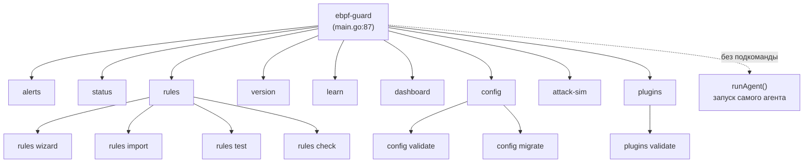

# Глава 18. Полный справочник CLI

> Уровень: **средний**. Предполагает главы [3](03-getting-started.md) и [8](08-writing-rules.md).

## Зачем это нужно

Главы 3 и 8 уже показали пару команд (`sudo make run`, `ebpf-guard rules
check`) мимоходом, чтобы двигаться дальше. Эта глава — единая точка
входа: полный список того, что умеет бинарник `ebpf-guard`, без
запуска самого агента. Аналогия: если предыдущие главы были про то, как
устроен автомобиль, то это — руководство по приборной панели и рычагам
управления.

Важное расхождение с `CLAUDE.md`: в списке подкоманд там упомянуты
`explain`, `migrate`, `wizard`, `validate`, `test` как отдельные
top-level команды. В реальности часть из них — это **подкоманды**
других команд, а `explain` — вообще не CLI-команда, а HTTP-эндпойнт.
Ниже — то, что действительно зарегистрировано в коде
(`cmd/ebpf-guard/main.go:122-132`).



## Глобальные флаги

Регистрируются на `root.PersistentFlags()`
(`cmd/ebpf-guard/main.go:99-114`):

| Флаг | Тип | По умолчанию | Назначение |
|---|---|---|---|
| `--config` | string | `config/config.yaml` | путь к файлу конфигурации |
| `--log-level` | string | `info` | `debug`/`info`/`warn`/`error` |
| `--dry-run` | bool | `false` | без реальных eBPF-проб — синтетические события (глава 6) |
| `--simulate` | bool | `false` | считать, что было бы убито/заблокировано, но не действовать |
| `--simulate-duration` | string | `""` | остановить симуляцию через указанную длительность |
| `--shutdown-timeout` | string | `""` | override таймаута graceful shutdown, допустимый диапазон `[5s, 300s]` (проверяется в `main.go:227-229`) |
| `--zero-config` | bool | `false` | запуск без файла конфигурации — встроенные дефолты + встроенные правила |
| `--simple` | bool | `false` | простой режим: автоматически убивает криптомайнеры/веб-шеллы/reverse-shell |
| `--profile` | string | `$EBPF_GUARD_PROFILE` | пресет тюнинга под железо: `lite`/`balanced`/`production` (глава 22) |

**Важный нюанс:** `--config`, `--dry-run` и `--log-level` не всегда
по-настоящему глобальны. Команды `dashboard`
(`main.go:2749,2751`) и `learn`/`config validate`/`config migrate`
(`main.go:2827,2851`) объявляют **свои собственные** локальные флаги с
теми же именами, которые перекрывают persistent-флаги root'а для этого
поддерева команд — если что-то не применяется, как ожидалось, ищите
локальный флаг у конкретной подкоманды.

Без подкоманды (`ebpf-guard --config ...`) root-команда сама запускает
агента (`main.go:94-96`) — это тот самый путь, что описан в главе 4
(startup sequence).

## Команды

### `version`

`newVersionCmd()`, `main.go:1928-1940`. Печатает `ebpf-guard %s (commit
%s[, built %s])`, где `Version`/`Commit`/`BuildTime` — переменные,
подставляемые линковщиком через `-ldflags` при сборке (`main.go:57-59`).
Без флагов.

```
$ ebpf-guard version
ebpf-guard 0.10.0-alpha (commit a1b2c3d, built 2026-07-20T10:00:00Z)
```

### `status`

`newStatusCmd()`, `main.go:2006-2014`. Не подключается к работающему
агенту сама — просто указывает, что живой статус нужно смотреть через
`GET /health` HTTP API (глава 13). Без флагов.

### `alerts`

`newAlertsCmd()`, `main.go:1942-2004`. Запрашивает **хранилище алертов**
(глава 14: memory/sqlite), настроенное в текущем конфиге — то есть
команда читает те же данные, что видел бы `GET /alerts`, но напрямую из
файла БД, без запущенного агента.

| Флаг | Тип | По умолчанию | Назначение |
|---|---|---|---|
| `--limit` | int | `50` | максимум записей |
| `--severity` | string | `""` | фильтр `warning`/`critical` |
| `--since` | string | `""` | окно времени, например `1h`, `30m` |

```
ebpf-guard alerts --severity critical --since 1h --limit 20
```

### `rules` (родительская команда)

`newRulesCmd()`, `main.go:2016-2043`. Без подкоманды — загружает и
печатает список правил из `cfg.Rules.Path` (глава 8).

#### `rules wizard`

`newWizardCmd()`, `main.go:2313-2356`. Интерактивный пошаговый TUI для
сборки одного правила без ручного написания YAML — типовой путь входа
для новичка, ранее не писавшего правил (глава 8 показывает YAML
напрямую; эта команда — альтернативный, более пологий путь к тому же
результату).

```
ebpf-guard rules wizard --output rules/custom/
```

Флаг: `--output`/`-o` (string, по умолчанию `""`).

#### `rules import [PATH]`

`newRulesImportCmd()`, `main.go:2052-2190`. Импорт правил из внешних
форматов — **sigma, ecs, falco** (глава 21 разбирает falco-путь
подробно).

| Флаг | Тип | По умолчанию | Назначение |
|---|---|---|---|
| `--format` / `--source` | string | `""` | `sigma`/`ecs`/`falco` |
| `--dir` | string | `""` | директория с исходными правилами |
| `--out` | string | `rules/imported` | куда писать сконвертированные правила |
| `--dry-run` | bool | `false` | только показать, что будет сконвертировано |

```
ebpf-guard rules import --format sigma ./sigma-rules/ --out ./rules/imported/
```

#### `rules test`

`newRulesTestCmd()`, `main.go:2365-2438`. Прогоняет исторические события
(JSONL-лог, `EventLogConfig` из главы 19) через конкретное правило и
считает, сколько алертов сработало бы — способ проверить новое правило
на реальных данных до включения его в проде, не дожидаясь новой атаки.

| Флаг | Тип | По умолчанию |
|---|---|---|
| `--rule` | string | `""` (обязателен) |
| `--replay` | string | `24h` |
| `--events-log` | string | `""` (иначе берётся из конфига) |
| `--limit` | int | `20` |

```
ebpf-guard rules test --rule my-rule.yaml --replay 24h
```

#### `rules check [PATH]`

`newRulesCheckCmd()`, `main.go:2449-2567`. Декларативные YAML unit-тесты
для правил — CI-дружественный путь (в отличие от `rules test`, который
про исторические данные, `rules check` — про заранее заданные
входные/ожидаемые события). Вывод в формате TAP v13, `exit 1` при
провале.

| Флаг | Тип | По умолчанию |
|---|---|---|
| `--rules` | string | `""` |
| `--junit` | string | `""` (путь для JUnit XML-отчёта, для CI) |
| `--watch` | bool | `false` |

```
ebpf-guard rules check ./tests/rules/
```

### `learn`

`newLearnCmd()`, `main.go:2577-2617`. Наблюдает за поведением контейнера
живьём и генерирует минимальный профиль правил на основе увиденного —
практический способ построить allowlist для конкретного workload'а, не
угадывая вручную (см. также `internal/autolearn/` из главы 11).

| Флаг | Тип | По умолчанию |
|---|---|---|
| `--duration` | string | `5m` |
| `--output` | string | `rules/generated` |
| `--namespace` | string | `""` |
| `--container` | string | `""` |
| `--comm` | string | `""` |
| `--log-level` | string | `info` |
| `--dry-run` | bool | `false` |

```
ebpf-guard learn --duration 5m --namespace production --output /tmp/profiles/
```

### `dashboard`

`newDashboardCmd()`, `main.go:2700-2756`. Интерактивный live-TUI:
события, алерты, статистика по правилам в реальном времени, 5 вкладок
(`Tab`/`1`-`5` для переключения, `j`/`k`/стрелки — прокрутка, `p` —
пауза, `q` — выход; `main.go:2713-2735`).

Отдельная возможность — **fleet mode**: один dashboard может
агрегировать несколько агентов сразу.

| Флаг | Тип | По умолчанию |
|---|---|---|
| `--config` | string | `config/config.yaml` (локальный, перекрывает persistent) |
| `--log-level` | string | `warn` |
| `--dry-run` | bool | `false` |
| `--fleet` | string | `""` — список URL агентов через запятую, включает fleet-режим |
| `--fleet-token` | string | `$EBPF_GUARD_TOKEN` |
| `--fleet-interval` | duration | `3s` |

```
ebpf-guard dashboard --fleet http://node-a:9090,http://node-b:9090 --fleet-token "$TOKEN"
```

### `config` (родительская команда)

`newConfigCmd()`, `main.go:2801-2809`. Инструменты валидации и миграции
файла конфигурации.

#### `config validate`

`newConfigValidateCmd()`, `main.go:2812-2829`, раннер —
`runConfigValidate` (`main.go:2857-2906`). Работает в два прохода:
1. `config.CheckConfigFile` — ищет устаревшие/удалённые поля;
2. `config.ValidateConfig` — полная структурная валидация.

Печатает `✓ <секция>: OK` для каждой из 21 проверяемой секции
(`server, bpf, rules, correlator, profiler, exporter, alerting,
kubernetes, auth, notifications, store, collectors, enforcement,
watchdog, policy, compat, gossip, wasm, osint, event_log, canary` —
жёстко заданный список, `main.go:2873-2878`) и `✗ <поле>: <ошибка>` для
найденных проблем. `exit 1`, если есть проблемы.

```
ebpf-guard config validate --config config/config.yaml
```

#### `config migrate`

`newConfigMigrateCmd()`, `main.go:2832-2855`, раннер —
`runConfigMigrate` (`main.go:2908+`). Автоматически переносит файл
конфигурации на целевую версию схемы.

| Флаг | Тип | По умолчанию |
|---|---|---|
| `--config` | string | `config/config.yaml` |
| `--to` | string | `v0.2.0` |
| `--out` | string | `""` (по умолчанию `<config>.migrated.yaml`) |

Явное предупреждение в коде (`main.go:2846`): YAML-комментарии в
результате миграции **не сохраняются** — если в исходном конфиге были
важные комментарии-пояснения, стоит сохранить их копию отдельно перед
миграцией.

### `attack-sim`

`newAttackSimCmd()`, `main.go:2996-3117`. Симулирует атаки безопасными
синтетическими событиями (без реальных payload'ов и сетевого трафика,
`main.go:3010-3011`) и проверяет, что соответствующие детекты
срабатывают — способ регрессионно протестировать весь стек правил+профайлер
после апгрейда или изменения конфигурации, не устраивая настоящую атаку
на прод.

| Флаг | Тип | По умолчанию |
|---|---|---|
| `--list` | bool | `false` |
| `--run-all` | bool | `false` |
| `--scenario` | string | `""` |
| `--verify` | bool | `false` |
| `--agent` | string | `http://localhost:8080` |
| `--token` | string | `""` |
| `--timeout` | string | `30s` |

```
ebpf-guard attack-sim --list
ebpf-guard attack-sim --run-all
ebpf-guard attack-sim --scenario dga-dns-query
ebpf-guard attack-sim --scenario sensitive-file-read --verify \
  --agent http://localhost:8080 --token mytoken --timeout 30s
```

### `plugins` (родительская команда)

`newPluginsCmd()`, `main.go:3125-3132`. Управление WASM-плагинами
детекции (глава 16).

#### `plugins validate [PATH]`

`newPluginsValidateCmd()`, `main.go:3134-3210`. Проверяет соответствие
WASM-плагина ожидаемому ABI и опционально прогоняет его на синтетических
событиях без запуска полного агента.

| Флаг | Тип | По умолчанию |
|---|---|---|
| `--dry-run` | bool | `true` |
| `--events` | int | `1` |

```
ebpf-guard plugins validate ./rules/custom/my-plugin.wasm
ebpf-guard plugins validate ./rules/custom/ --dry-run
```

## А где же `explain`?

`explain` не существует как CLI-команда вообще. Функциональность,
описанная в `CLAUDE.md` под этим именем, реализована как HTTP-эндпойнт:
`srv.SetupExplainer("")` в `main.go:774-781` подключает
`GET /api/v1/alerts/{id}/explain` к уже запущенному агенту (это тот же
`internal/explainer/` из архитектурной карты в главе 4). Чтобы получить
объяснение конкретного алерта, обращайтесь к этому эндпойнту через
`curl`/HTTP-клиент, а не через отдельную CLI-подкоманду.

## Дальше почитать

- [`cmd/ebpf-guard/main.go`](../../cmd/ebpf-guard/main.go) — все определения команд в одном файле.
- Глава [8](08-writing-rules.md) — что делать с правилами, которые печатает/тестирует `rules`.
- Глава [11](11-autolearn-drift.md) — что происходит с профилем, который генерирует `learn`.
- Глава [16](16-wasm-plugins.md) — контекст для `plugins validate`.
- Глава [21](21-falco-migration.md) — подробности `rules import --format falco`.
- [Cobra (spf13/cobra) docs](https://github.com/spf13/cobra) — библиотека, на которой построен весь CLI.

## Глоссарий

- **Cobra** — Go-библиотека для построения CLI с подкомандами, флагами и авто-генерацией help; `ebpf-guard` целиком построен на ней.
- **Persistent flag** — флаг Cobra, наследуемый всеми подкомандами дерева, если не переопределён локально.
- **TAP (Test Anything Protocol)** — простой текстовый формат вывода результатов тестов, используемый `rules check`.
- **Zero-config режим** — запуск агента без файла конфигурации, на встроенных дефолтах и встроенных правилах (`--zero-config`).

---

**Назад:** [Глава 17. TLS/HTTP inspection и DNS-мониторинг](17-tls-dns-monitoring.md) · **Далее:** [Глава 19. Полный справочник конфигурации](19-config-reference.md)
