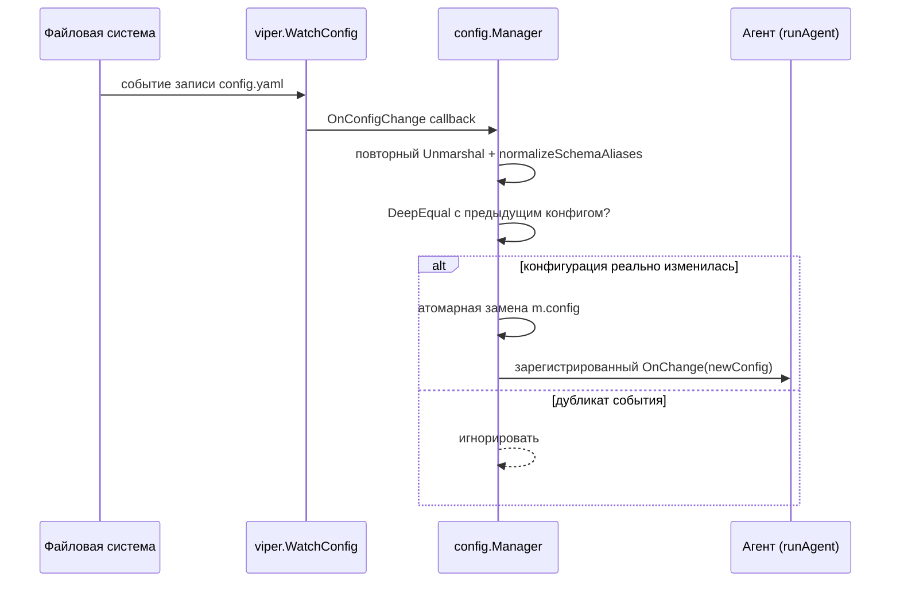

# Глава 19. Полный справочник конфигурации (`internal/config/`)

> Уровень: **средний**. Предполагает главу [18](18-cli-reference.md).

## Зачем это нужно

Предыдущие главы упоминали отдельные поля конфигурации по мере
надобности: `profiler.learning_period` в главе 9, `alerting.mtls` в
контексте безопасности, `collectors.tls.max_data_size` в главе 17. Эта
глава — единая карта: какие секции вообще существуют в `Config`, что
каждая настраивает и где искать значения по умолчанию. Аналогия: если
`rules/*.yaml` — это «что агент ищет», то `config.yaml` — это «как
агент устроен и работает» (порты, лимиты памяти, к каким внешним
системам подключаться).

Вся структура — один Go-тип `Config`
(`internal/config/config.go:17-125`), загружаемый через
[viper](https://github.com/spf13/viper) с YAML-файла, путь к которому
задаётся флагом `--config` (глава 18, по умолчанию
`config/config.yaml`).

## Полный список секций

| Секция (YAML-ключ) | Go-тип и файл:строка | Что настраивает |
|---|---|---|
| `server` | `ServerConfig`, `config.go:127-150` | адрес HTTP-биндинга, пути `/metrics`/`/health`, таймауты shutdown, CORS |
| `bpf` | `BPFConfig`, `config.go:700-765` | размеры BPF map'ов, размер ring buffer, kernel-side фильтр, статический sampling, adaptive load, разрешение BTF |
| `rules` | `RulesConfig`, `config.go:873-903` | путь к правилам, hot-reload, rate limiting, проверка checksum'ов, per-namespace оверрайды (глава 7, 8) |
| `correlator` | `CorrelatorConfig`, `config.go:930-939` | размер буфера событий, глобальный rate limit алертов, агрегация алертов |
| `profiler` | `ProfilerConfig`, `config.go:950-988` | EWMA-профилирование, sequence profiling, lineage tracking, syscall allowlist, drift baseline (глава 9) |
| `exporter` | `ExporterConfig`, `config.go:1083-1086` | включение/выключение экспортёра метрик |
| `alerting` | `AlertingConfig`, `config.go:1089-1119` | вебхук Alertmanager, circuit breaker, fallback-буфер (глава 13) |
| `kubernetes` | `KubernetesConfig`, `config.go:1130-1137` | обогащение метаданными K8s, путь kubeconfig, resync-интервал informer'а |
| `auth` | `AuthConfig`, `config.go:153-170` | Bearer-токен аутентификация (viewer/admin/namespaced токены, глава 23) |
| `notifications` | `NotificationsConfig`, `config.go:184-208` | Slack/Teams/Webhook/OTLP/Kafka/Syslog-CEF/Discord/Telegram/Unix-socket, SSRF-защита |
| `store` | `StoreConfig`, `config.go:366-378` | backend хранилища алертов (memory/sqlite/opensearch), батчинг (глава 14) |
| `collectors` | `CollectorsConfig`, `config.go:393-434` | настройки отдельных коллекторов: TLS, DNS, plaintext HTTP, cloud audit logs, io_uring, bpf()-монитор, TLS fingerprint (главы 6, 17) |
| `enforcement` | `EnforcementConfig`, `config.go:1232-1283` | действия kill/block/throttle, backend блокировки, LSM path/network блок-листы, генерация NetworkPolicy (глава 12) |
| `watchdog` | `WatchdogConfig`, `config.go:1314-1319` | авто-тюнинг под давлением памяти/CPU (глава 22) |
| `policy` | `PolicyConfig`, `config.go:1376-1379` | движок политик Rego/OPA (глава 10) |
| `compat` | `CompatConfig`, `config.go:1419-1429` | Falco-совместимый вывод, алиасы метрик (falco/tetragon/kubearmor) |
| `gossip` | `GossipConfig`, `config.go:1382-1416` | обмен IOC между узлами, список пиров, mTLS, ротация секретов |
| `wasm` | `WasmConfig`, `config.go:497` | движок WASM-плагинов детекции: директория плагинов, лимит памяти на инстанс (глава 16) |
| `osint` | `OSINTConfig`, `config.go:1440-1466` | синхронизация фидов threat-intel (MISP/OpenCTI/VirusTotal), синхронизация в BPF map |
| `event_log` | `EventLogConfig`, `config.go:1521-1530` | JSONL-лог событий для replay в `rules test` (глава 18) |
| `canary` | `CanaryConfig`, `config.go:1533-1551` | детект по canary/honeypot-файлам |
| `hidden_process` | `HiddenProcessConfig`, `config.go:620-630` | детект скрытых процессов через сравнение BPF task iterator vs `/proc` |
| `audit` | `AuditConfig`, `config.go:1554-1567` | append-only JSONL-аудит изменений правил/конфигурации |
| `admission_webhook` | `AdmissionWebhookConfig`, `config.go:1573+` | сервер K8s ValidatingAdmissionWebhook (Rego-based допуск подов) |
| `runtime` | `RuntimeConfig`, `config.go:1142-1154` | обогащение через container runtime (CRI/Docker сокеты) вне K8s |
| `drift` | `DriftConfig`, `config.go:1157-1180` | детект дрейфа контейнера от baseline образа |
| `simple_mode` | `SimpleModeConfig`, `config.go:1183-1199` | режим `--simple` — авто-enforcement для криптомайнеров/веб-шеллов |
| `strict_config` | `bool`, `config.go:108` | отказ от старта, если файл конфигурации доступен группе/всем на чтение |
| `self_protection` | `SelfProtectionConfig`, `config.go:1205-1229` | детект тамперинга с собственными BPF-объектами агента (глава 23) |
| `profile` | `config.go:115` | пресет тюнинга под железо: `lite`/`balanced`/`production` (глава 22) |
| `config_version` | `string`, `config.go:22` | версия схемы конфигурации, используется `config validate`/`config migrate` |

30 секций — заметно больше, чем перечислено в кратком списке
`CLAUDE.md` (`server, bpf, rules, profiler, alerting, kubernetes, auth,
store, notifications, enforcer, collectors, policy.rego, compat`), но
это ожидаемо: `CLAUDE.md` — обзорный документ по архитектуре, а не
исчерпывающий справочник по конфигурации, каким является эта глава.

## Пример: значения по умолчанию

Дефолты выставляются в `setDefaults` (`config.go:1900` и далее) — вот
несколько показательных:

```go
// config.go:1903-1908
BindAddress: ":9090"
MetricsPath: "/metrics"
ShutdownTimeout: "30s"   // главы 18: допустимый диапазон [5s, 300s]

// config.go:1914-1923
MapSizes.Events: 65536
RingBufSize: 0            // 0 = автоопределение (глава 5)
KernelFilter.Enabled: true

// config.go:1936-1937
Rules.Path: "rules/"
Rules.HotReload: true     // глава 8 — fsnotify-перезагрузка правил

// config.go:2040
Store.Backend: "memory"   // глава 14
```

## Файл конфигурации по умолчанию

`config/config.yaml` (426 строк) — не пример-заглушка с суффиксом
`.example`, а реальный checked-in файл, который использует бинарник,
когда флаг `--config` не указан явно (`main.go:99`,
дефолт `"config/config.yaml"`). В нём `config_version: "v0.1"`,
переопределён `server.bind_address: ":19090"`, уменьшены
`bpf.map_sizes`, задан `file_rate: 1` (против дефолта 50) — то есть это
уже слегка настроенная конфигурация для локальной разработки, а не
голые дефолты. Отдельного `config.example.yaml` в репозитории нет.

## Валидация и миграция — без повторения главы 18

Команды `ebpf-guard config validate` и `ebpf-guard config migrate`
(разобраны в главе 18) работают напрямую с этой структурой:
`config validate` прогоняет `config.CheckConfigFile` (устаревшие/удалённые
поля) и `config.ValidateConfig` (структурная валидация) по 21 секции;
`config migrate` переносит файл на целевую `config_version`, **не
сохраняя YAML-комментарии** в выходном файле.

## Hot-reload: как конфигурация меняется на лету

В отличие от правил (глава 8, где hot-reload — часть `RuleEngine`),
здесь механизм живёт в `internal/config/config.go` и завязан на тот же
`fsnotify`, что и глава 8:

1. `Manager.Watch()` (`config.go:2242-2273`) вызывает
   `m.viper.WatchConfig()` (`config.go:2245`) и регистрирует
   `m.viper.OnConfigChange(func(e fsnotify.Event) {...})`
   (`config.go:2246-2270`).
2. На каждое изменение файла — заново разбирает YAML в новый `Config`,
   прогоняет `normalizeSchemaAliases` (`config.go:2255`).
3. Дедуплицирует «дребезжащие» повторные события fsnotify через
   `reflect.DeepEqual` со старым конфигом (`config.go:2261-2263`) — без
   этого один `save` в редакторе мог бы вызвать несколько срабатываний
   подряд.
4. Атомарно подменяет `m.config` (`config.go:2265`) и вызывает
   зарегистрированный колбэк (`config.go:2267-2269`).

Колбэк регистрируется через `Manager.OnChange(fn func(*Config))`
(`config.go:2236-2240`) и подключается при старте агента в `runAgent`:
`cfgManager.OnChange(...)` на `main.go:1165`, а сам `Watch()` запускается
на `main.go:1208`.



Важно: `Manager.Stop()` (`config.go:2276-2279`) — заглушка (в
комментарии прямо сказано, что у viper нет прямого метода остановки
вотчера) — то есть после старта watch продолжает работать до конца
жизни процесса.

## Дальше почитать

- [`internal/config/config.go`](../../internal/config/config.go) — вся структура `Config` и `setDefaults`.
- [`config/config.yaml`](../../config/config.yaml) — рабочий пример полной конфигурации.
- Глава [18](18-cli-reference.md) — команды `config validate`/`config migrate`.
- [spf13/viper](https://github.com/spf13/viper) — библиотека загрузки конфигурации.
- [fsnotify/fsnotify](https://github.com/fsnotify/fsnotify) — библиотека отслеживания изменений файлов, на которой построен hot-reload.

## Глоссарий

- **viper** — Go-библиотека для чтения конфигурации из YAML/JSON/env с поддержкой hot-reload через fsnotify.
- **mapstructure tag** — тег Go-структуры (`mapstructure:"..."`), который viper использует для сопоставления YAML-ключей с полями Go-структуры.
- **Schema version (`config_version`)** — версия формата конфигурации, используемая для определения, какие поля устарели/удалены при `config validate`/`config migrate`.
- **Strict config mode** — режим (`strict_config: true`), при котором агент отказывается стартовать, если файл конфигурации читаем группой/всеми (защита от утечки секретов через права доступа).

---

**Назад:** [Глава 18. Полный справочник CLI](18-cli-reference.md) · **Далее:** [Глава 20. Развёртывание в Kubernetes](20-kubernetes-deployment.md)
