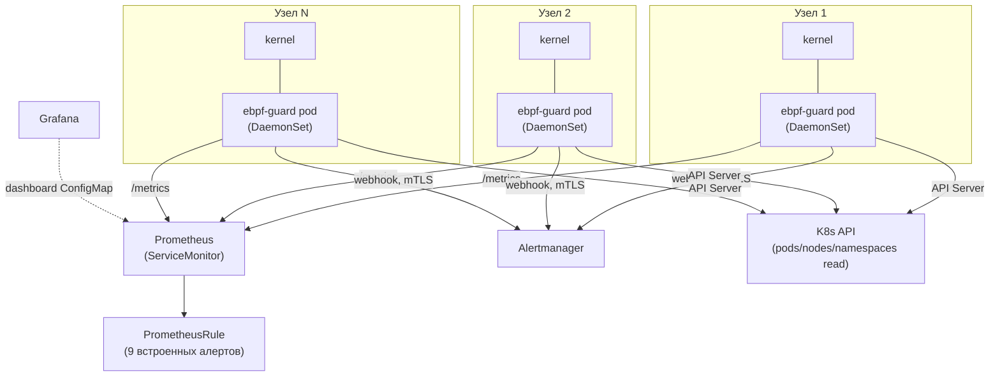
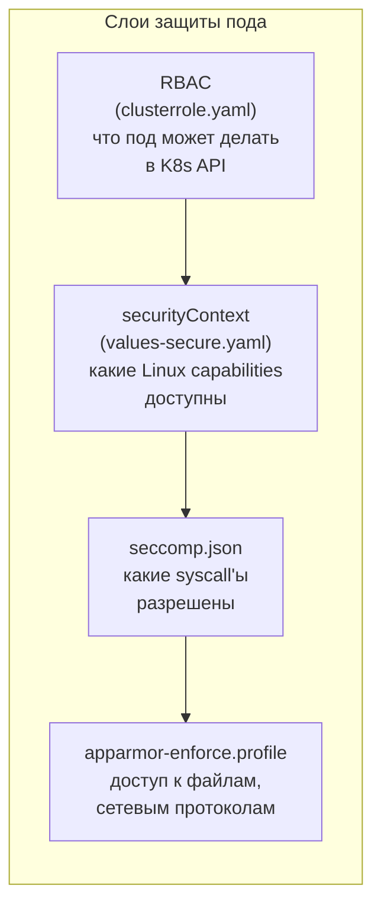

# Глава 20. Развёртывание в Kubernetes

> Уровень: **средний**. Предполагает главы [4](04-architecture.md) и [19](19-config-reference.md).

## Зачем это нужно

ebpf-guard — это агент, который должен видеть события ядра **каждого**
узла кластера, а не одного пода. В Kubernetes для этого есть
единственный правильный примитив — DaemonSet: под, гарантированно
запущенный ровно один раз на каждом (подходящем) узле, живущий и
умирающий вместе с узлом. Эта глава разбирает готовый Helm-чарт
(`deploy/helm/ebpf-guard/`) — что именно он разворачивает, какие
привилегии реально нужны поду с eBPF внутри, и как их можно урезать
для проды через `values-secure.yaml`.

Аналогия: обычное приложение в Kubernetes — это охранник в отдельной
комнате конкретного этажа. ebpf-guard — это охранник, которому для
работы физически нужен доступ к системе видеонаблюдения всего здания
(ядру узла) — отсюда и особые требования к правам, которых у обычного
пода нет.



## Структура чарта

`deploy/helm/ebpf-guard/` (`Chart.yaml`: `name: ebpf-guard`,
`version: 0.1.1`, `appVersion: 0.10.0-alpha`). Шаблоны в
`templates/`:

| Шаблон | Что рендерит |
|---|---|
| `daemonset.yaml` | сам под агента (см. ниже) |
| `configmap.yaml` | два ConfigMap: `<fullname>-config` (`config.yaml`) и `<fullname>-rules` (`rules.yaml`) — прямое отражение главы 19 |
| `clusterrole.yaml` + `clusterrolebinding.yaml` | RBAC (см. ниже) |
| `serviceaccount.yaml` | ServiceAccount, гейт `serviceAccount.create` |
| `service.yaml` | ClusterIP Service, порт метрик |
| `servicemonitor.yaml` | Prometheus Operator ServiceMonitor, гейт `serviceMonitor.enabled` |
| `prometheusrule.yaml` | PrometheusRule, гейт `prometheusRule.enabled` — 9 встроенных правил (`EbpfGuardDown`, `EbpfGuardHighAlertRate`, `RuleReloadStale`, `RuleReloadFailing`, `EbpfGuardMemoryPressure`, `EbpfGuardCPUPressure`, `EbpfGuardCollectorDown`, `EbpfGuardEventQueueSaturated`, `EbpfGuardCanaryFileTampered` и др.) |
| `grafana-dashboard.yaml` / `grafana-fleet-dashboard.yaml` | ConfigMap с JSON-дашбордом Grafana, каждый под своим гейтом (по умолчанию оба выключены) |
| `validatingwebhookconfig.yaml` | K8s ValidatingWebhookConfiguration + admission Service (+ опционально cert-manager `Certificate`), гейт `admissionWebhook.enabled` |
| `vpa.yaml` | VerticalPodAutoscaler, гейт `vpa.enabled` |
| `namespace.yaml` | опциональное создание namespace, гейт `namespaceCreate` |
| `NOTES.txt` | подсказки после `helm install`: команды для статуса/логов/метрик, получение bearer-токена |

Рядом есть `deploy/manifests/` — тот же набор без Helm, для тех, кто не
использует Helm вообще (не разбирается в этой главе подробно).

## DaemonSet: что реально требуется от узла

`templates/daemonset.yaml`:

- `hostNetwork: true`, `hostPID: true`, `dnsPolicy: ClusterFirstWithHostNet`
  (строки 35-37) — агент должен видеть PID- и сетевое пространство
  **самого узла**, а не изолированного пода, иначе eBPF-пробы будут
  видеть только свой собственный контейнер.
- `securityContext` контейнера по умолчанию — `privileged: true`
  (`values.yaml:49-50`, с комментарием «required for eBPF programs»).
  Дальше в этой главе показано, как от этого уйти.
- `volumeMounts`: `bpf-fs` → `/sys/fs/bpf` (чтобы пиновать
  BPF-объекты между рестартами процесса), `cgroup-fs` → `/sys/fs/cgroup`
  (read-only), `proc-fs` → `/proc` (read-only), `modules` →
  `/lib/modules` (read-only) — плюс ConfigMap-маунты конфигурации и
  правил, и условные маунты для `profiler-state`/`audit-log`.
- Init-контейнеры (условные): `profiler-state-init` — готовит
  hostPath-директорию для персистентности профайлера (глава 9) между
  рестартами пода; `btf-init` — скачивает BTF-файл ядра из
  [btfhub-archive](https://github.com/aquasecurity/btfhub-archive) в
  `emptyDir`, если у узла нет собственного `/sys/kernel/btf/vmlinux`
  (глава 2 — зачем вообще нужен BTF).
- Заметно **отсутствует** прямой bind-mount `/sys/kernel/debug` или
  заголовков ядра хоста — вместо постоянного маунта BTF решается
  разовой загрузкой через init-контейнер, а не зависимостью от того,
  что именно установлено на узле.
- `tolerations: {operator: Exists}` по умолчанию (`values.yaml:33`) —
  под планируется на все узлы, включая control-plane с taint'ами,
  потому что control-plane узлы тоже нуждаются в мониторинге.

## RBAC: минимально необходимое, не более

`templates/clusterrole.yaml` — весь набор прав ServiceAccount'а:

```yaml
- apiGroups: [""]
  resources: ["pods"]
  verbs: ["get", "list", "watch"]
- apiGroups: [""]
  resources: ["nodes"]
  verbs: ["get", "list"]
- apiGroups: [""]
  resources: ["namespaces"]
  verbs: ["get", "list", "watch"]
# условно, только если enforcement.networkpolicy.enabled:
- apiGroups: ["networking.k8s.io"]
  resources: ["networkpolicies"]
  verbs: ["get", "list", "watch", "create", "delete"]
```

Никаких прав на `secrets`, `exec`, `delete` подов и т.п. — RBAC
ограничен ровно тем, что нужно K8s-enricher'у (глава про метаданные, см.
`internal/k8s/` в карте пакетов главы 4) плюс опциональной генерацией
`NetworkPolicy` при включённом сетевом enforcement (глава 12).

## `values-secure.yaml`: захардненный оверлей

`deploy/helm/ebpf-guard/values-secure.yaml` — не отдельный чарт, а
**оверлей** поверх `values.yaml` (`helm install ... -f values.yaml -f
values-secure.yaml`). Ключевые отличия:

| Параметр | `values.yaml` (по умолчанию) | `values-secure.yaml` |
|---|---|---|
| `securityContext.privileged` | `true` | `false` |
| `securityContext.capabilities` | (не задано — полный набор через privileged) | `drop: [ALL]`, `add: [SYS_ADMIN, BPF, PERFMON, IPC_LOCK, NET_ADMIN]` |
| `securityContext.readOnlyRootFilesystem` | не задано | `true` |
| `securityContext.allowPrivilegeEscalation` | не задано | `false` |
| `podSecurityContext.seccompProfile.type` | `{}` | `RuntimeDefault` |
| `podSecurityContext.runAsNonRoot` | не задано | `true` (с `runAsUser: 0` — см. ниже) |
| `store.backend` | `memory` | `sqlite` |
| `serviceMonitor.enabled` / `prometheusRule.enabled` | `false` | `true` |
| `vpa.enabled` | `false` | `true` (`updateMode: Initial`) |
| `resources` | `limits: 500m/256Mi` | `limits: 1000m/512Mi` |

Явный конкретный набор capabilities вместо `privileged: true` — это
прямое применение принципа наименьших привилегий: `SYS_ADMIN`, `BPF`,
`PERFMON`, `IPC_LOCK` нужны для загрузки/присоединения BPF-программ и
доступа к perf-событиям, `NET_ADMIN` — только если используется
`enforcer.block_backend: nftables` (глава 12); если вместо nftables
выбран `lsm`-backend, `NET_ADMIN` можно убрать вовсе.

Важный практический нюанс: `runAsUser: 0` (root) в `values-secure.yaml`
остаётся, несмотря на `runAsNonRoot: true`-заголовок секции — комментарий
в файле поясняет, что root UID пока требуется для `CAP_BPF` на части
поддерживаемых ядер; полностью non-root запуск (например,
`runAsUser: 65534`) возможен на более новых ядрах при правильном наборе
capabilities, но не является дефолтной конфигурацией чарта.

AppArmor-аннотация в `values-secure.yaml` оставлена закомментированной
— профиль нужно сначала загрузить на узлы вручную, только потом
включать аннотацию (см. ниже).

## Hardening за пределами Helm: seccomp и AppArmor

`deploy/security/`:

- **`seccomp.json`** — `defaultAction: SCMP_ACT_ERRNO` (запрет по
  умолчанию), явный allowlist обычных syscall'ов, отдельно разрешены
  `bpf` и `perf_event_open`, а также `mount`/`umount2`/`pivot_root`
  (нужны для части операций с cgroup/namespace). При этом `ptrace`
  **явно запрещён** отдельной записью с комментарием «Deny ptrace for
  security» — примечательно, что сам агент не использует `ptrace` для
  своей работы (весь сбор данных идёт через eBPF, глава 2), поэтому
  запрет ничего не ломает, но закрывает потенциальный вектор для
  скомпрометированного процесса агента.
- **`apparmor.profile`** / **`apparmor-enforce.profile`** — два
  варианта одного и того же профиля `ebpf-guard`; тела правил
  идентичны, разница только во флагах: `apparmor-enforce.profile`
  явно включает `enforce` в списке флагов профиля, тогда как
  `apparmor.profile` — вариант без явного enforce/complain (используется
  как базовый шаблон для дальнейшей настройки). Оба разрешают:
  широкий набор capabilities (`sys_admin`, `net_admin`, `bpf`,
  `perfmon`, `ipc_lock`, `sys_ptrace` — да, ptrace вопреки
  seccomp-профилю выше, поскольку AppArmor и seccomp — два независимых,
  не всегда синхронизированных слоя), сетевой доступ (`inet`/`inet6`
  stream/dgram/raw/packet), запись в `/sys/fs/bpf/**` и
  `/sys/kernel/debug/tracing/**`. При этом явно **запрещена** запись в
  `/etc/shadow`, `/etc/passwd`, `/etc/group`, `/root/**` и
  `/home/*/.ssh/**` — даже с широкими capabilities, профиль не даёт
  агенту трогать системные секреты и SSH-ключи пользователей.

Оба слоя (seccomp + AppArmor) применяются одновременно и независимо
друг от друга — они закрывают разные классы риска (seccomp фильтрует
syscall'ы на уровне ядра, AppArmor — доступ к файлам и capabilities на
уровне LSM), поэтому в проде рекомендуется включать оба, а не выбирать
один.



## Наблюдаемость «из коробки»

При `serviceMonitor.enabled: true` и `prometheusRule.enabled: true`
(в `values-secure.yaml` — по умолчанию) Prometheus Operator сам
обнаруживает под через `ServiceMonitor` и начинает алертить по 9
встроенным правилам без дополнительной настройки — включая
`EbpfGuardDown` (агент не отвечает), `EbpfGuardMemoryPressure`/
`EbpfGuardCPUPressure` (сигналы от watchdog'а из главы 22),
`RuleReloadFailing` (hot-reload правил из главы 8 перестал работать) и
`EbpfGuardCanaryFileTampered` (сработал canary-детект). Grafana-дашборд
(`grafana-dashboard.yaml`, гейт `grafana.dashboard.enabled`) и
fleet-версия дашборда (`grafana-fleet-dashboard.yaml`, для нескольких
узлов сразу) подключаются тем же паттерном — ConfigMap с JSON,
подхватываемый Grafana sidecar'ом.

## Дальше почитать

- [`deploy/helm/ebpf-guard/`](../../deploy/helm/ebpf-guard/) — весь чарт.
- [`deploy/helm/ebpf-guard/values-secure.yaml`](../../deploy/helm/ebpf-guard/values-secure.yaml) — захардненный оверлей.
- [`deploy/security/`](../../deploy/security/) — seccomp и AppArmor профили, `README.md` внутри с таблицей capabilities.
- Глава [19](19-config-reference.md) — что именно кладётся в ConfigMap `config.yaml`.
- Глава [23](23-agent-security.md) — модель угроз агента в целом.
- [Kubernetes DaemonSet docs](https://kubernetes.io/docs/concepts/workloads/controllers/daemonset/), [Prometheus Operator](https://prometheus-operator.dev/) — справочная документация используемых K8s-примитивов.

## Глоссарий

- **DaemonSet** — контроллер Kubernetes, гарантирующий один под на каждом (подходящем) узле кластера.
- **hostPID / hostNetwork** — режимы пода, при которых он видит PID- и сетевое пространство имён узла, а не изолированное пространство контейнера.
- **ServiceMonitor / PrometheusRule** — Custom Resource'ы Prometheus Operator для авто-обнаружения целей скрейпа и деклараций алертов соответственно.
- **Seccomp-профиль** — список разрешённых syscall'ов на уровне ядра для процесса в контейнере.
- **AppArmor-профиль** — LSM-политика, ограничивающая доступ процесса к файлам, сети и capabilities по имени пути/протокола.
- **VPA (VerticalPodAutoscaler)** — контроллер Kubernetes, автоматически подстраивающий CPU/memory requests/limits пода на основе фактического потребления.

---

**Назад:** [Глава 19. Полный справочник конфигурации](19-config-reference.md) · **Далее:** [Глава 21. Миграция с Falco](21-falco-migration.md)
