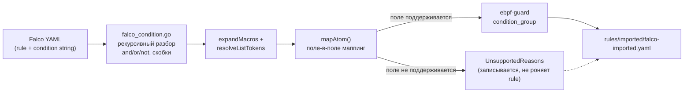

# Глава 21. Миграция с Falco (`internal/migration/`)

> Уровень: **средний**. Предполагает главы [7](07-correlation-engine.md), [8](08-writing-rules.md) и [18](18-cli-reference.md).

## Зачем это нужно

У команды, уже использующей [Falco](https://falco.org/), может быть
накоплен реальный, проверенный на практике набор правил — переписывать
его вручную под DSL из главы 8 дорого и рискованно (легко потерять
нюанс условия при переносе). `internal/migration/` — это конвертер:
он разбирает синтаксис Falco-условий (`evt.type=open and
fd.name contains "/etc/shadow"`) и пытается автоматически собрать
эквивалентное правило ebpf-guard. Аналогия: это не переводчик,
знающий оба языка в совершенстве, а прагматичный переводчик по
словарю — там, где точное соответствие есть, перевод точен; там, где
понятия не совпадают (например, у Falco есть поле `container.id`, а у
ebpf-guard пока нет доступа к container-метаданным в условиях правил),
конвертер честно говорит «это не переносится» вместо того, чтобы
угадывать.



## Как устроен разбор условия

В `internal/migration/falco_condition.go` нет генератора парсеров —
это написанный вручную рекурсивный разбор булева выражения:

1. `splitTopLevelKeyword(s, keyword)` (`falco_condition.go:137`) —
   делит строку на `and`/`or` только на верхнем уровне вложенности
   скобок, с учётом кавычек и границ слов (чтобы не разрезать, например,
   `"contains and stuff"` внутри строкового литерала).
2. `stripNotPrefix` (`:186`) и `stripOuterParens` (`:199`) — разбирают
   `not (...)` и обрамляющие скобки.
3. `parseExpr(expr, eventType, lists)` (`:337`) — приоритет операторов:
   `or` связывает слабее всего, затем `and`, затем `not` (порядок
   вычисления совпадает со стандартной булевой алгеброй).
4. `mapAtom(atom, eventType, lists)` (`:485`) — на уровне листового
   условия происходит собственно маппинг поля Falco → поле ebpf-guard,
   через цепочку `switch`/`hasFieldPrefix`.
5. `expandMacros(cond, macros)` (`:47`) — до 25 проходов подстановки
   `macro:`-блоков Falco (именованные переиспользуемые фрагменты
   условия) по границе слова, с жёстким лимитом длины
   `maxExpandedConditionLen = 64*1024` (`:42`), чтобы циклическая или
   патологическая цепочка макросов не привела к неконтролируемому
   росту строки.
6. `resolveListTokens` (`:117`) — рекурентно раскрывает ссылки на
   `list:`-блоки внутри `in (...)`, с защитой от циклов через `seen`.
7. `detectEventType(expandedCond)` (`:266`) — определяет
   `event_type` результата (`file`/`network`/`syscall`) по селекторам
   `evt.type`/`syscall.type`, с фолбэком на эвристику по префиксу поля
   `fd.*`.

## Что поддерживается

| Falco-поле | Условие | ebpf-guard-эквивалент |
|---|---|---|
| `evt.type` / `syscall.type` | `= open/read/write` (file) | `op` через `classifyFileOp` |
| `evt.type` / `syscall.type` | прочее (generic syscall) | `nr` (номер syscall x86_64 через `autolearn.SyscallNr`) |
| `fd.name` | | `fd.name` |
| `fd.filename` | | `filename` |
| `fd.directory` | | `directory` |
| `fd.sport` / `fd.dport` | | `sport` / `dport` |
| `fd.sip` / `fd.dip` | значение с `/` → CIDR | `saddr`/`daddr`, автоматически `in_cidr` |
| `fd.proto` | | `proto` |
| `proc.args` | | `proc.args` |
| `proc.name` | | `proc.comm` |
| `user.uid` | | `uid` |

Операторы: `=`/`!=` → `eq`/`neq`, `in (...)`/`not in (...)` (со
списками), `contains`, `startswith` → `prefix`, простые glob-шаблоны
(`*` только в начале/конце → `prefix`/`suffix`/`contains`), числовые
`>`, `>=`, `<`, `<=`. Логика `and`/`or`/`not` — включая инверсию `not`
для одиночного условия через `negateCondition`
(`falco_condition.go:428-455`, например `not (evt.type = open)` →
`neq`, а не буквальное «NOT» в выходном YAML, которого в DSL главы 7 нет).

`macro:` и `list:` блоки раскрываются рекурсивно перед конвертацией.
Правила с `enabled: false` конвертируются в `status: disabled` и
пропускаются, а не вызывают ошибку (`falco_importer.go:250-254`).

## Что не поддерживается — и почему это правильный выбор

Явно **не** переносится (клауза отбрасывается, причина попадает в
`UnsupportedReasons`, но само правило не проваливается целиком, если
хоть что-то сконвертировалось):

| Falco-поле/конструкция | Причина |
|---|---|
| `fd.typechar`, `fd.type` | нет эквивалента в модели событий ebpf-guard |
| `fd.net`/`fd.cnet`/`fd.snet`/`fd.rnet` | направление подсети неоднозначно — используйте явные `fd.sip`/`fd.dip` |
| прочие `fd.*` | нет маппинга поля |
| `container.*` | метаданные контейнера не доступны в условиях правил |
| `k8s.*` | метаданные Kubernetes не доступны в условиях правил |
| `proc.*` кроме `name`/`args` | не поддерживается |
| `user.*` кроме `uid` | не поддерживается |
| `group.*` | нет эквивалента |
| `evt.type != ...` | неравенство по типу события не поддержано |
| `not` над составным (`and`/`or`) выражением | не поддерживается — только `not` над одиночным условием |
| `not` над `contains`/`regex` | у этих операторов нет обратной формы |
| сложные glob-шаблоны (несколько `*` внутри строки) | не поддерживается |

Это не недоработка «на будущее», а прямое следствие модели событий
ebpf-guard из главы 7: `condition`/`condition_group` работают по
конкретным полям `types.Event`, а container/k8s-метаданные там
физически не проходят через путь событие→правило (обогащение k8s
происходит отдельно, на уровне алерта, а не внутри `RuleEngine`).
Важно, что поведение при частичной неподдержке — «best-effort»:
правило становится `"unsupported"` целиком, только если **ни одна**
клауза не сконвертировалась; если хотя бы часть условия перенеслась,
конвертер отдаёт `"converted"` правило с урезанным условием плюс список
причин, что именно выпало — не тихо, а с явным указанием, что нужно
проверить вручную.

## Пример: до и после

Из `internal/migration/falco_importer_test.go`
(`TestFalcoImporter_BasicRule`, строки 15-40):

```yaml
# Falco — вход
- rule: Read sensitive file
  desc: An attempt to read /etc/shadow
  condition: evt.type = open and fd.name contains "/etc/shadow"
  priority: WARNING
  tags: [filesystem, mitre_credential_access]
```

конвертируется в правило с `event_type: file`, `severity: warning`,
`action: alert`, `condition_group.operator: and` из двух условий — по
сути прямой перенос, потому что оба поля (`evt.type=open`,
`fd.name contains`) полностью поддерживаются.

Более показательный случай частичной деградации —
`TestFalcoImporter_ContainerFieldsDropped`
(`falco_importer_test.go:78-98`): условие вида

```
container.id != host and proc.name = nsenter
```

конвертируется, **теряя** клаузу `container.id != host` (она не
переносима — см. таблицу выше), но сохраняя `proc.comm eq nsenter` и
записывая причину отбрасывания в `UnsupportedReasons` — правило
остаётся рабочим, просто более широким, чем оригинал, и это явно
видно в отчёте импорта.

Реалистичный многоправиловый пример с макросами и списками —
`internal/migration/testdata/falco_sample.yaml` — прогоняется
end-to-end тестом `TestFalcoImporter_RoundTrip_RealisticSample`
(`falco_importer_test.go:717-736`), который не просто конвертирует, но
и загружает результат обратно через `correlator.LoadRulesFromFile` и
`correlator.NewRuleEngine` (глава 7) — то есть доказывает, что
сгенерированный YAML не просто синтаксически похож на правило, а
реально загружается движком.

## Как запустить миграцию

Отдельной команды `ebpf-guard migrate` **нет** (см. также главу 18) —
Falco-импорт — это режим общей команды `rules import`:

```bash
ebpf-guard rules import --format falco ./falco-rules/ --out rules/imported/
ebpf-guard rules import --format falco rule.yaml --dry-run
```

Реализация: `runFalcoImport`
(`cmd/ebpf-guard/main.go:2193-2250`) создаёт `migration.NewFalcoImporter()`
(`:2194`), вызывает `imp.ImportDir`/`imp.ImportFile` в зависимости от
того, файл или директория передана (`:2199`/`:2201`), печатает сводку
и пишет результат в `<outDir>/falco-imported.yaml` с правами `0o600`
(`:2244-2246`) — то есть выходной файл сразу защищён от чтения другими
пользователями системы, как и положено файлу с потенциально
чувствительными деталями инфраструктуры.

После импорта — не пропускайте шаг: прогоните
`ebpf-guard rules check` (глава 18) на новых правилах и просмотрите
`UnsupportedReasons` в выводе импорта, прежде чем полагаться на
перенесённые правила в проде.

## Дальше почитать

- [`internal/migration/falco_importer.go`](../../internal/migration/falco_importer.go), [`falco_condition.go`](../../internal/migration/falco_condition.go) — реализация.
- [`internal/migration/testdata/falco_sample.yaml`](../../internal/migration/testdata/falco_sample.yaml) — реалистичный пример входных Falco-правил.
- Глава [7](07-correlation-engine.md) — целевая модель условий, в которую конвертируются правила.
- Глава [18](18-cli-reference.md) — `rules import`/`rules check`.
- [Falco rules syntax](https://falco.org/docs/rules/) — официальная документация условий Falco.

## Глоссарий

- **Falco condition** — булево выражение над полями события (`evt.*`, `fd.*`, `proc.*`, ...), определяющее, когда срабатывает Falco-правило.
- **Macro (Falco)** — именованный переиспользуемый фрагмент условия, подставляемый в другие условия по имени.
- **List (Falco)** — именованный список значений, используемый внутри `in (...)`.
- **Best-effort conversion** — стратегия конвертации, при которой поддерживаемая часть условия переносится, а неподдерживаемая явно помечается как отброшенная, вместо отказа от всего правила целиком.

---

**Назад:** [Глава 20. Развёртывание в Kubernetes](20-kubernetes-deployment.md) · **Далее:** [Глава 22. Производительность, тюнинг и траблшутинг](22-performance-tuning.md)
