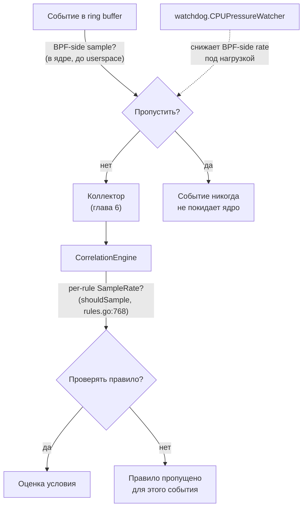

# Глава 22. Производительность, тюнинг и траблшутинг

> Уровень: **продвинутый**. Предполагает главы [6](06-collectors.md), [7](07-correlation-engine.md) и [9](09-profiler-anomalies.md).

## Зачем это нужно

Агент, который видит каждый `read`/`write` syscall на загруженном
хосте, физически не может обрабатывать 100% событий бесплатно — вопрос
не «включать ли оптимизации», а «на каком уровне их настроить под
конкретную нагрузку». Эта глава собирает воедино три независимых
механизма экономии ресурсов, которые в отдельности уже упоминались в
главах 6 и 7 (BPF-side sampling, adaptive sampling, per-rule
sampling), плюс то, что раньше не разбиралось: PGO-сборку, конкретные
бенчмарки хот-пути, дисциплину порядка захвата блокировок и готовые
пресеты под разное железо.

## Три независимых уровня семплирования — сводная картина

Главы 6 и 7 разбирали каждый механизм в контексте своего слоя. Здесь —
таблица, чтобы не путать их между собой:

| Уровень | Что решает | Где живёт | Конфиг |
|---|---|---|---|
| BPF-side sampling | пропустить событие целиком, **до** ring buffer | ядро (глава 6) | `bpf.syscall_sample_rate`/`network_sample_rate`/`file_sample_rate` |
| Adaptive (CPU-pressure) sampling | динамически снизить BPF-side rate под нагрузкой CPU | `watchdog.MultiBPFController` (глава 6) | `watchdog.cpu_pressure.*` |
| Per-rule sampling | проверять правило не на каждом событии, а с заданной частотой — событие уже распарсено | `RuleEngine` (глава 7) | `rules.sampling.rate`/`.mode` (`random`/`hash_pid`), плюс глобальный `rules.adaptive_sampling.*` |

`docs/performance-tuning.md` формулирует рекомендованный порядок
тюнинга (строки 129-135): сначала снять baseline без семплирования →
найти «горячие» правила по метрикам → включить статическое per-rule
семплирование → включить adaptive sampling → проверить, что качество
алертов не деградировало сильнее заданного допуска. Этот допуск —
не абстрактная цифра: тесты `internal/correlator/rules_test.go:1529`
(«allow ±5% tolerance around the 10% target») и проверки в
`sampler_test.go` фиксируют его в код, то есть отклонение фактической
частоты сработок от заданной цели `sample_rate` контролируется
автоматическими тестами, а не только замеряется вручную при ревью.



## PGO: не просто файл в репозитории

`default.pgo` в корне репозитория — не декоративный артефакт, он
реально подключён к сборке:

```makefile
# Makefile:68 — комментарий
# PGO is applied automatically when default.pgo exists in the module root.
# Makefile:72 — дефолтная цель build
go build -pgo=auto -o $(BUILD_DIR)/$(BINARY_NAME) ./cmd/ebpf-guard
```

Отдельная цель `build-pgo` (`Makefile:75-78`) делает то же самое с
флагом `-v`. Обновляется профиль через `make pgo-profile`/`make
pgo-update` (`Makefile:188-200`), которые прогоняют
`scripts/pgo-update.sh default.pgo` и регенерируют файл «из бенчмарков
горячего пути (correlator + profiler)» (комментарий на `Makefile:188`)
— то есть профиль оптимизации привязан именно к бенчмаркам, описанным
ниже, а не к произвольному профилированию продакшена.

## Бенчмарки: что реально измеряется

- **Correlation engine** — `internal/correlator/ingest_bench_test.go`:
  `BenchmarkIngest_NoMatch_Syscall` (:31), `BenchmarkIngest_Match_Syscall`
  (:55), `BenchmarkIngest_Parallel_NoMatch` (:79). Комментарий в файле
  (строки 27-30) описывает цель как измерение «полного синхронного
  hot path `Ingest` на доминирующем продакшен-сценарии». Важная
  деталь для точности: явной числовой цели вида «< X µs/op» **нигде в
  коде нет** — фраза из `CLAUDE.md` («correlation engine < X µs/op») это
  буквально незаполненный плейсхолдер, а не реальный SLA, зафиксированный
  где-либо в репозитории.
- **Profiler** — `internal/profiler/anomaly_bench_test.go`:
  `BenchmarkProcessEvent` (:13), и — в отличие от correlation engine —
  здесь цель **реально зафиксирована** прямо в комментарии над
  бенчмарком (строка 12):
  ```go
  // Target: p99 < 10µs at 10k events/sec sustained throughput.
  func BenchmarkProcessEvent(b *testing.B) { ... }
  ```
  Плюс `BenchmarkProcessEventFileAccess` (:68), `BenchmarkProcessEventSyscall`
  (:113), `BenchmarkProcessEventParallel` (:182).
- Дополнительные бенчмарки хот-пути: `internal/correlator/rules_bench_test.go`
  (оценка правил), `internal/correlator/sharded_buffer_test.go`
  (контеншен 16-шардового буфера из главы 7), `internal/profiler/sequence_test.go`,
  `internal/profiler/lineage_test.go`.

Запуск: `make bench` (см. `CLAUDE.md`) или напрямую
`go test -bench=. -benchmem ./internal/correlator/... ./internal/profiler/...`.

## Дисциплина блокировок

Полная документация — `docs/lock-ordering.md` (267 строк). Верхнеуровневая
иерархия (строки 12-16), от самой внешней к самой внутренней:

```
ProfileManager.mu (снаружи) → ProcessProfile.mu → AnomalyDetector.mu (внутри)
```

Ключевые конкретные точки:

- `internal/profiler/profile.go:RecordEvent` — берёт `pm.mu` до
  `profile.mu` (doc line 23).
- `internal/profiler/anomaly.go` — `AnomalyDetector.learningComplete`
  специально сделан `atomic.Bool`, а не полем под мьютексом, именно
  чтобы избежать блокировки на самом горячем пути проверки «профиль уже
  обучен?» (doc lines 62-91) — конкретный пример того, что не каждое
  разделяемое состояние стоит защищать мьютексом, если можно свести к
  одному атомарному чтению.
- `internal/exporter/alertmanager.go` — `AlertmanagerClient.mu` (doc
  line 97); `internal/exporter/cardinality.go` —
  `AnomalyScoreGuard.mu`, защищающий map и heap **вместе**, одной
  блокировкой (doc line 117) — раздельные мьютексы на map и heap здесь
  были бы источником рассинхронизации, а не оптимизацией.
- `internal/correlator/engine.go` — 16-шардовый PID-buffer (глава 7):
  `shard := e.PID % 16`, никакой кросс-шардовой блокировки (doc lines
  135-154) — прямое объяснение, почему шардирование вообще даёт
  выигрыш: каждый шард можно блокировать независимо.
- Раздел «анти-паттерны» (doc lines 192-242) — гонка при апгрейде
  блокировки (read→write lock), непоследовательный порядок захвата
  между двумя путями кода, удержание блокировки во время I/O
  (например, во время HTTP-запроса к Alertmanager).

Практический вывод для контрибьютора: если добавляете новый разделяемый
кэш/буфер, сначала проверьте `docs/lock-ordering.md` — новый мьютекс
должен встать в существующую иерархию, а не создавать собственную,
потенциально противоречащую ей.

## Пресеты под железо

`docs/hardware-profiles.md` — три пресета: `lite`, `balanced`,
`production`. Приоритет выбора (doc lines 11-18): явный флаг
`--profile` (глава 18) > ключ `profile:` в конфиге (глава 19) >
автоопределение по `nproc`/`/proc/meminfo`. Таблица автоопределения
(doc lines 20-23): 1 CPU или ≤ ~2.2 ГБ RAM → `lite`; иначе →
`balanced`; `production` **никогда** не выбирается автоматически — его
нужно указать явно, поскольку это осознанный компромисс в сторону
большего потребления ресурсов ради полноты детекта, который не стоит
включать «случайно» на маленьком узле.

Что меняется между пресетами (doc lines 39-48): `bpf.map_sizes.{events,
processes, connections}`, `profiler.max_tracked_pids`,
`profiler.sequence.enabled`, `profiler.lineage.enabled` (главы 9),
переменные окружения `GOMEMLIMIT`/`GOGC` (управление сборщиком мусора
Go под конкретный бюджет памяти). Реализация — `internal/config/config.go`:
`resolveHardwareProfile()`/`ApplyHardwareProfile()`, вызываемые внутри
`NewZeroConfigManagerWithProfile` (`config.go:1805-1806`) — то есть
пресет применяется именно на этапе построения конфигурации, до того как
остальной агент увидит `Config`.

## Траблшутинг: типовые проблемы

Единого файла «Troubleshooting» в репозитории нет — рекомендации
разбросаны по темам, что логично: каждая проблема специфична для
своего слоя.

**Нет BTF / старое ядро:**
- `docs/deployment.md:8` — минимальное требование: kernel 5.15+ с BTF
  (`CONFIG_DEBUG_INFO_BTF=y`).
- `docs/deployment.md:155-192`, раздел «Troubleshooting»: под в
  `CrashLoopBackOff` → сначала проверить версию ядра, затем
  `ls /sys/kernel/btf/` — должен быть файл `vmlinux` (строки 163-169).
  Если BTF на узле нет, вспомните `btf-init`-контейнер из главы 20,
  который решает это для Helm-деплоя.
- `Makefile` (цель `make generate`, строки 55-61) — падает с ошибкой,
  если нет `bpftool`/BTF ядра сборочной машины **и** нет закоммиченного
  `bpf/vmlinux.h` — то есть для сборки в песочнице без реального ядра
  нужен именно закоммиченный `vmlinux.h`, а не живой BTF.

**Verifier reject:**
- `docs/operations.md:779-792` — эндпойнт живой перезагрузки BPF
  возвращает структурированную ошибку вида
  `{"status": "error", "error": "kernel verifier reject: ..."}`, если
  ядро отклонило программу при hot-reload — это тот же verifier,
  что разбирался в главе 2 (зачем он вообще нужен и что проверяет).

**Дропы событий:**
- `docs/dns-monitoring.md:210-211` — конкретный PromQL для DNS-коллектора:
  `... | grep ebpf_guard_dns_events_dropped_total`.
- `docs/metrics.md:98-99` — общий запрос по всем коллекторам:
  `sum by (collector) (ebpf_guard_events_dropped_total)`. Если это
  значение растёт — сначала проверьте sampling-конфигурацию выше в
  этой главе, прежде чем увеличивать `bpf.map_sizes.events`
  (глава 19): рост размера map — не всегда правильный первый шаг, если
  причина в burst-нагрузке, которую лучше сгладить семплированием.

**Прочие точечные troubleshooting-разделы** (каждый — в своей теме, а
не в общем месте): `docs/enforcement.md`, `docs/lsm-enforcement.md`,
`docs/metrics.md`, `docs/notifications.md`, `docs/rules.md`,
`docs/tls-inspection.md`, `docs/wasm-plugins.md` — если проблема
относится к конкретной фиче, начинайте поиск с troubleshooting-раздела
профильного документа, а не с общих источников.

## Дальше почитать

- [`docs/performance-tuning.md`](../performance-tuning.md), [`docs/hardware-profiles.md`](../hardware-profiles.md), [`docs/lock-ordering.md`](../lock-ordering.md) — полные операционные документы.
- [`docs/deployment.md`](../deployment.md) — деплой-специфичный troubleshooting.
- [`internal/profiler/anomaly_bench_test.go`](../../internal/profiler/anomaly_bench_test.go), [`internal/correlator/ingest_bench_test.go`](../../internal/correlator/ingest_bench_test.go) — бенчмарки хот-пути.
- Глава [6](06-collectors.md) — BPF-side и adaptive sampling.
- Глава [7](07-correlation-engine.md) — per-rule sampling и шардированный буфер.
- [Go PGO (Profile-Guided Optimization)](https://go.dev/doc/pgo) — официальная документация механизма, на котором строится `-pgo=auto`.

## Глоссарий

- **PGO (Profile-Guided Optimization)** — механизм компилятора Go, использующий профиль реальной нагрузки (`default.pgo`) для более агрессивной инлайновой оптимизации горячих путей кода.
- **p99** — 99-й перцентиль латентности: значение, ниже которого укладываются 99% измерений (метрика «типичного худшего случая», в отличие от среднего).
- **Lock ordering (порядок блокировок)** — соглашение о фиксированном порядке захвата нескольких мьютексов, предотвращающее deadlock при пересечении путей кода.
- **Hardware profile (пресет)** — заранее заданный набор значений конфигурации (`lite`/`balanced`/`production`), подобранный под класс железа, на котором работает агент.
- **Verifier reject** — отказ BPF-верификатора ядра (глава 2) загрузить или присоединить программу, обычно при hot-reload новой версии BPF-кода.

---

**Назад:** [Глава 21. Миграция с Falco](21-falco-migration.md) · **Далее:** [Глава 23. Безопасность самого агента и модель угроз](23-agent-security.md)
