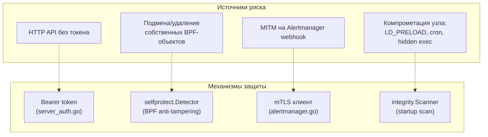

# Глава 23. Безопасность самого агента и модель угроз

> Уровень: **продвинутый**. Предполагает главы [12](12-enforcer.md), [13](13-exporters.md) и [20](20-kubernetes-deployment.md).

## Зачем это нужно

Все предыдущие главы разбирали, как ebpf-guard защищает **остальную**
систему. Эта глава — про обратный вопрос: а что защищает сам агент?
Это не праздный вопрос — агент по конструкции работает с широкими
привилегиями (`CAP_BPF`, `CAP_SYS_ADMIN`, глава 20), видит plaintext
TLS-трафик (глава 17) и держит HTTP API, который может убивать процессы
(глава 12). Скомпрометированный ebpf-guard — это не «одно приложение
из многих упало», а потенциальный root-эквивалентный доступ ко всему
узлу. Аналогия: если весь остальной агент — это система камер и
охрана здания, то эта глава — про то, кто охраняет самого охранника, и
что происходит, если кто-то попробует его подкупить или обмануть.



## Модель угроз: что признаётся открыто

`SECURITY.md` (277 строк) прямо формулирует контекст (строки 188-201):
агент штатно работает привилегированно (`CAP_BPF`/`CAP_SYS_ADMIN`/
`CAP_NET_ADMIN`, см. также главу 20 про урезание этого набора), и
проведён предметный разбор конкретных зон риска — не общими словами, а
таблицей «риск → принятая мера»:

| Зона риска | Принятая мера |
|---|---|
| Timing-атака на проверку HTTP-токена | `subtle.ConstantTimeCompare` |
| ReDoS через regex-условия в правилах | движок RE2 (без backtracking) + лимит 1 КиБ на паттерн |
| Timing-атака на gossip-секрет (кросс-узловой обмен IOC) | constant-time сравнение |
| SSRF через webhook Alertmanager | валидация целевого адреса |
| SQL-инъекция в SQLite-хранилище (глава 14) | параметризованные запросы |
| Подмена сертификата в mTLS | явная проверка цепочки |
| Побег из WASM-песочницы (глава 16) | ограничения рантайма плагинов |
| Инъекция через Rego-политику (глава 10) | ограничение возможностей политики |

Практический вывод для читателя: это не список «мы обещаем, что всё
безопасно», а список конкретных, поимённо разобранных векторов — то
есть авторы уже подумали про очевидные атаки на сам HTTP API и
regex-движок раньше, чем это придёт в голову внешнему аудитору.
`SECURITY.md` (строки 205-254) также честно фиксирует: полноценный
внешний аудит для v1.0 **ещё не проведён** — это roadmap-пункт с
перечнем потенциальных аудиторов (Trail of Bits, NCC Group, Cure53,
CNCF-аффилированные фирмы), а не завершённый факт.

Поддерживаемая версия для получения патчей безопасности — только
`0.1.x` (строка 9); SLA на патч: критичный — 14 дней, высокий — 30,
средний — 90, низкий — со следующим релизом (строки 41-46), при общем
90-дневном окне раскрытия информации (строки 48-57).

## Bearer-токен: как он на самом деле генерируется

`internal/exporter/server_auth.go`:

- `GenerateRandomToken()` (строки 78-86) — 32 случайных байта через
  `crypto/rand.Read` (строка 82), затем hex-кодирование (строка 85) —
  итоговый токен 64 символа. Это подтверждает формулировку из
  `CLAUDE.md` («auto-generated 32-byte token») дословно: 32 байта
  энтропии, а не 32 символа готовой строки.
- `SetupAuth()` (строки 88-120): если `authCfg.Enabled` включён, но
  `BearerToken` в конфиге не задан явно, вызывается
  `GenerateRandomToken()` (строка 100). В структурированный лог
  попадает только 8-символьный превью через `tokenPreview()` (строки
  62-70, 109-111) — полный токен печатается один раз в `stderr` при
  старте (строки 112-114) и **никогда** не пишется в обычный лог. Это
  осознанное разделение: превью — для того, чтобы оператор мог сверить
  «это тот же токен, что я записал», не давая возможности восстановить
  полный токен из логов, которые обычно живут дольше и собираются в
  централизованные системы шире, чем консольный вывод при старте.
- Проверка токена — константное по времени сравнение,
  `subtle.ConstantTimeCompare`, используется в трёх местах: строка 145
  (`BearerTokenMiddleware`), 315 и 370 (проверки admin/viewer токенов в
  RBAC-подобной логике далее в файле) — именно эта мера закрывает
  «Timing-атаку на проверку HTTP-токена» из таблицы выше.
- В zero-config режиме (`--zero-config`, глава 18) аутентификация
  включается принудительно: `NewZeroConfigManagerWithProfile`
  (`internal/config/config.go:1825-1833`) форсирует
  `cfg.Auth.Enabled = true` (строка 1826) — то есть даже при полностью
  автоматической конфигурации без единого файла, HTTP API не остаётся
  открытым по умолчанию. Переменная окружения `EBPF_GUARD_AUTH_TOKEN`
  позволяет закрепить конкретный admin-токен для контейнеризованных
  сценариев (CI/e2e), при этом viewer-токен всё равно генерируется
  автоматически (комментарий, строки 1827-1830).

## mTLS для Alertmanager: клиентская сторона

`internal/exporter/alertmanager.go`:

```go
// createMTLSConfig, строки 159-180 (упрощённо)
cert, _ := tls.LoadX509KeyPair(mtls.CertFile, mtls.KeyFile)
caData, _ := os.ReadFile(mtls.CAFile)
pool := x509.NewCertPool()
pool.AppendCertsFromPEM(caData)
return &tls.Config{
    Certificates: []tls.Certificate{cert},
    RootCAs:      pool,
    MinVersion:   tls.VersionTLS12,
}
```

Подключается в `newAlertmanagerClientFull` (строки 133-143): если
`mtls.Enabled`, HTTP-клиент получает `Transport` с этим
`tls.Config` (строки 139-141). Схема конфигурации —
`alerting.mtls.{enabled, cert_file, key_file, ca_file}`
(документировано в `SECURITY.md:135-144`, глава 19 — общий обзор
секции `alerting`). `MinVersion: tls.VersionTLS12` — явный отказ от
TLS 1.0/1.1 на стороне клиента, вне зависимости от того, что
поддерживает сервер Alertmanager.

## `selfprotect`: защита от вмешательства в собственные BPF-объекты

Важный нюанс, который стоит понять сразу: `internal/selfprotect/detector.go`
(315 строк) — **не** защита процесса агента от `kill -9` и не защита
конфигурационных файлов. Его область у́же и конкретнее, о чём явно
сказано в doc-комментарии пакета (строки 1-9): детект тамперинга
именно с BPF-объектами **самого агента**.

- `dangerousCommands` (строки 23-27) — карта опасных команд `bpf()`
  syscall: `BPF_MAP_UPDATE_ELEM`, `BPF_MAP_DELETE_ELEM`,
  `BPF_PROG_DETACH`. `IsTamperingCmd`/`TamperingCmdName` (строки 31-40)
  проверяют событие на принадлежность к этому набору.
- `OwnedObjects` (строки 44-131) — реестр собственных ID программ/карт
  и путей pin в bpffs агента: детект тамперинга срабатывает только на
  чужое вмешательство именно в **эти** объекты, а не в любые BPF-вызовы
  в системе (иначе алерты сыпались бы на легитимную работу самого
  агента).
- `AgentAllowlist` (строки 136-177) — при создании сразу добавляет
  `os.Getpid()` (строка 146), чтобы собственный процесс агента никогда
  не считался нарушителем; поддерживает динамическое добавление PID
  для сценария rolling upgrade (когда старый и новый под временно живут
  одновременно).
- `Detector.ProcessEvent` (строки 252-299): опасная `bpf()`-команда от
  PID **не из allowlist**, нацеленная на объект из `OwnedObjects` →
  алерт `RuleID: "self_protection_001"`, по умолчанию
  `SeverityCritical` (строка 215).
- `EnforceMode` (строки 190-193) — опциональный флаг: при включении
  сигнал алерта используется BPF LSM-слоем (глава 5, 12), чтобы вернуть
  `-EPERM` и реально заблокировать опасный вызов, а не только
  залогировать его. Требует ядро 5.7+ и `CONFIG_BPF_LSM=y` (те же
  требования, что у LSM-хуков из главы 5) — по умолчанию режим
  detection-only.

Проверка world-writable конфигурационного файла при старте — отдельная
мера, живущая не в `selfprotect`, а в поле `StrictConfig`
(`internal/config/config.go:108`, глава 19); упомянута в `SECURITY.md:81`.

## `integrity`: сканирование узла при старте

`internal/integrity/scanner.go` — не защита самого агента, а первичная
проверка **окружения**, в котором агент запускается: `Scanner.Scan()`
(строки 93-126) выполняет 4 проверки по порядку:

1. **`checkLDPreload()`** (строки 128-162) — читает
   `/etc/ld.so.preload`; любая непустая некомментарная строка —
   находка `ld_preload` (классический вектор персистентности через
   подмену библиотек для всех процессов системы).
2. **`checkCronDirs()`** (строки 164-200) — сканирует `/etc/cron.d`,
   `/etc/cron.{daily,hourly,weekly,monthly}`, `/var/spool/cron`,
   `/var/spool/cron/crontabs` на файлы, изменённые в пределах
   `checkWindow` (по умолчанию 24 часа, строка 73).
3. **`checkRootShellConfigs()`** (строки 202-258) — проверяет
   `/root/{.bashrc,.profile,.bash_profile,.bash_login,.zshrc,.zprofile}`
   на недавние изменения и грепает содержимое на паттерны `nc `,
   `netcat`, `curl ... | sh`, `wget ... | sh` (строки 241-249) —
   типичные индикаторы бэкдора через shell rc-файл root-пользователя.
4. **`checkAnonymousExecRegions()`** (строки 260-340) — обходит
   `/proc/<pid>/maps` всех процессов, ищет исполняемые регионы памяти
   без файла на диске (anonymous executable) — классический признак
   fileless-малвари или process injection.

Находки экспортируются как Prometheus-метрика
`ebpf_guard_integrity_findings_total{check}` (строки 342-355) и
рассылаются как алерты `SeverityWarning`, сгруппированные по типу
проверки (строки 374-407). Важно понимать место этой проверки в общей
картине: это разовый скан состояния узла на момент старта агента, а
не непрерывный мониторинг — непрерывное покрытие тех же классов угроз
даёт основной пайплайн правил (главы 7-8), integrity scan закрывает
именно «что уже произошло до того, как агент запустился».

## Минимальные привилегии на практике

`docs/security.md` даёт конкретную таблицу capabilities (строки
63-73): `CAP_BPF` (загрузка/присоединение BPF, ядро 5.8+),
`CAP_SYS_ADMIN` (BPF на ядрах < 5.8, доступ к BTF, операции с cgroup),
`CAP_NET_ADMIN` (nftables enforcement, глава 12 — можно убрать при
`enforcer.block_backend: lsm`), `CAP_PERFMON` (доступ к
perf-событиям, ядро 5.8+), `CAP_IPC_LOCK` (блокировка памяти BPF map в
RAM). Это ровно тот набор, который `values-secure.yaml` (глава 20)
явно перечисляет вместо `privileged: true` — таблица здесь и
`securityContext.capabilities.add` там описывают одно и то же с двух
сторон: доки объясняют «зачем», Helm-чарт — «как применить».

## Дальше почитать

- [`SECURITY.md`](../../SECURITY.md) — полная модель угроз, процесс раскрытия уязвимостей, SLA патчей.
- [`docs/security.md`](../security.md) — операционное руководство по capabilities и hardening.
- [`internal/selfprotect/detector.go`](../../internal/selfprotect/detector.go), [`internal/integrity/scanner.go`](../../internal/integrity/scanner.go) — реализация.
- [`internal/exporter/server_auth.go`](../../internal/exporter/server_auth.go), [`internal/exporter/alertmanager.go`](../../internal/exporter/alertmanager.go) — аутентификация и mTLS.
- Глава [20](20-kubernetes-deployment.md) — как ограничить привилегии пода в K8s (`values-secure.yaml`).
- [OWASP: Timing Attacks](https://owasp.org/www-community/attacks/Timing_attack) — почему нужен `subtle.ConstantTimeCompare`.
- [Linux capabilities(7) man page](https://man7.org/linux/man-pages/man7/capabilities.7.html) — справочник по `CAP_BPF`/`CAP_SYS_ADMIN`/и т.д.

## Глоссарий

- **Constant-time comparison** — сравнение строк за время, не зависящее от того, на каком символе найдено первое различие; защищает от восстановления секрета по замерам задержки ответа.
- **Anonymous executable memory region** — область памяти процесса с правом на исполнение, не отображённая ни на один файл на диске — типичный признак fileless-малвари.
- **Zero-day self-protection (BPF anti-tampering)** — детект попыток вмешаться в уже загруженные BPF-объекты самого агента (не путать с защитой процесса или конфигурации).
- **CAP_BPF / CAP_SYS_ADMIN / CAP_NET_ADMIN / CAP_PERFMON / CAP_IPC_LOCK** — Linux capabilities, дающие точечные привилегии вместо полного root, необходимые агенту для загрузки BPF-программ, доступа к BTF, сетевого enforcement, perf-событий и блокировки памяти соответственно.
- **Responsible disclosure window** — согласованный период (в ebpf-guard — 90 дней) между приватным сообщением об уязвимости и публичным раскрытием деталей.

---

**Назад:** [Глава 22. Производительность, тюнинг и траблшутинг](22-performance-tuning.md) · **Далее:** [Глава 24. Глоссарий терминов](24-glossary.md)
